<div align="center">


# GPT Image 2.5 Prompt Atlas

**Fifty prompts for `gpt-image-2.5`, each shipped with the exact frame it produced — and a measured answer to the question everyone repeats instead of testing: Flare or Sunburst?**


<sub><b>Start here</b> · <a href="#the-showcase--twenty-short-prompts">Showcase</a> · <a href="#flare-or-sunburst-we-measured-it">Tier comparison</a> · <a href="#the-craft-cases--thirty-complete-briefs">Craft cases</a> · <a href="#how-to-use-a-case">How to use</a> · <a href="#repository-layout">Layout</a></sub>

</div>

---

## Two ends of one model

Most prompt repositories pick a side: either a wall of two-sentence ideas, or a shelf of thousand-word specifications. This one ships both, side by side, so you can see what each actually buys.

| | **Showcase** — 20 prompts | **Craft cases** — 30 prompts |
|---|---|---|
| **Length** | 5 to 494 words | 400 to 4,500 words |
| **What is specified** | one idea | canvas, light, materials, exact text, counts |
| **What the model decides** | almost everything | almost nothing |
| **Good for** | seeing what the model does unprompted | shipping a frame that has to be right |
| **Where** | [`showcase/`](showcase/) | [`cases/`](cases/) |

The two ends are the argument. Read [case 14](showcase/14-celebrity-in-real-life/) — sixteen words — against [case 13](showcase/13-silhouette-universe-poster/) — four hundred and ninety-four — and you have the whole question of prompt length answered by the same model on the same day.

---

## The showcase — twenty short prompts

Each of these asks for one idea and shows how far the model takes it on its own. **Fifteen are reproduced verbatim** from the [GPT Image Prompt Library](https://cyberbara.com/gpt-image-prompt-library) so you can read the reference idiom unedited — including the five-word ones. **The last five are written for this atlas** and rendered on both tiers as a controlled comparison.

Every entry carries the exact settings that produced it. Prompts under 200 words are shown in full; longer ones collapse so the page stays scannable.

---

### 01 · Convenience Store Night Scene

<sub>Photography &nbsp;·&nbsp; reproduced verbatim &nbsp;·&nbsp; 145 words</sub>


<sub><code>openai/gpt-image-2.5-flare</code> &nbsp;·&nbsp; quality <code>xhigh</code> &nbsp;·&nbsp; 3:2 &nbsp;·&nbsp; 1536 × 1024 &nbsp;·&nbsp; 2459 image tokens &nbsp;·&nbsp; 43 s &nbsp;·&nbsp; $0.0747</sub>

Four friends outside a shop at 10 PM. Nobody posing.

```text
Create an ultra-realistic urban street group photo at a convenience store entrance at 10 PM summer night. 3-4 young people briefly chatting at the entrance, someone holding drinks, someone sitting on plastic outdoor chairs, someone standing looking at their phone. Bright white light streaming through the glass doors and windows, warm yellow street lights and distant car headlights outside. Characters wearing everyday clothes: T-shirts, shirts, shorts, jeans, sneakers. No internet celebrity styling. Faces and postures must look like real pedestrians, not overly polished. Environment must include real convenience store elements: freezer stickers, promotional posters, trash cans, entrance mats, glass reflections, shared bikes on roadside, water droplets from drink bottles on ground. The image should look like a very authentic life slice captured by a photographer in the city. Focus on testing natural multi-person interactions, night convenience store lighting, glass reflections, and ordinary people's vibe restoration.
```

[Case page →](showcase/01-convenience-store-night-scene/) &nbsp;·&nbsp; [Full-size](showcase/01-convenience-store-night-scene/full.jpg) &nbsp;·&nbsp; [Prompt file](showcase/01-convenience-store-night-scene/prompt.txt)

<sub>Prompt reproduced verbatim from the GPT Image Prompt Library. The frame was generated for this atlas, not copied.</sub>

---

### 02 · RAW iPhone Quality - Subway Station

<sub>Photography &nbsp;·&nbsp; reproduced verbatim &nbsp;·&nbsp; 38 words</sub>


<sub><code>openai/gpt-image-2.5-flare</code> &nbsp;·&nbsp; quality <code>xhigh</code> &nbsp;·&nbsp; 3:2 &nbsp;·&nbsp; 1536 × 1024 &nbsp;·&nbsp; 2459 image tokens &nbsp;·&nbsp; 32 s &nbsp;·&nbsp; $0.0741</sub>

A subway platform, rendered deliberately unprocessed.

```text
Create a completely RAW quality, unprocessed, unedited image with full iPhone camera quality. A subway station in USA, a momentary blur. The subway is in motion. In front of the subway, there is an elderly woman and man.
```

[Case page →](showcase/02-raw-iphone-subway-station/) &nbsp;·&nbsp; [Full-size](showcase/02-raw-iphone-subway-station/full.jpg) &nbsp;·&nbsp; [Prompt file](showcase/02-raw-iphone-subway-station/prompt.txt)

<sub>Prompt reproduced verbatim from the GPT Image Prompt Library. The frame was generated for this atlas, not copied.</sub>

---

### 03 · Rice Grain Micro Typography

<sub>Typography &nbsp;·&nbsp; reproduced verbatim &nbsp;·&nbsp; 19 words</sub>


<sub><code>openai/gpt-image-2.5-sunburst</code> &nbsp;·&nbsp; quality <code>xhigh</code> &nbsp;·&nbsp; 1:1 &nbsp;·&nbsp; 1024 × 1024 &nbsp;·&nbsp; 3122 image tokens &nbsp;·&nbsp; 78 s &nbsp;·&nbsp; $0.0938</sub>

Nineteen words. Three characters, on one grain of rice.

```text
A massive pile of rice, and on one single grain of rice there is tiny text that reads "wOw"
```

[Case page →](showcase/03-rice-grain-micro-typography/) &nbsp;·&nbsp; [Full-size](showcase/03-rice-grain-micro-typography/full.jpg) &nbsp;·&nbsp; [Prompt file](showcase/03-rice-grain-micro-typography/prompt.txt)

<sub>Prompt reproduced verbatim from the GPT Image Prompt Library. The frame was generated for this atlas, not copied.</sub>

---

### 04 · 360 Equirectangular Panorama

<sub>Photography &nbsp;·&nbsp; reproduced verbatim &nbsp;·&nbsp; 5 words</sub>


<sub><code>openai/gpt-image-2.5-flare</code> &nbsp;·&nbsp; quality <code>xhigh</code> &nbsp;·&nbsp; 21:9 &nbsp;·&nbsp; 1536 × 1024 &nbsp;·&nbsp; 2459 image tokens &nbsp;·&nbsp; 26 s &nbsp;·&nbsp; $0.0739</sub>

A 360 frame. Sunbeams through a slot canyon at noon.

```text
360 equirectangular image of a slot canyon in Arizona at noon, sunbeams falling through the narrow opening
```

[Case page →](showcase/04-360-equirectangular-panorama/) &nbsp;·&nbsp; [Full-size](showcase/04-360-equirectangular-panorama/full.jpg) &nbsp;·&nbsp; [Prompt file](showcase/04-360-equirectangular-panorama/prompt.txt)

<sub>Prompt reproduced verbatim from the GPT Image Prompt Library. The frame was generated for this atlas, not copied.</sub>

---

### 05 · 90s Point-and-Shoot Aesthetic

<sub>Photography &nbsp;·&nbsp; reproduced verbatim &nbsp;·&nbsp; 5 words</sub>


<sub><code>openai/gpt-image-2.5-flare</code> &nbsp;·&nbsp; quality <code>xhigh</code> &nbsp;·&nbsp; 3:2 &nbsp;·&nbsp; 1536 × 1024 &nbsp;·&nbsp; 2459 image tokens &nbsp;·&nbsp; 26 s &nbsp;·&nbsp; $0.0738</sub>

Five words, and the whole picture is decided.

```text
90s + point-and-shoot camera quality
```

[Case page →](showcase/05-90s-point-and-shoot/) &nbsp;·&nbsp; [Full-size](showcase/05-90s-point-and-shoot/full.jpg) &nbsp;·&nbsp; [Prompt file](showcase/05-90s-point-and-shoot/prompt.txt)

<sub>Prompt reproduced verbatim from the GPT Image Prompt Library. The frame was generated for this atlas, not copied.</sub>

---

### 06 · GTA 6 Style In-Game Footage

<sub>Game &nbsp;·&nbsp; reproduced verbatim &nbsp;·&nbsp; 47 words</sub>


<sub><code>openai/gpt-image-2.5-flare</code> &nbsp;·&nbsp; quality <code>xhigh</code> &nbsp;·&nbsp; 16:9 &nbsp;·&nbsp; 1024 × 1536 &nbsp;·&nbsp; 2459 image tokens &nbsp;·&nbsp; 24 s &nbsp;·&nbsp; $0.0741</sub>

An open-world screenshot, interface and all.

```text
GTA 6 in-game footage, very detailed, very realistic. Close-up shot taken from a stationary 4k monitor. (There's a slight blurriness in the image, as it feels like it was taken handheld). A wide, bright environment. Realistic details. The character is walking on the beach with / :dog.
```

[Case page →](showcase/06-gta6-style-in-game-footage/) &nbsp;·&nbsp; [Full-size](showcase/06-gta6-style-in-game-footage/full.jpg) &nbsp;·&nbsp; [Prompt file](showcase/06-gta6-style-in-game-footage/prompt.txt)

<sub>Prompt reproduced verbatim from the GPT Image Prompt Library. The frame was generated for this atlas, not copied.</sub>

---

### 07 · 100 Pixel Art Items Grid

<sub>Typography &nbsp;·&nbsp; reproduced verbatim &nbsp;·&nbsp; 19 words</sub>


<sub><code>openai/gpt-image-2.5-sunburst</code> &nbsp;·&nbsp; quality <code>xhigh</code> &nbsp;·&nbsp; 1:1 &nbsp;·&nbsp; 1024 × 1024 &nbsp;·&nbsp; 3122 image tokens &nbsp;·&nbsp; 63 s &nbsp;·&nbsp; $0.0938</sub>

A hundred distinct objects on a ten-by-ten grid.

```text
Create a single image containing a grid of 100 completely unique pixel art items, each with a meaningful label
```

[Case page →](showcase/07-100-pixel-art-items-grid/) &nbsp;·&nbsp; [Full-size](showcase/07-100-pixel-art-items-grid/full.jpg) &nbsp;·&nbsp; [Prompt file](showcase/07-100-pixel-art-items-grid/prompt.txt)

<sub>Prompt reproduced verbatim from the GPT Image Prompt Library. The frame was generated for this atlas, not copied.</sub>

---

### 08 · Live Streaming Screenshot

<sub>UI/UX &nbsp;·&nbsp; reproduced verbatim &nbsp;·&nbsp; 13 words</sub>

<p align="center">

</p>

<sub><code>openai/gpt-image-2.5-sunburst</code> &nbsp;·&nbsp; quality <code>xhigh</code> &nbsp;·&nbsp; 9:16 &nbsp;·&nbsp; 1024 × 1536 &nbsp;·&nbsp; 2459 image tokens &nbsp;·&nbsp; 47 s &nbsp;·&nbsp; $0.0739</sub>

A live stream, drawn down to the gift icons.

```text
Generate a screenshot of a TikTok live stream featuring a woman streaming.
```

[Case page →](showcase/08-live-streaming-screenshot/) &nbsp;·&nbsp; [Full-size](showcase/08-live-streaming-screenshot/full.jpg) &nbsp;·&nbsp; [Prompt file](showcase/08-live-streaming-screenshot/prompt.txt)

<sub>Source prompt adapted from the reference library — <code>source.json</code> records the original wording and why it changed.</sub>

---

### 09 · Song Dynasty Social Media Feed

<sub>UI/UX &nbsp;·&nbsp; reproduced verbatim &nbsp;·&nbsp; 152 words</sub>

<p align="center">

</p>

<sub><code>openai/gpt-image-2.5-sunburst</code> &nbsp;·&nbsp; quality <code>xhigh</code> &nbsp;·&nbsp; 9:16 &nbsp;·&nbsp; 1024 × 1536 &nbsp;·&nbsp; 2459 image tokens &nbsp;·&nbsp; 50 s &nbsp;·&nbsp; $0.0749</sub>

A Song dynasty group chat. Dongpo pork, 126 likes.

```text
"Song Dynasty People's Moments"/"SONG DYNASTY SOCIAL MEDIA FEED", Ancient and modern time-travel humor fusion interface design style, The image simulates a mobile phone social media interface, but the content is entirely Song Dynasty scenes, The avatar is a portrait of a Song Dynasty literati, Username "Su Dongpo SuShi_Official", Post content "Just arrived in Huangzhou, demoted but feeling okay. Made Dongpo pork myself today, tastes amazing, recipe attached:", The attached image is a close-up of Dongpo pork in Gongbi painting style, Likes list "Huang Tingjian, Qin Guan, Fo Yin etc. 126 people", Comments section "Wang Anshi: Hehe" "Sima Guang: Still the same taste", Interface elements such as the like icon are replaced with Song Dynasty patterns, The status bar shows "Great Song Mobile 5G" and "Third Year of Yuanfeng", The color scheme is mobile phone dark mode paired with elegant Song Dynasty tones, A masterpiece of fun collision between history and social media
```

[Case page →](showcase/09-song-dynasty-social-feed/) &nbsp;·&nbsp; [Full-size](showcase/09-song-dynasty-social-feed/full.jpg) &nbsp;·&nbsp; [Prompt file](showcase/09-song-dynasty-social-feed/prompt.txt)

<sub>Prompt reproduced verbatim from the GPT Image Prompt Library. The frame was generated for this atlas, not copied.</sub>

---

### 10 · WeChat Chat Interface Smartphone Photo

<sub>UI/UX &nbsp;·&nbsp; reproduced verbatim &nbsp;·&nbsp; 107 words</sub>

<p align="center">

</p>

<sub><code>openai/gpt-image-2.5-sunburst</code> &nbsp;·&nbsp; quality <code>xhigh</code> &nbsp;·&nbsp; 3:4 &nbsp;·&nbsp; 1024 × 1536 &nbsp;·&nbsp; 2459 image tokens &nbsp;·&nbsp; 48 s &nbsp;·&nbsp; $0.0745</sub>

A chat photographed off a phone, scratches and glare.

```text
Generate an image, aspect ratio 3:4. A real-life smartphone photo, with the phone screen displaying a WeChat chat interface in Chinese dialogue, featuring chat bubbles and a Word document attachment. The interface has green and gray bubbles. The screen shows obvious fingerprints, smudges, and scratches. The glass has strong reflections and a direct light source creating glare. The frame is slightly tilted, handheld shot, natural ambient light, imperfect composition, strong sense of realism, casual everyday snapshot, high detail, 4K. The dialogue is between a boss and an employee: the employee sends a file to the boss, and the boss replies that they will take a look first.
```

[Case page →](showcase/10-wechat-chat-smartphone-photo/) &nbsp;·&nbsp; [Full-size](showcase/10-wechat-chat-smartphone-photo/full.jpg) &nbsp;·&nbsp; [Prompt file](showcase/10-wechat-chat-smartphone-photo/prompt.txt)

<sub>Prompt reproduced verbatim from the GPT Image Prompt Library. The frame was generated for this atlas, not copied.</sub>

---

### 11 · Pet Brand Collaboration Poster

<sub>Editing &nbsp;·&nbsp; reproduced verbatim &nbsp;·&nbsp; 98 words</sub>

<p align="center">

</p>

<sub><code>openai/gpt-image-2.5-sunburst</code> &nbsp;·&nbsp; quality <code>xhigh</code> &nbsp;·&nbsp; 3:4 &nbsp;·&nbsp; 1024 × 1536 &nbsp;·&nbsp; 2459 image tokens &nbsp;·&nbsp; 51 s &nbsp;·&nbsp; $0.0745</sub>

A cat in a fast-food uniform, and a whole campaign kit.

```text
Theme: "77 (cat's name) X KFC" collaboration poster. Generate a collaboration poster featuring the same pet (absolutely consistent in appearance and coloring) with KFC brand identity (red-and-white color scheme, classic logo, restaurant scenes, etc.). Have the cat wear a KFC employee uniform, KFC employee hat, and name badge while standing at the counter, selling fried chicken, burgers, and combo meals, and interacting with chicken buckets, fries, soda, and other brand elements. The style should be lively and fun with a commercial co-branding feel, suitable for online promotion and event posters. Add appropriate Chinese copy freely for the poster.
```

[Case page →](showcase/11-pet-brand-collaboration/) &nbsp;·&nbsp; [Full-size](showcase/11-pet-brand-collaboration/full.jpg) &nbsp;·&nbsp; [Prompt file](showcase/11-pet-brand-collaboration/prompt.txt)

<sub>Prompt reproduced verbatim from the GPT Image Prompt Library. The frame was generated for this atlas, not copied.</sub>

---

### 12 · World Time Analog Clock Wall

<sub>Typography &nbsp;·&nbsp; reproduced verbatim &nbsp;·&nbsp; 50 words</sub>


<sub><code>openai/gpt-image-2.5-sunburst</code> &nbsp;·&nbsp; quality <code>xhigh</code> &nbsp;·&nbsp; 3:2 &nbsp;·&nbsp; 1536 × 1024 &nbsp;·&nbsp; 2459 image tokens &nbsp;·&nbsp; 40 s &nbsp;·&nbsp; $0.0741</sub>

Six clocks, six cities, one instant. All of them right.

```text
It's 10 AM in Los Angeles, 11 AM in Denver, 12 PM in Chicago, 1 PM in New York, 6 PM in London, and 2 AM in Tokyo. Render a wall with different analog clocks, each showing the correct time for its city, with the city label below each clock.
```

[Case page →](showcase/12-world-time-clock-wall/) &nbsp;·&nbsp; [Full-size](showcase/12-world-time-clock-wall/full.jpg) &nbsp;·&nbsp; [Prompt file](showcase/12-world-time-clock-wall/prompt.txt)

<sub>Prompt reproduced verbatim from the GPT Image Prompt Library. The frame was generated for this atlas, not copied.</sub>

---

### 13 · Silhouette Universe Narrative Poster

<sub>Typography &nbsp;·&nbsp; reproduced verbatim &nbsp;·&nbsp; 494 words</sub>

<p align="center">

</p>

<sub><code>openai/gpt-image-2.5-flare</code> &nbsp;·&nbsp; quality <code>xhigh</code> &nbsp;·&nbsp; 2:3 &nbsp;·&nbsp; 1024 × 1536 &nbsp;·&nbsp; 2459 image tokens &nbsp;·&nbsp; 26 s &nbsp;·&nbsp; $0.0772</sub>

494 words. A poster that reveals itself in three passes.

<details>
<summary><b>Prompt</b> — 494 words, 3,510 characters</summary>

```text
Automatically generate a high-aesthetic "Silhouette Universe / Collector's Edition Narrative Poster" based on [theme: the last lighthouse keeper]. Do not default to common containers such as bottles, hourglasses, glass domes, or pocket watches. Instead, let the AI choose the most symbolic, visually strong, and narratively suitable outer silhouette for the theme. The silhouette can be an artifact, building, gate, tower, archway, dome, stairwell, corridor, statue, profile, eye, hand, skull, wing, mask, mirror, throne, ring, crack, light curtain, shadow, geometric form, spatial cross-section, stage frame, abstract symbol, or any more creative contour that best represents the theme. The goal is not to simply place a world inside an object, but to make the entire themed universe grow naturally within, around, and through the silhouette itself. The silhouette should be elegant, recognizable, and compositionally dominant. Inside or along its boundary, generate a rich and layered narrative world strongly tied to the theme, including iconic scenes, key architecture or spaces, symbols and metaphors, traces of characters or civilizations, foreground-midground-background depth, and atmosphere with emotional tension. Elements such as doors, staircases, bridges, water, smoke, paths, light sources, ruins, mechanical structures, landscapes, abstract forms, creatures, or props should all feel unified and organically integrated rather than pasted together. The final composition should feel like a premium collector's poster with strong design value. The large shapes should feel stable, the main silhouette should be unmistakable, and the inner world should have depth, structure, and breathing room. Details should be rich but not crowded. You may add small human silhouettes, distant buildings, beams of light, doorways, bridges, steps, corridors, reflections, skylight, or far-background structures to enhance scale, story, and epic atmosphere. The overall mood should be quiet, grand, refined, and lingering rather than noisy or overloaded. Blend the feeling of a collector's edition film poster, high-end narrative visual design, dreamy watercolor texture, and fine printed paper. Emphasize paper grain, feathered edges, watercolor brush marks, gentle diffusion, atmospheric perspective, soft haze, selective volumetric light, light passing through mist, generous negative space, and restrained layout. The image should feel premium, poetic, majestic, sacred, nostalgic, quiet, and mythic. Let the AI choose an elevated color palette based on the theme, but keep it unified, restrained, tasteful, low-saturation, and premium. Avoid chaotic high saturation, cheap neon effects, or plastic digital color. Suitable palette families may include black-gold-gray, cool blue-gray, mist white-gray, brown-red with off-white, dark copper, aged paper tones, deep sea blue, twilight purple, or silver-gray, as long as they serve the theme. Final requirement: the first glance should give strong theme recognition and a memorable silhouette, the second glance should reveal a complete narrative world, and the third glance should still reward close inspection with depth and aftertaste. Avoid generic backgrounds, hard cut-and-paste compositions, templated fantasy assets, video-game promo art vibes, excessive cartooning, or realism that kills the artistic mood. If appropriate, subtle titles, numbering, signatures, or marks can be added as part of the poster design, but they must never overpower the image.
```

</details>

[Case page →](showcase/13-silhouette-universe-poster/) &nbsp;·&nbsp; [Full-size](showcase/13-silhouette-universe-poster/full.jpg) &nbsp;·&nbsp; [Prompt file](showcase/13-silhouette-universe-poster/prompt.txt)

<sub>Prompt reproduced verbatim from the GPT Image Prompt Library. The frame was generated for this atlas, not copied.</sub>

---

### 14 · Celebrity in real life

<sub>Photography &nbsp;·&nbsp; reproduced verbatim &nbsp;·&nbsp; 16 words</sub>


<sub><code>openai/gpt-image-2.5-flare</code> &nbsp;·&nbsp; quality <code>xhigh</code> &nbsp;·&nbsp; 3:2 &nbsp;·&nbsp; 1536 × 1024 &nbsp;·&nbsp; 2459 image tokens &nbsp;·&nbsp; 27 s &nbsp;·&nbsp; $0.0739</sub>

Sixteen words. Three tech figures, one popcorn counter.

```text
Sam Altman, Donald Trump, and Elon Musk working behind the counter of a busy movie theater
```

[Case page →](showcase/14-celebrity-in-real-life/) &nbsp;·&nbsp; [Full-size](showcase/14-celebrity-in-real-life/full.jpg) &nbsp;·&nbsp; [Prompt file](showcase/14-celebrity-in-real-life/prompt.txt)

<sub>Prompt reproduced verbatim from the GPT Image Prompt Library. The frame was generated for this atlas, not copied.</sub>

---

### 15 · Apple Park Keynote Crowd Shot

<sub>Photography &nbsp;·&nbsp; reproduced verbatim &nbsp;·&nbsp; 23 words</sub>


<sub><code>openai/gpt-image-2.5-flare</code> &nbsp;·&nbsp; quality <code>xhigh</code> &nbsp;·&nbsp; 3:2 &nbsp;·&nbsp; 1536 × 1024 &nbsp;·&nbsp; 2459 image tokens &nbsp;·&nbsp; 24 s &nbsp;·&nbsp; $0.0739</sub>

A keynote from inside the crowd, stage far away.

```text
Amateur iPhone photo at Apple Park during the iPhone 20 keynote, Tim Cook presenting on stage. Shot from the crowd at a distance
```

[Case page →](showcase/15-apple-park-keynote-crowd/) &nbsp;·&nbsp; [Full-size](showcase/15-apple-park-keynote-crowd/full.jpg) &nbsp;·&nbsp; [Prompt file](showcase/15-apple-park-keynote-crowd/prompt.txt)

<sub>Prompt reproduced verbatim from the GPT Image Prompt Library. The frame was generated for this atlas, not copied.</sub>

---

### 16 · Direct Flash Night Portrait

<sub>Photography &nbsp;·&nbsp; written for this atlas &nbsp;·&nbsp; 117 words &nbsp;·&nbsp; rendered on both tiers</sub>

<table><tr>
<td width="50%">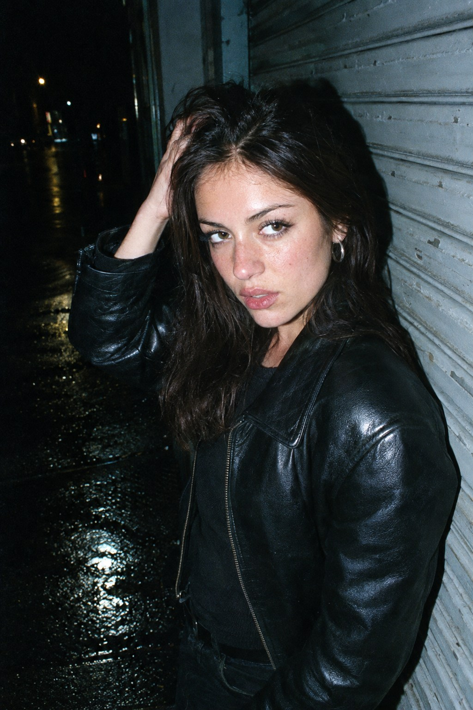<br><sub><b>Flare</b> &nbsp;<code>openai/gpt-image-2.5-flare</code></sub></td>
<td width="50%"><br><sub><b>Sunburst</b> &nbsp;<code>openai/gpt-image-2.5-sunburst</code></sub></td>
</tr></table>

<sub>quality <code>xhigh</code> on both &nbsp;·&nbsp; 3:4 &nbsp;·&nbsp; 1024 × 1536 &nbsp;·&nbsp; 2459 image tokens each &nbsp;·&nbsp; 27 s &nbsp;·&nbsp; $0.0746 each</sub>

**What we found:** **Flare holds the skin better.** Pores, freckles and the oily highlight across the forehead are individually visible, where Sunburst renders a marginally smoother face. Both get the hard shadow and the wet-pavement return.

```text
35mm color film photography with harsh direct on-camera flash, specular highlights on skin and clothing, strong catchlights in eyes, high contrast flash illumination, authentic film grain and color shift, night street editorial style, close-up portrait, a woman in a black leather jacket leaning back against a shuttered shopfront at 1 AM, one hand pushing her hair back, chin slightly down, gaze just past the lens, hard shadow thrown straight behind her onto the wall, background falling away to black, wet asphalt at the bottom of the frame catching the flash, slight cyan drift in the shadows, no plastic skin, no digital over-sharpening, no airbrushing, no oily skin, no watermark, no text, authentic 35mm direct flash film look
```

[Case page →](showcase/16-direct-flash-night-portrait/) &nbsp;·&nbsp; [Full-size](showcase/16-direct-flash-night-portrait/full-flare.jpg) &nbsp;·&nbsp; [Full-size Sunburst](showcase/16-direct-flash-night-portrait/full-sunburst.jpg) &nbsp;·&nbsp; [Prompt file](showcase/16-direct-flash-night-portrait/prompt.txt)

<sub>Prompt written for this atlas.</sub>

---

### 17 · Night Market Queue

<sub>Photography &nbsp;·&nbsp; written for this atlas &nbsp;·&nbsp; 81 words &nbsp;·&nbsp; rendered on both tiers</sub>

<table><tr>
<td width="50%">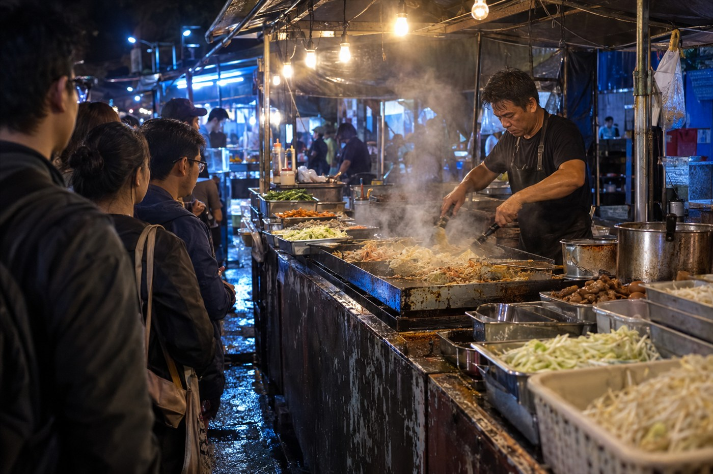<br><sub><b>Flare</b> &nbsp;<code>openai/gpt-image-2.5-flare</code></sub></td>
<td width="50%"><br><sub><b>Sunburst</b> &nbsp;<code>openai/gpt-image-2.5-sunburst</code></sub></td>
</tr></table>

<sub>quality <code>xhigh</code> on both &nbsp;·&nbsp; 3:2 &nbsp;·&nbsp; 1536 × 1024 &nbsp;·&nbsp; 2459 image tokens each &nbsp;·&nbsp; 27 s &nbsp;·&nbsp; $0.0743 each</sub>

**What we found:** **Effectively a tie.** Flare resolves the steam and the crowd into separate layers; Sunburst tightens the framing and gives slightly more definition to the cooking equipment. Three colour temperatures survive in both.

```text
Authentic night market food stall photograph at 11 PM, a queue of people along the front, steam rising off the griddle into bare bulbs strung overhead, the vendor working fast with both hands, trays of ingredients stacked around them, mixed light from hot bulbs above and a cold blue spill from the neighbouring stall, wet ground, worn scratched counter, real used cooking equipment, shallow depth of field, high ISO noise, no staging, no text, no signage, no brand names, no watermark
```

[Case page →](showcase/17-night-market-queue/) &nbsp;·&nbsp; [Full-size](showcase/17-night-market-queue/full-flare.jpg) &nbsp;·&nbsp; [Full-size Sunburst](showcase/17-night-market-queue/full-sunburst.jpg) &nbsp;·&nbsp; [Prompt file](showcase/17-night-market-queue/prompt.txt)

<sub>Prompt written for this atlas.</sub>

---

### 18 · Golden Hour Backlight

<sub>Photography &nbsp;·&nbsp; written for this atlas &nbsp;·&nbsp; 72 words &nbsp;·&nbsp; rendered on both tiers</sub>

<table><tr>
<td width="50%">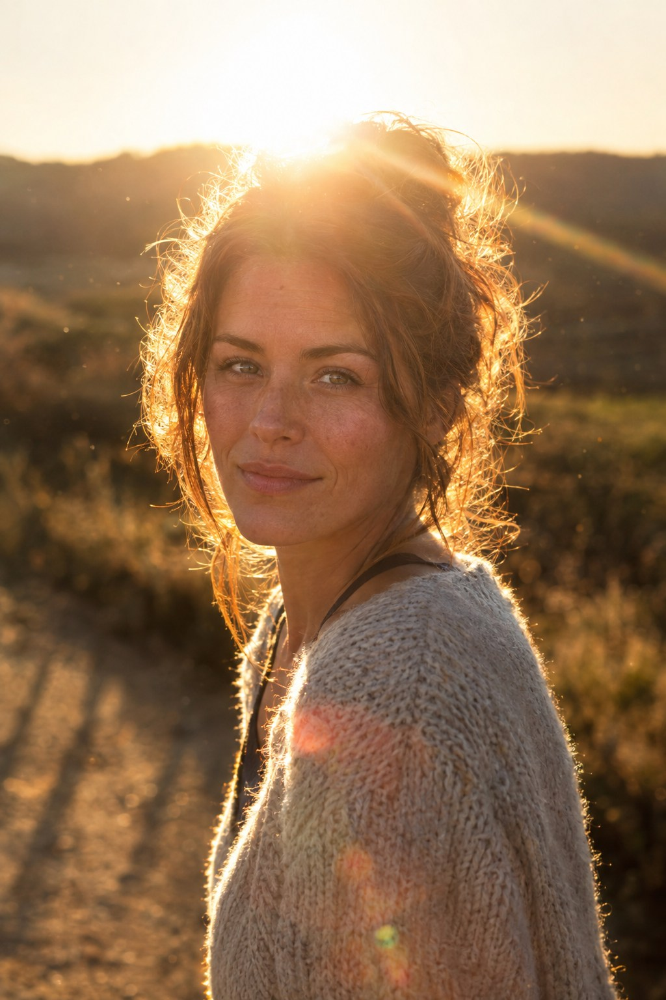<br><sub><b>Flare</b> &nbsp;<code>openai/gpt-image-2.5-flare</code></sub></td>
<td width="50%"><br><sub><b>Sunburst</b> &nbsp;<code>openai/gpt-image-2.5-sunburst</code></sub></td>
</tr></table>

<sub>quality <code>xhigh</code> on both &nbsp;·&nbsp; 3:4 &nbsp;·&nbsp; 1024 × 1536 &nbsp;·&nbsp; 2459 image tokens each &nbsp;·&nbsp; 24 s &nbsp;·&nbsp; $0.0743 each</sub>

**What we found:** **Flare wins clearly.** Flare puts a real flare streak across the frame and turns the hair into a rim that reads as light rather than as a painted edge; Sunburst is flatter and more even.

```text
85mm portrait photograph backlit at golden hour with the sun directly behind the subject's head, hair glowing as a bright halo, face in soft open shade with bounced fill only, strong natural lens flare streaking across the frame, dust in the air catching the light, long shadows running toward the camera, real skin texture with visible pores and fine lines, no airbrushing, no plastic skin, no digital over-sharpening, no watermark, no text
```

[Case page →](showcase/18-golden-hour-backlight/) &nbsp;·&nbsp; [Full-size](showcase/18-golden-hour-backlight/full-flare.jpg) &nbsp;·&nbsp; [Full-size Sunburst](showcase/18-golden-hour-backlight/full-sunburst.jpg) &nbsp;·&nbsp; [Prompt file](showcase/18-golden-hour-backlight/prompt.txt)

<sub>Prompt written for this atlas.</sub>

---

### 19 · Retro Racing Game Replay

<sub>Game &nbsp;·&nbsp; written for this atlas &nbsp;·&nbsp; 109 words &nbsp;·&nbsp; rendered on both tiers</sub>

<table><tr>
<td width="50%"><br><sub><b>Flare</b> &nbsp;<code>openai/gpt-image-2.5-flare</code></sub></td>
<td width="50%"><br><sub><b>Sunburst</b> &nbsp;<code>openai/gpt-image-2.5-sunburst</code></sub></td>
</tr></table>

<sub>quality <code>xhigh</code> on both &nbsp;·&nbsp; 16:9 &nbsp;·&nbsp; 1024 × 1536 &nbsp;·&nbsp; 2459 image tokens each &nbsp;·&nbsp; 46 s &nbsp;·&nbsp; $0.0746 each</sub>

**What we found:** **Sunburst wins clearly.** Both tiers placed all five strings exactly right, but Sunburst stacks every readout into one tight block with a segmented speed bar, where Flare scatters them to four corners in flatter type.

```text
A gameplay screenshot of a 1990s arcade racing game replay screen, 16:9. Low-polygon flat-shaded cars on a seaside coastal road seen from a chase camera, a low-poly sea to one side, dithered gradients on the horizon, visible polygon edges and low-resolution textures as a period console would render them. The HUD is fully rendered over the gameplay: a position indicator reading "3/8", a lap counter reading "LAP 2/5", a timer reading "0'47\"12", a best-lap reading "0'45\"88", and a speed readout reading "241 km/h" with a red-line bar. Chunky pixel font, all caps. Render only those five strings. No other text, no watermark, no real game logo or track name.
```

[Case page →](showcase/19-retro-racing-replay/) &nbsp;·&nbsp; [Full-size](showcase/19-retro-racing-replay/full-flare.jpg) &nbsp;·&nbsp; [Full-size Sunburst](showcase/19-retro-racing-replay/full-sunburst.jpg) &nbsp;·&nbsp; [Prompt file](showcase/19-retro-racing-replay/prompt.txt)

<sub>Prompt written for this atlas.</sub>

---

### 20 · Isometric Dungeon Key Art

<sub>Game &nbsp;·&nbsp; written for this atlas &nbsp;·&nbsp; 131 words &nbsp;·&nbsp; rendered on both tiers</sub>

<table><tr>
<td width="50%">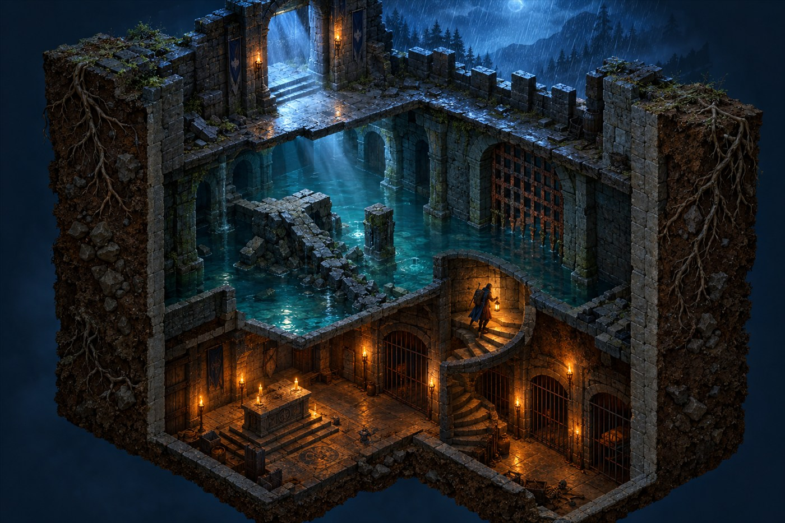<br><sub><b>Flare</b> &nbsp;<code>openai/gpt-image-2.5-flare</code></sub></td>
<td width="50%"><br><sub><b>Sunburst</b> &nbsp;<code>openai/gpt-image-2.5-sunburst</code></sub></td>
</tr></table>

<sub>quality <code>xhigh</code> on both &nbsp;·&nbsp; 4:3 &nbsp;·&nbsp; 1024 × 1536 &nbsp;·&nbsp; 2459 image tokens each &nbsp;·&nbsp; 57 s &nbsp;·&nbsp; $0.0746 each</sub>

**What we found:** **Sunburst wins narrowly.** Both produce a legible three-level cutaway with the warm/cold split; Sunburst resolves the cut walls, roots and rubble more distinctly.

```text
A true isometric cutaway illustration of a dungeon three levels deep, seen at exactly 30 degrees with no perspective distortion, game key art style. The top level is a cold stone entrance open to the night and rain. The middle level holds a flooded cistern, a collapsed bridge and a rusted portcullis. The bottom level is a warm torch-lit vault with a stone altar and barred cells. A single hero carrying a lamp is on the spiral staircase between the middle and bottom levels. The cut walls show their thickness and the earth beside them, with roots and rubble. Warm torchlight inside against cold blue night above, volumetric light shafts through the entrance. One hero only. No text, no UI, no HUD, no watermark, no perspective, grid locked to 30 degrees.
```

[Case page →](showcase/20-isometric-dungeon-key-art/) &nbsp;·&nbsp; [Full-size](showcase/20-isometric-dungeon-key-art/full-flare.jpg) &nbsp;·&nbsp; [Full-size Sunburst](showcase/20-isometric-dungeon-key-art/full-sunburst.jpg) &nbsp;·&nbsp; [Prompt file](showcase/20-isometric-dungeon-key-art/prompt.txt)

<sub>Prompt written for this atlas.</sub>


---

### Flare or Sunburst? We measured it

We could not find anyone who had compared the two tiers rather than repeated the marketing copy, so we rendered five identical prompts through both and looked.

> **If the picture is about light, use Flare. If the picture is about arrangement, use Sunburst.**

Flare renders atmosphere — flare streaks, bloom, a believable falloff from one hard source. Sunburst renders structure — type on the baseline, interface elements on a grid, a layout that does not drift. They cost the same.

| Case | Winner | Margin |
|---|---|---|
| [16 Direct Flash Night Portrait](showcase/16-direct-flash-night-portrait/) | **Flare** | narrow |
| [17 Night Market Queue](showcase/17-night-market-queue/) | tie | — |
| [18 Golden Hour Backlight](showcase/18-golden-hour-backlight/) | **Flare** | clear |
| [19 Retro Racing Game Replay](showcase/19-retro-racing-replay/) | **Sunburst** | clear |
| [20 Isometric Dungeon Key Art](showcase/20-isometric-dungeon-key-art/) | **Sunburst** | narrow |

**[Read the full comparison, both frames side by side →](docs/flare-vs-sunburst.md)**

---

## The craft cases — thirty complete briefs

The long end. Each one is a filled specification rather than a description: the canvas is decided before the subject, every visible string is quoted once and then verified, object and panel counts are stated and made to close, and the reference roles are assigned one job each. Where a render missed, the case says what missed and what changed.

These run from 700 to 4,500 words, so every prompt is folded away — open the one you want, and the case page has the rest.

---

### 01 · Citrus Under Pressure

<sub>Beverage campaign · product advertising</sub>

<p align="center">

</p>

<sub><code>gpt-image-2.5-sunburst</code> &nbsp;·&nbsp; text-to-image &nbsp;·&nbsp; 4K &nbsp;·&nbsp; 3:4 &nbsp;·&nbsp; 2480 × 3312 px &nbsp;·&nbsp; 37.6 s &nbsp;·&nbsp; 2,816 characters</sub>

One can, one orange slice, one liquid arc. Built on three circles.

<details>
<summary><b>Prompt</b> — 479 words, 2,816 characters</summary>

```text
A bright beverage advertisement photograph of a chilled can of orange sparkling soda, standing at a slight
tilt on a smooth pale surface, shot on a 3:4 vertical canvas at close product distance.

COMPOSITION
The can is the largest and most central element, occupying about 55% of the frame height, its base resting
just below the lower third. A single thin orange slice curls behind the can's upper third, its circle echoing
the can's rim. One narrow arc of liquid rises from the surface behind the can and sweeps around its right
side at the can's mid-height, then falls out of frame. The arc passes BEHIND the can and never crosses the
label. The composition is built on three circles — the slice, the rim, the liquid arc — held on one vertical
axis. Empty space falls to the lower left. Nothing touches the frame edges.

SETTING AND LIGHT
Background: a seamless warm cream backdrop with a soft apricot falloff toward the lower right, no props, no
horizon. Lighting: one large soft source behind the can at the upper left, acting as a rim light that passes
through the orange slice and glows through the liquid arc; one broad white bounce card in front at low
intensity to keep the label legible. Contact shadow: one tight soft shadow directly beneath the can base.
No coloured gels, no second light, no reflections of studio equipment.

MATERIALS
Cold aluminium can with a satin brushed finish and a fine bead-blasted sheen along the rim; heavy condensation
across the cold metal, with droplets varying from fine mist to a few larger runs, all catching the back light.
Orange slice: translucent flesh with visible radial segments and a pith ring, the back light glowing through
it so the pulp reads as wet rather than as coloured glass. Liquid: thin, glossy, opaque orange with a defined
meniscus, heavy enough to hold a smooth curve, catching a bright highlight line along its top edge.

LABEL AND TEXT
The label is white with a matte paper texture, wrapped cleanly and registered straight to the can's vertical
axis. It carries exactly this text, once each: the brand word "ZEST" in a bold condensed sans on the upper
third, "ORANGE" beneath it in a smaller light sans, and "330 ML" at the bottom of the label. No other words,
numbers, marks or symbols appear anywhere in the frame. Brand text must be crisp, correctly kerned, unobstructed
and readable at thumbnail size.

CONSTRAINTS
One liquid arc only. No scattered fruit pieces, no splashes, no droplets scattered through the air. The can's
silhouette, the label's proportions and the label's registration must stay unchanged. Do not add a second can,
a glass, ice cubes, leaves or a straw. No invented logos, no badges, no awards, no "new" or "best" flashes,
no watermark. Avoid plastic-looking CGI, avoid flat airless lighting, avoid over-sharpened edges.
```

</details>

[Case page →](cases/01-citrus-under-pressure/) &nbsp;·&nbsp; [Full-size image](cases/01-citrus-under-pressure/full.jpg) &nbsp;·&nbsp; [Prompt file](cases/01-citrus-under-pressure/prompt.txt)

---

### 02 · After Hours

<sub>Editorial poster · exact copy</sub>

<p align="center">

</p>

<sub><code>gpt-image-2.5-sunburst</code> &nbsp;·&nbsp; text-to-image &nbsp;·&nbsp; 4K &nbsp;·&nbsp; 2:3 &nbsp;·&nbsp; 2336 × 3520 px &nbsp;·&nbsp; 37.2 s &nbsp;·&nbsp; 2,222 characters</sub>

A beam of stage light becomes the instrument. Four strings, once each.

<details>
<summary><b>Prompt</b> — 374 words, 2,222 characters</summary>

```text
A vertical editorial concert poster, 2:3, printed artwork seen flat and straight on — not a photograph of a
poster on a wall.

COMPOSITION
Deep indigo ground with a subtle ink-darkening toward the outer edges. A single narrow shaft of warm gold
stage light enters from the upper left and falls through the centre of the sheet, and the illuminated volume
of that beam resolves into the abstract silhouette of a saxophone: bell low right, neck rising left, keys
suggested by a row of small dark interruptions along the beam's right edge. The silhouette is built only from
light and its absence — no outline, no drawn instrument. The headline sits above the beam, set large; the
supporting lines sit below it in a compact block with clear air around them; the date and venue occupy their
own zone at the bottom margin. The beam never crosses any letterform.

TEXT — render exactly these four strings, each appearing once
"AFTER HOURS"
"JAZZ WEEKENDER"
"18–20 SEPTEMBER"
"RIVERSIDE HALL"
Hierarchy: "AFTER HOURS" is the largest, set in a high-contrast condensed serif, tracked tight, on two lines
if needed. "JAZZ WEEKENDER" is roughly one third that height in a neutral uppercase sans with wide letter
spacing. "18–20 SEPTEMBER" and "RIVERSIDE HALL" are the smallest, set on one shared left-aligned column in the
bottom margin, separated by a thin rule. All type sits on one left axis. No other text anywhere.

PAPER AND FINISH
Heavy uncoated poster stock with visible fibre grain and a faint deckled suggestion along the edges; ink sits
slightly into the paper rather than on top of it. The gold light is printed ink luminance, not a glow effect:
flat in the deep areas, softly graduated only where the beam passes.

CONSTRAINTS
No QR code, no barcode, no sponsor logos, no decorative microtext, no fictional support acts, no ticket
prices, no "sold out" flashes. Do not paraphrase, abbreviate, re-case or hyphenate the four strings. Do not
rotate, outline, shadow or gradient-fill the type. Do not add a saxophone photograph, a player, a crowd or a
venue illustration. Keep the poster plane flat: no frame, no perspective, no wall shadow, no mockup, no tape,
no torn edges beyond a faint deckle. No watermark, no signature.
```

</details>

[Case page →](cases/02-after-hours-jazz-poster/) &nbsp;·&nbsp; [Full-size image](cases/02-after-hours-jazz-poster/full.jpg) &nbsp;·&nbsp; [Prompt file](cases/02-after-hours-jazz-poster/prompt.txt)

---

### 03 · The Midnight Bathhouse

<sub>World building · cutaway illustration</sub>


<sub><code>gpt-image-2.5-sunburst</code> &nbsp;·&nbsp; text-to-image &nbsp;·&nbsp; 4K &nbsp;·&nbsp; 3:2 &nbsp;·&nbsp; 3520 × 2336 px &nbsp;·&nbsp; 42.6 s &nbsp;·&nbsp; 2,339 characters</sub>

Three floors, one staircase, and cold outside holding warmth in.

<details>
<summary><b>Prompt</b> — 400 words, 2,339 characters</summary>

```text
A three-storey cutaway illustration of a small mountain bathhouse at night, drawn straight on as a section
through the building, on a 3:2 landscape canvas.

THE BUILDING
A compact timber inn, roughly three times as wide as it is tall, its left half cut away so all three floors
are visible at once. Outside: deep blue snow night, a low driftscape against the base, bare larch trunks
behind, falling snow. Inside: warm amber lamplight on timber, paper screens, and steam, clearly separated from
the cold exterior. Floor slabs read as solid timber sections; the roof is snow-loaded with a visible eave.
One staircase connects all three floors in a legible run, and its landings align with the floor slabs.

LOWER FLOOR — the bath
A sunken stone pool with faint steam rising off the water surface only, not through the walls. Wet stone
apron, a low wooden bucket, a folded towel on a rail. The water line is visible against the pool wall.

MIDDLE FLOOR — the tea room
Low table with a teapot mid-pour, two cups, a paper lantern, a folded blanket, a window onto the snow. A paper
screen partially drawn so the room behind it stays readable.

UPPER FLOOR — the guest room
Two futons, a small chest, a hanging lamp, a pair of boots set beside the door, snow built up on the window sill.

FIGURES
Five small figures, each doing something different and quiet: one stepping into the bath, one seated pouring
tea, one asleep under a futon, one standing at an upper window looking out, one on the stairs carrying a
tray. Figures are small relative to the building, anatomically plain, and never repeated as identical stamps.

MATERIAL AND LIGHT
Timber: warm grain, visible joinery, worn edges at thresholds. Paper screens: translucent, glowing from the
lamps behind them. Stone: cold grey-green with damp sheen near the pool. Snow: matte, with soft blue shadow.
Outside light is cool and low-contrast; inside light is warm and pooled around each lamp. The two light
sources never mix — snow stays blue, interiors stay amber.

CONSTRAINTS
Water and steam never pass through a wall, floor or the roof. Exterior falling snow never appears indoors.
Each floor's boundary, door and stair connection must be readable. Do not fill rooms with clutter; the space
must stay explorable along the stairs. Do not add text, signage, numbers or logos. No watermark.
```

</details>

[Case page →](cases/03-midnight-bathhouse/) &nbsp;·&nbsp; [Full-size image](cases/03-midnight-bathhouse/full.jpg) &nbsp;·&nbsp; [Prompt file](cases/03-midnight-bathhouse/prompt.txt)

---

### 04 · Miniature Crew on a Lens

<sub>Scale contrast · macro diorama</sub>


<sub><code>gpt-image-2.5-sunburst</code> &nbsp;·&nbsp; text-to-image &nbsp;·&nbsp; 4K &nbsp;·&nbsp; 3:2 &nbsp;·&nbsp; 3520 × 2336 px &nbsp;·&nbsp; 40.3 s &nbsp;·&nbsp; 2,655 characters</sub>

Seven workers repairing a camera lens. One of them is standing on the glass.

<details>
<summary><b>Prompt</b> — 456 words, 2,655 characters</summary>

```text
A macro photograph of a miniature construction site built on top of a real camera lens lying on a dark
wooden desk, shot at 3:2 with a tilt-shift effect so the plane of focus runs diagonally across the lens barrel.

THE LENS AS LANDSCAPE
A large prime lens lies on its side, filling most of the frame: black anodised aluminium barrel with fine
knurled focus and aperture rings, a metal mount ring at the near end, engraved white numerals along the barrel,
and the front glass element facing the camera at the far end. The glass is deep blue-violet with concentric
coating rings and a curved reflection of the room's ceiling. The lens is the terrain — everything else is built
on it.

THE SITE
A miniature crew is working along the top of the barrel. On the rubber ring: a climbing scaffold of thin
aluminium poles lashed with small orange ties. Mid-barrel: a lattice crane with a counterweight, its hook
lowered toward the glass. Near the mount: a striped barrier line of cones and tape around a "work area", with
a tiny open toolbox, a coiled cable, a folded tarp and two traffic cones. On the front glass element: a
single worker standing well out on the glass, casting a reflection beneath himself.

FIGURES
Seven figures in high-visibility yellow vests and white helmets. Each is doing something different: one
climbing the scaffold, one walking a beam with a tether, one at the crane controls, one kneeling to check a
level, one carrying a plank over the shoulder, one standing on the glass, one sitting on the barrel edge with
a clipboard. All are anatomically plain, correctly scaled to each other, and never repeated as identical stamps.

LIGHT AND DEPTH
One warm desk lamp off-frame to the upper left, its shade just visible as a soft amber glow at the frame's
edge, throwing warm directional light along the barrel and long soft shadows to the right. A cold blue rim
from a window behind separates the figures from the background. Strong tilt-shift depth of field: the strip
across the barrel top is sharp, the near knurling and the far background fall into soft focus. Background
bokeh of warm amber point lights and one blue highlight.

CONSTRAINTS
The lens must remain a real, correctly proportioned camera lens: barrel diameter, ring widths, mount ring,
engraved numerals and the glass element all plausible and consistent. No text anywhere except the lens's own
engraved markings, which are embossed metal and unreadable at this scale. No logos, no brand marks, no
watermark. Do not make the scene look like plastic toys: real metal, real rubber, real glass, real tiny
clothing with fabric weave. No flame, no welding sparks, no dust cloud.
```

</details>

[Case page →](cases/04-miniature-crew-on-a-lens/) &nbsp;·&nbsp; [Full-size image](cases/04-miniature-crew-on-a-lens/full.jpg) &nbsp;·&nbsp; [Prompt file](cases/04-miniature-crew-on-a-lens/prompt.txt)

---

### 05 · Exploded Ramen Bowl

<sub>Food campaign · assembly diagram</sub>


<sub><code>gpt-image-2.5-sunburst</code> &nbsp;·&nbsp; text-to-image &nbsp;·&nbsp; 4K &nbsp;·&nbsp; 4:3 &nbsp;·&nbsp; 3312 × 2480 px &nbsp;·&nbsp; 65.6 s &nbsp;·&nbsp; 3,155 characters</sub>

Seven components, seven labels, one thin leader each. Nothing crosses.

<details>
<summary><b>Prompt</b> — 528 words, 3,155 characters</summary>

```text
A commercial food photograph of an exploded ramen bowl, drawn on a 4:3 canvas as a vertical assembly diagram
in three dimensions: the finished bowl at the bottom, and its components suspended above it in the order they
are assembled, each labelled.

COMPOSITION
Dark slate ground filling the frame, one value, with a soft pool of light in the centre. The ceramic bowl sits
in the lower third, centred, seen from a slightly raised three-quarter angle so its interior is visible. Directly
above the bowl, seven components float in a vertical stack with generous even gaps, largest at the bottom,
smallest at the top. Each component has one thin straight leader line running horizontally out to a label at
the left or right margin; no leader crosses another, no leader crosses a component, and every leader ends exactly
on the component it names.

THE COMPONENTS, bottom to top
1. Amber broth held as a perfect disc of liquid suspended in mid-air, with a defined meniscus and a bright
   highlight along its edge; faint steam rising from this disc only.
2. A coil of fresh noodles, lifted and separated so individual strands are visible, glossy and pale gold.
3. Three slices of braised pork belly, edge-seared, with visible fat-to-meat layering and a caramelised rim.
4. Two halves of a marinated soft-boiled egg, yolks jammy and slightly translucent, cut faces toward camera.
5. A sheet of toasted nori standing almost upright, matte black-green with visible fibre structure.
6. A small fan of sliced scallions, fresh green and white rings, crisp edges.
7. A tight cluster of chili oil droplets suspended together, each catching a small bright specular point.

TEXT — render exactly these seven strings, one per label, each appearing once
"BROTH" / "NOODLES" / "CHASHU" / "SOFT EGG" / "NORI" / "SCALLION" / "CHILI OIL"
Typography: one neutral uppercase sans, one size only, set horizontally, left-aligned on the left margin for
components 1, 3, 5, 7 and right-aligned on the right margin for components 2, 4, 6, so the leaders stay short.
No other text anywhere in the frame.

LIGHT AND MATERIAL
One large soft key from the upper left, one weak fill from the right, and one narrow back light that makes the
broth glow from within and catches the rim of the egg yolks. Ceramic: matte glaze with fine crazing and a soft
rim highlight. Liquid: glossy, opaque amber with a viscous meniscus. Noodles: wet and reflective without looking
oiled plastic. Pork: crisp caramelised edge, fibrous interior. Egg: dense jammy yolk with a matte albumen.
Steam rises only from the broth disc, thin and directional, never covering a component or a label.

CONSTRAINTS
Exactly seven components and exactly seven labels, one each, in the order given. Components must not overlap,
touch, or drift off the vertical axis. Do not add chopsticks, a spoon, a napkin, a second bowl, scattered
ingredients, flying droplets, herbs or decorative garnishes. Do not add brackets, arrows, dashed boxes,
measurement lines or dimension marks — the only graphics in the frame are the seven thin leaders. Do not
restyle the labels, do not add units or prices. No watermark, no logo, no border.
```

</details>

[Case page →](cases/05-exploded-ramen-bowl/) &nbsp;·&nbsp; [Full-size image](cases/05-exploded-ramen-bowl/full.jpg) &nbsp;·&nbsp; [Prompt file](cases/05-exploded-ramen-bowl/prompt.txt)

---

### 06 · Anamorphic Night Crossing

<sub>Cinematic still · 21:9</sub>


<sub><code>gpt-image-2.5-sunburst</code> &nbsp;·&nbsp; text-to-image &nbsp;·&nbsp; 4K &nbsp;·&nbsp; 21:9 &nbsp;·&nbsp; 3840 × 1648 px &nbsp;·&nbsp; 38.7 s &nbsp;·&nbsp; 2,704 characters</sub>

Wet street, one cyclist, one flare sourced from a light that is actually in frame.

<details>
<summary><b>Prompt</b> — 457 words, 2,704 characters</summary>

```text
An anamorphic night exterior, 21:9, shot on a rain-slicked city street minutes after the rain stopped — a
cinematic still, not a tourist photograph.

COMPOSITION
Wide frame, camera at chest height on the near pavement, the road running diagonally away to the right so the
reflections carry the eye into depth. A single cyclist crosses left to right through the middle third, small in
frame, moving out of the left of the shot, caught mid-pedal; a pedestrian with a dark umbrella walks away from
camera on the far pavement, well down the street. Foreground: the wet kerb and the out-of-focus edge of a parked
van intruding into the lower right corner, cropped by the frame. Empty wet road occupies the lower half. Nothing
is centred.

THE STREET
Named elements, all present: wet asphalt, painted lane markings, standing puddles holding reflections, a bento
shop window with a paper lantern, a vending machine glowing on the near wall, a bento shop sign with unreadable
lettering, a traffic signal showing amber, overhead power lines crossing the sky, a metal drain grate, a
steam vent from a basement grate, wet bicycle tyres, a low bollard, a shuttered roller door, a stack of plastic
crates beside a doorway.

LIGHT
Night, blue hour, no sun. Sources: the amber lantern of the bento shop at the left, at eye level; the cold white
of the vending machine on the near right; the amber traffic signal high in the frame; and a weak blue-grey
ambient sky. One dominant direction: the warm shop light comes from the left and slightly behind, so the cyclist
is rimmed and the road reflections stretch toward camera. Every shadow and every reflection must agree with the
warm source being on the left.

LENS CHARACTER
True anamorphic rendering: one long horizontal blue lens flare streak across the frame at eye level, sourced
from the vending machine; oval bokeh in the background lights, elongated horizontally; a slight horizontal
smear at the frame edges; fine film grain; a very shallow depth of field that keeps the puddles and road
reflections sharp in the middle distance and softens the far street.

CONSTRAINTS
No readable text anywhere: all signage, the vending machine front and the shop lantern must stay illegible —
off-angle, cropped, or out of focus — and must never resolve into invented words. No legible vehicle plates.
No people facing the camera, nobody posing, no crowd. No lens flare except the one horizontal streak. No
watermark. Do not light the scene with a fill: keep the contrast deep and the shadows held. Do not add neon
signage in colours that contradict the amber-left / cold-right lighting logic. No rain falling, no spray from
tyres — the street is wet, the weather has stopped.
```

</details>

[Case page →](cases/06-anamorphic-night-crossing/) &nbsp;·&nbsp; [Full-size image](cases/06-anamorphic-night-crossing/full.jpg) &nbsp;·&nbsp; [Prompt file](cases/06-anamorphic-night-crossing/prompt.txt)

---

### 07 · Six-Panel Manga Spread

<sub>Sequential art · wordless</sub>


<sub><code>gpt-image-2.5-sunburst</code> &nbsp;·&nbsp; text-to-image &nbsp;·&nbsp; 4K &nbsp;·&nbsp; 3:2 &nbsp;·&nbsp; 3520 × 2336 px &nbsp;·&nbsp; 47.4 s &nbsp;·&nbsp; 2,966 characters</sub>

Six shots, one chase, no dialogue. Same girl and same cat in all six.

<details>
<summary><b>Prompt</b> — 511 words, 2,966 characters</summary>

```text
A six-panel manga spread, 3:2 landscape, black and white, telling one continuous action with no dialogue
and no text of any kind. Two columns of six equal panels: three columns across, two rows down, with even
gutters. Reading order is left to right, then top to bottom.

STYLE
Traditional ink manga: confident black linework with variable weight, screentone for mid-tones and shadow,
cross-hatching for the darkest areas, and large untouched white areas for light. High contrast, clean panels,
no grey wash. Screentone dots stay legible at print size. Nothing is coloured.

THE ACTION — one girl pursuing a cat through a narrow alley and up to a roof, six beats
Panel 1 — wide establishing shot: a narrow residential alley at dusk, deep in frame, laundry lines overhead,
  a stack of crates against a wall; the girl enters from the left edge, small, mid-stride.
Panel 2 — extreme close-up on the ground: her feet and the cat's paws over a puddle, water displaced, motion
  indicated by two short speed lines only.
Panel 3 — medium shot from behind: the cat slips around a corner ahead, only tail and hindquarters visible;
  the girl's arm reaches into frame from the left, fingers open, missing it.
Panel 4 — over-the-shoulder: the alley opens onto a narrow exterior stairwell rising to the right; the cat is
  two steps up, paused, looking back; the girl's shoulder and hair fill the left edge.
Panel 5 — low angle from below: the girl at the top of the stairs, mid-leap, cape of her jacket lifting,
  the roofline and sky behind her, strong diagonal composition.
Panel 6 — wide, calm: a rooftop with a water tank and a low parapet; the cat sits on the parapet with its back
  to us; the girl stands four steps away, doubled over and out of breath, one hand on her knee.

CONSISTENCY ACROSS ALL SIX PANELS
Same character throughout: a girl of about sixteen, short dark bobbed hair with a blunt fringe, a bomber jacket
with ribbed cuffs over a striped shirt, dark trousers, scuffed canvas shoes. Her hairstyle, fringe, jacket,
shirt stripes and shoe design are identical in every panel where she appears. The cat is a single dark tabby
of the same size and markings in every panel. The alley is the same alley: brick walls, the same laundry lines,
the same crates.

CAMERA
Every panel uses a different shot — wide, extreme close-up, medium, over-the-shoulder, low angle, wide — and no
panel repeats another panel's framing. Panels 1 and 6 are both wide but differ in subject and altitude.

CONSTRAINTS
No text anywhere: no dialogue, no captions, no signage, no sound-effect lettering, no speech balloons, no page
numbers, no watermark, no signature. Do not add a title strip or a border beyond the panel gutters. Do not
colour any element. Do not let the character's design change between panels, and do not mirror her asymmetrically
between panels. Nothing may be cropped by a panel edge that should not be: hands, feet and the cat's tail stay
inside their panels.
```

</details>

[Case page →](cases/07-six-panel-manga-spread/) &nbsp;·&nbsp; [Full-size image](cases/07-six-panel-manga-spread/full.jpg) &nbsp;·&nbsp; [Prompt file](cases/07-six-panel-manga-spread/prompt.txt)

---

### 08 · Isometric Bookshop Cutaway

<sub>World building · true isometric</sub>


<sub><code>gpt-image-2.5-sunburst</code> &nbsp;·&nbsp; text-to-image &nbsp;·&nbsp; 4K &nbsp;·&nbsp; 1:1 &nbsp;·&nbsp; 2880 × 2880 px &nbsp;·&nbsp; 52 s &nbsp;·&nbsp; 3,197 characters</sub>

Three floors of a bookshop, cold dusk outside, every lamp inside on.

<details>
<summary><b>Prompt</b> — 558 words, 3,197 characters</summary>

```text
A true isometric cutaway illustration of a three-storey independent bookshop in the evening, on a 1:1 canvas,
drawn in a single axonometric projection at 30 degrees on both horizontal axes, orthographic, with no
perspective and no vanishing point. The front-right quarter of the building is removed so all three floors and
the roof are visible at once. The building is lit from inside; it is dusk outside.

THE BUILDING
Narrow and tall, roughly twice as tall as it is wide. Brick side walls with visible coursing, a slate roof with
a glazed skylight and a small chimney, a painted timber shopfront on the ground floor with a deep doorway
recess, and a gutter running the full width of the roof edge. Floor slabs read as solid sections with visible
thickness.

GROUND FLOOR — the shop
A long service counter with a till, a stack of books waiting to be shelved, a low display table with books
fanned open face-up, two deep reading armchairs, a floor lamp, a potted rubber plant, a brass bell on the
counter, a stack of newspaper, a bicycle leaning inside the doorway, and a cat asleep on the armchair.

MIDDLE FLOOR — the shelves
Six full-height shelves in two rows along the side walls, a rolling wooden ladder hooked to a rail, a reading
nook with a window seat and a cushion, an open atlas on a stand, a globe on a cabinet, a desk lamp, a stack of
oversize art books lying flat, a rolled map in a corner, and a wall clock.

TOP FLOOR — the café
A small espresso machine on a counter with two cups and a knock box, three round tables with chairs, a tray of
pastries under a glass dome, a floor-to-ceiling window with the evening sky beyond, hanging pendant lamps,
a wall of small framed prints, a chalkboard, a water jug, and a tall shelf of mugs.

ROOF
The glazed skylight glowing from below, the chimney, a small water tank, two pigeons, and a weather vane.

FIGURES
Six small figures, each doing something different: one browsing a shelf with a book half out, one reading in a
ground-floor armchair, one climbing the rolling ladder, one carrying a stack of books up the stairs, one seated
at a café table with a cup, one standing at the top-floor window looking out. Figures are small relative to the
building and are never repeated as identical stamps.

LIGHT AND MATERIAL
Evening: cool blue dusk light from outside, warm amber lamplight pooled inside each floor, and the skylight
glowing up onto the roof. The two light temperatures never mix — exterior blue, interior amber. Materials:
painted timber, brick, glass, brass, worn leather on the armchairs, matte paper. Wood grain and brick texture
are visible but never noisy.

CONSTRAINTS
True isometric only: parallel verticals stay parallel, both floor plans keep the same 30-degree axes, and no
element is drawn in perspective. Each floor's ceiling must not be drawn — the viewer looks down into each level.
Staircases must connect visibly between floors and land on the slabs. Do not add text, signage, prices, numbers,
lettering on spines, or a shop name; all book spines are abstract blocks of colour with no lettering. No
watermark. Do not fill the building with so much furniture that the floor plates stop reading as separate levels.
```

</details>

[Case page →](cases/08-isometric-bookshop-cutaway/) &nbsp;·&nbsp; [Full-size image](cases/08-isometric-bookshop-cutaway/full.jpg) &nbsp;·&nbsp; [Prompt file](cases/08-isometric-bookshop-cutaway/prompt.txt)

---

### 09 · Lunar Courier — Character Sheet

<sub>Character design · four views</sub>


<sub><code>gpt-image-2.5-sunburst</code> &nbsp;·&nbsp; text-to-image &nbsp;·&nbsp; 4K &nbsp;·&nbsp; 3:2 &nbsp;·&nbsp; 3520 × 2336 px &nbsp;·&nbsp;  s &nbsp;·&nbsp; 3,824 characters</sub>

One asymmetric detail, and the mirroring rule that has to be stated to get it right.

<details>
<summary><b>Prompt</b> — 687 words, 3,824 characters</summary>

```text
A character design sheet for a lunar courier, drawn on a 3:2 landscape sheet of warm off-white design paper at a
slightly larger scale than a technical reference: four zones, each with a clear border of empty space, hand-drawn
production-art quality, flat cel shading with a single light source from the upper left.

THE CHARACTER — reproduce identically in every view
A courier of about thirty, wiry build, medium height, close-cropped dark hair, a narrow face with a strong
jawline and a thin scar through the left eyebrow. Wearing a cream short cape that stops at the hip with a
scuffed brass clasp at the throat, a slate-grey flight suit with a high collar and ribbed cuffs, worn carbon
boots scuffed at the toe, and fingerless gloves.

Equipment: a hard-shell backpack in cobalt blue with a visible seam, two side pockets and a rolled blanket
strapped on top, and — the asymmetric detail — a single orange tool box clipped to the character's RIGHT hip.
Nothing is worn on the left hip.

THE HIP SIDE — read this before drawing any view
The orange tool box is on the character's OWN RIGHT hip. A figure facing the viewer is mirrored, so the two
views must show it on opposite sides of the sheet:
- FRONT or three-quarter-front view: the box appears on the **LEFT** side of the sheet.
- BACK view: the box appears on the **RIGHT** side of the sheet.
- SIDE view: the character faces the **viewer's right**, so that the right hip is the near side and the box is
  visible in profile at the front of the hip.
Never draw the box on the same side of the sheet in the front view and the back view. Getting this wrong is the
single failure that ruins the sheet.

ZONE 1 — main three-quarter front view, upper LEFT of the sheet, the largest figure
Full body, standing, weight on the left leg, turned about thirty degrees, head facing the viewer, arms relaxed.
The orange tool box reads on the left side of the sheet. Both hands are empty and open.

ZONE 2 — side view, upper RIGHT of the sheet
Full body, facing the viewer's right, standing straight, arms at the sides. The backpack's profile is visible:
its depth, the two side pockets, the rolled blanket on top. The orange tool box is visible on the near hip.

ZONE 3 — back view, lower centre-left of the sheet, roughly a third smaller than Zone 1
Full body, seen from directly behind. The cape falls open at the back, the backpack covers the upper back with
its straps crossing at the chest, and the rolled blanket sits on top of it. The orange tool box appears on the
RIGHT side of the sheet.

ZONE 4 — equipment detail, lower right of the sheet, no figure
The backpack shown on its own, opened: the main compartment, the two side pockets, and the internal divider
laid out flat. Drawn at about half the size of the backpack in Zone 2 and consistent with it in every
proportion, seam position and colour. Nothing else is drawn in this zone.

SHEET PRESENTATION
Drawn figures and equipment only, on flat design paper. No grid lines, no measurement rulers, no dimension
arrows, no callouts, no leader lines. Line work is confident and slightly varied in weight; shadows are a single
flat tone per material, not rendered gradients. The paper has a faint tooth and a soft uneven edge where the
sheet meets the background.

CONSTRAINTS
No text anywhere: no labels, no names, no view captions, no colour swatches with codes, no watermark, no
signature. The character's face, hair, cape, suit, boots and both pieces of equipment must be identical across
Zones 1 to 3 — same proportions, same colours, same seam positions. The backpack in Zone 4 must match the
backpack as worn in Zones 1 to 3. Do not mirror the orange tool box between the front and back views. Do not add
a second character, a pose sheet, a turnaround strip, a colour palette strip, or a background environment.
```

</details>

[Case page →](cases/09-lunar-courier-character-sheet/) &nbsp;·&nbsp; [Full-size image](cases/09-lunar-courier-character-sheet/full.jpg) &nbsp;·&nbsp; [Prompt file](cases/09-lunar-courier-character-sheet/prompt.txt)

---

### 10 · One Room, Warmer

<sub>Image-to-image · soft furnishings only</sub>


<sub><code>gpt-image-2.5-sunburst</code> &nbsp;·&nbsp; image-to-image &nbsp;·&nbsp; 4K &nbsp;·&nbsp; 3:2 &nbsp;·&nbsp; 3520 × 2336 px &nbsp;·&nbsp;  s &nbsp;·&nbsp; 3,830 characters</sub>

The same room, changed only in what you can carry out of it.

**Built from these reference images**, in the order the prompt calls them:

<table><tr>
<td width="100%"><br><sub><b>Image 1</b></sub></td>
</tr></table>

<details>
<summary><b>Prompt</b> — 694 words, 3,830 characters</summary>

```text
Image 1: the room — the sole authority for the architecture, the camera and the existing furniture. It supplies
no new styling, no new objects and no new light.

TASK
Keep this room exactly as it is and make it warmer: change only the soft furnishings and add one lamp, so the
same room reads as lived-in and inviting while remaining unmistakably the same room.

PRESERVE EXACTLY — architecture, joinery and furniture
- The window: same position, same size, same plain white frame, and the same glazing. It is a simple two-leaf
  casement window with ONE horizontal glazing bar in each leaf, six panes in total. Do not convert it into a
  multi-pane Georgian or sash window, do not add bars, do not add muntins, do not change the frame profile.
- The door: same position, same swing, same plain FLAT door leaf with no panels and no mouldings, same simple
  lever handle on the same side. Do not add raised panels, mouldings, glazing or a different handle.
- The sofa: same position against the left wall, same size, same silhouette, same wooden feet. Its upholstery
  stays the same grey woven fabric of the same mid-grey value — do not lighten it, do not re-colour it, do not
  change it to linen or cream, do not change the weave.
- Walls, skirting, ceiling line, both room corners, the socket on the right wall and the low scuff mark on the
  left wall, all unchanged.
- The camera: identical position, identical height, identical angle and identical lens. The result must align
  with Image 1 edge to edge, with the ceiling line, both corners and the floor plane in the same places.
- The pale grey carpet and the faint worn path in the middle of the room.

CHANGE — only these five things
- Add a large wool rug under the sofa and slightly in front of it: warm terracotta with a simple repeating
  geometric border.
- Replace the four grey cushions with four cushions in warm rust, ochre and cream linen, one slightly creased.
  The sofa itself keeps its grey upholstery — only the loose cushions change.
- Hang floor-length linen curtains in warm oatmeal on a slim black rod above the window, drawn open to both
  sides so the window stays completely visible and no glass is covered.
- Add one slim floor lamp with a cream linen shade standing in the near right corner, switched on.
- Set a small stack of two books on the floor beside the sofa's near arm, on the rug.

MATCH NATURALLY
- The lamp adds a warm pool of light entering from the right; the window keeps its cool daylight from the left.
  Both must be visible in the final frame and neither may cancel the other.
- Every new object casts a soft-edged shadow, and each shadow agrees with both light sources: a soft shadow to
  the right from the window, a second softer shadow away from the lamp.
- Fabric must read as fabric: wool with visible fibre and a slightly flattened pile where the sofa legs press
  into it, linen with a soft vertical fold and a hint of translucency at the curtain's leading edge.
- The rug must follow the floor plane in the same perspective as the carpet beneath it.

DO NOT
- Do not restyle the joinery. The window stays a plain two-leaf casement, the door stays a plain flat leaf.
- Do not re-colour, re-upholster or restyle the sofa in any way.
- Do not move, resize or remove the window, the door, the walls, the skirting, the ceiling or the sofa.
- Do not change the camera, the crop, the aspect ratio or the perspective. This is the same frame.
- Do not add architectural elements: no second window, no built-in shelving, no new doorway, no wallpaper, no
  picture rail, no coving.
- Do not add people, pets, plants, artwork, a television, a coffee table, a sideboard or a fireplace.
- Do not brighten or HDR the whole frame. The daylight stays flat and cool; only the lamp area gains warmth.
- No text, no signage, no watermark.
```

</details>

[Case page →](cases/10-one-room-warmer/) &nbsp;·&nbsp; [Full-size image](cases/10-one-room-warmer/full.jpg) &nbsp;·&nbsp; [Prompt file](cases/10-one-room-warmer/prompt.txt)

---

### 11 · Product Into a Scene

<sub>Image-to-image · two references</sub>


<sub><code>gpt-image-2.5-sunburst</code> &nbsp;·&nbsp; image-to-image &nbsp;·&nbsp; 4K &nbsp;·&nbsp; 3:2 &nbsp;·&nbsp; 3520 × 2336 px &nbsp;·&nbsp;  s &nbsp;·&nbsp; 2,960 characters</sub>

One reference owns the object, the other owns the light. Neither does both.

**Built from these reference images**, in the order the prompt calls them:

<table><tr>
<td width="50%">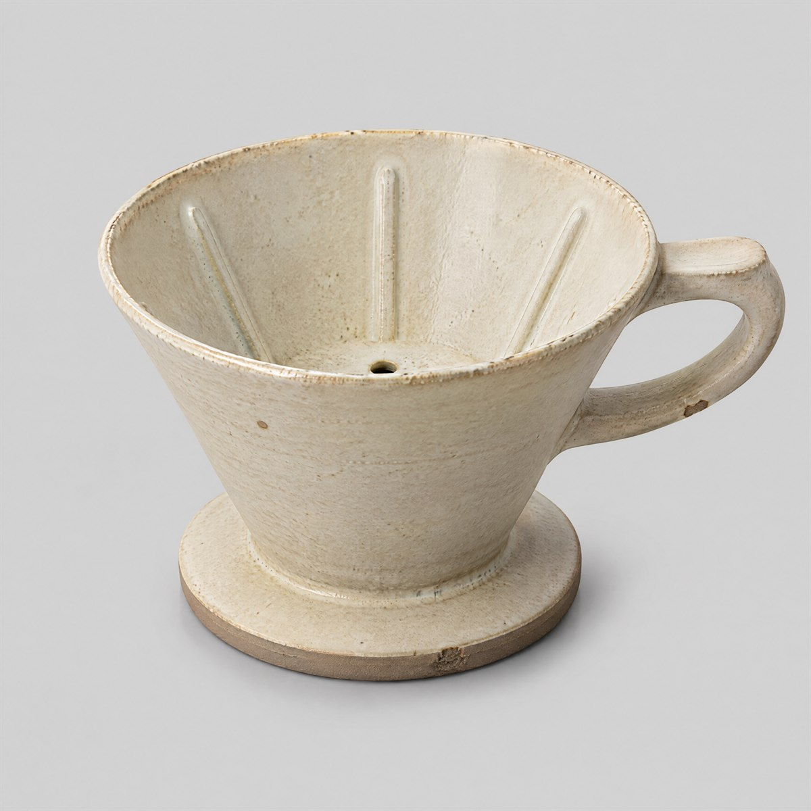<br><sub><b>Image 1</b></sub></td>
<td width="50%">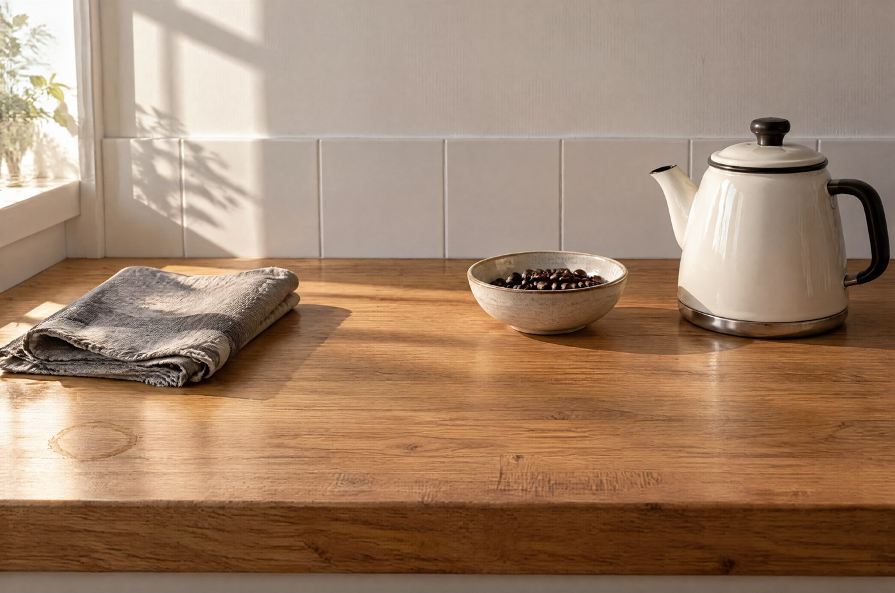<br><sub><b>Image 2</b></sub></td>
</tr></table>

<details>
<summary><b>Prompt</b> — 534 words, 2,960 characters</summary>

```text
Image 1: the product — the sole authority for the dripper's form, its proportions, its cream glaze, the throwing
line, the interior ribs, the drain hole, the unglazed foot and the shape of the side handle. It supplies no
setting, no camera and no lighting.
Image 2: the scene — the sole authority for the space, the counter, the camera position, the scale of everything
in frame and the direction and quality of every light. It supplies no product.

TASK
Place the dripper from Image 1 onto the clear strip of counter along the front edge of Image 2, standing upright
on its foot at the left third of the frame, and follow the scene's own light exactly.

PRESERVE EXACTLY
- The dripper's geometry: cone angle, rim diameter, base ring, handle size and its angle, the wall thickness at
  the rim, and the interior ribs and drain hole.
- The dripper's material: cream glaze with the same gloss level, the same visible throwing line, the same
  slightly uneven rim, the same unglazed clay foot.
- The scene: the oak worktop with its grain, knife marks and water ring, the tiled splashback, the wall above
  it, the enamel kettle, the folded linen cloth, the bowl of beans and their positions.
- The camera: identical position, height, angle and framing. The result must align with Image 2 edge to edge.
- The empty strip of counter along the front edge stays otherwise empty.

MATCH NATURALLY
- Light direction: the window is off-frame to the left, so the dripper is lit from the left. Its lit side is on
  the left, its shadow falls to the right, and its right side falls into the same gentle gradient as the
  splashback behind it.
- Colour temperature: warm in the highlight, cool in the shadow, matching the rest of the scene. Do not add a
  warm or cool cast of its own.
- Contact shadow: one soft-edged shadow beneath the base, short and to the right of the object, denser where the
  foot ring meets the counter and fading outward.
- Reflection: a faint, low-contrast reflection of the base in the oiled oak immediately beneath it, the same
  intensity as the reflection the kettle already casts.
- Scale: the dripper is roughly the height of the enamel kettle's body and stands on the same plane, its base
  resting on the counter surface at the same depth as the kettle's base. It must not float or sink.
- Grain and sharpness: identical to the rest of the frame at the same depth.

DO NOT
- Do not redesign, restyle, recolour or reshape the dripper, and do not change its glaze or its handle.
- Do not change the counter, the splashback, the existing three objects, the camera, the crop or the light
  direction.
- Do not add coffee, a filter, a mug, beans, a spoon, steam, a hand or a second product.
- Do not paste the object flat: no outline, no cut-out edge, no drop shadow of even density, no missing contact
  shadow, no flat colour fill.
- Do not apply a shadow that disagrees with the light coming from the left.
- No text, no logo, no watermark.
```

</details>

[Case page →](cases/11-product-into-a-scene/) &nbsp;·&nbsp; [Full-size image](cases/11-product-into-a-scene/full.jpg) &nbsp;·&nbsp; [Prompt file](cases/11-product-into-a-scene/prompt.txt)

---

### 12 · A Small Delivery

<sub>Wordless comic · ink and watercolour</sub>


<sub><code>gpt-image-2.5-sunburst</code> &nbsp;·&nbsp; text-to-image &nbsp;·&nbsp; 4K &nbsp;·&nbsp; 3:2 &nbsp;·&nbsp; 3520 × 2336 px &nbsp;·&nbsp; 52.4 s &nbsp;·&nbsp; 3,289 characters</sub>

A postal robot shelters a paper crane from the rain. Four panels, no words.

<details>
<summary><b>Prompt</b> — 600 words, 3,289 characters</summary>

```text
A four-panel wordless comic, 3:2 landscape, arranged as two columns of two equal panels with even gutters,
reading left to right then top to bottom. Ink line with watercolour wash, consistent throughout. No text
of any kind.

STYLE
Loose confident ink linework with a fine nib, watercolour washes layered underneath, edges softening slightly
outside the lines. Cool grey-blue palette for the rain, warm amber for the lit interior. Paper texture visible
in the washes. Whites are left as raw paper. Nothing is digitally sharp or vector-clean.

THE CHARACTER — identical in all four panels
A small boxy postal robot, about knee height, with a rounded rectangular body in faded red paint with visible
scratches and a dent in the left flank, a single round lamp eye set high on the front, a small brass slot on
the chest, short articulated legs with flat feet, and a worn canvas mail satchel on a strap across its body.
Its proportions, paint wear and the dent must be in the same place in every panel.

THE STORY, four beats
Panel 1 — the discovery. Medium shot, low angle at the robot's eye level. Rain falls across the frame. The
robot stands on a wet pavement looking down at a small paper crane lying crumpled in a puddle, one wing
soaked through and dark. A single street lamp above and behind it throws a cold cone of light; the crane sits
just inside the light's edge.
Panel 2 — the protection. Close-up, from just above. The robot has lifted the crane clear of the water and is
holding it against its chest with one small articulated hand while it pulls a large used envelope out of the
satchel with the other. The envelope is already creased and its flap is torn. The robot's lamp eye is angled
down at the crane.
Panel 3 — the journey. Wide shot, from behind and slightly to the side. The robot walks away from us up a
steep wet cobbled lane toward a single warm light at the far end. It is holding the envelope arched over the
crane like a small roof; the crane is hidden underneath, only its folded tip visible. Rain streaks the frame
diagonally. The lane is empty and dark.
Panel 4 — the arrival. Medium close-up, from a low angle. The robot stands on a dry stone doorstep in front of
a warm amber doorway with a paper of light spilling out onto the wet step. It is holding the crane up with both
hands, offering it. The crane is dry and its folds have opened back into shape. The rain has stopped and only
drips from the gutter remain.

CONSISTENCY
The same robot, the same satchel, the same envelope once it appears, the same crane. Lighting is consistent
throughout: cold blue-grey for the rain in panels 1 to 3, warm amber for the doorway in panel 4. The paper
crane's condition progresses in one direction only — soaked in panel 1, dark and limp in panel 2 and 3, dry and
opened back into shape in panel 4.

CONSTRAINTS
No text anywhere: no dialogue, no captions, no sound-effect lettering, no signage, no page numbers, no
watermark, no signature. Do not add a title, a border beyond the gutters, or a gutter gutter label. Do not add
people, cats, cars, bins or other props. Do not let the robot's design change between panels, and do not mirror
its dent or its satchel strap between panels. Do not make the crane into a bird — it stays a folded paper object
in every panel.
```

</details>

[Case page →](cases/12-a-small-delivery/) &nbsp;·&nbsp; [Full-size image](cases/12-a-small-delivery/full.jpg) &nbsp;·&nbsp; [Prompt file](cases/12-a-small-delivery/prompt.txt)

---

### 13 · Watercolor Coastal Town

<sub>Traditional media · watercolour</sub>


<sub><code>gpt-image-2.5-sunburst</code> &nbsp;·&nbsp; text-to-image &nbsp;·&nbsp; 2K &nbsp;·&nbsp; 3:2 &nbsp;·&nbsp; 2512 × 1664 px &nbsp;·&nbsp; 37.9 s &nbsp;·&nbsp; 2,498 characters</sub>

Wet-in-wet sky and water, and a town that dissolves into bare paper.

<details>
<summary><b>Prompt</b> — 445 words, 2,498 characters</summary>

```text
A loose watercolour painting of a small coastal town on a steep hillside, on a 3:2 landscape sheet of rough
cold-pressed paper, painted from across the water at a low vantage point.

COMPOSITION
The town rises diagonally from the lower right to the upper left, filling the right two thirds of the sheet
with stacked whitewashed houses and terracotta roofs. To the left, a strip of harbour water occupies the lower
third and opens toward the upper left, where the paper is left almost entirely unpainted. In the immediate
foreground at the lower right, a short flight of worn stone steps and a low wall anchor the composition and are
painted darkest. A single small boat sits on the water at the middle left, very simply described, no rigging
detail. The sky is bare paper with one pale wash at the very top edge. No element touches the sheet's edges;
generous margins are left on all four sides.

WATERCOLOUR TECHNIQUE — this is the subject of the painting as much as the town is
Wet-in-wet for the sky and the water, so the two bleed into each other along a soft horizontal band. Wet-on-dry
for the roofs and the walls, so their edges stay crisp on the lit sides and soften on the shadowed ones. Where
two washes meet, one is allowed to bloom into the other and the granulation of the pigment settles visibly in
that boundary. Roof terracotta granulates into the wall below it in places. Several edges are deliberately lost:
the far end of the town dissolves into the sky with no line at all. The paper's tooth shows through every wash,
and a few small dry-brush skips appear where pigment was dragged across the grain. Whites are unpainted paper —
there is no white paint anywhere in the image.

PALETTE — four pigments only
A warm ochre, a burnt sienna for the roofs, a cool grey-blue for the water and distant hill, and one deep
indigo for the darkest notes in the foreground steps and the shadowed sides of two or three houses. Colours are
allowed to mix on the paper rather than on the palette, so the greys lean green in places and violet in others.

CONSTRAINTS
No people, no animals, no vehicles, no boats beyond the single one, no cranes, no washing lines with legible
laundry, no signage. No text, no signature, no stamp, no watermark. Do not tighten the painting: no hard
outlines around buildings, no evenly-filled shapes, no white body paint, no digital-looking gradients. Do not
paint every window — most house fronts are left as a single wash with one or two dark window marks only.
```

</details>

[Case page →](cases/13-watercolor-coastal-town/) &nbsp;·&nbsp; [Full-size image](cases/13-watercolor-coastal-town/full.jpg) &nbsp;·&nbsp; [Prompt file](cases/13-watercolor-coastal-town/prompt.txt)

---

### 14 · 1936 Travel Poster

<sub>Print · four-colour silkscreen</sub>

<p align="center">

</p>

<sub><code>gpt-image-2.5-sunburst</code> &nbsp;·&nbsp; text-to-image &nbsp;·&nbsp; 2K &nbsp;·&nbsp; 2:3 &nbsp;·&nbsp; 1664 × 2512 px &nbsp;·&nbsp; 33.7 s &nbsp;·&nbsp; 2,929 characters</sub>

Four flat inks, one slightly off register, and a sheet that has been handled.

<details>
<summary><b>Prompt</b> — 512 words, 2,929 characters</summary>

```text
A 1936 travel poster, 2:3 portrait, designed as a four-colour silkscreen print on aged poster stock and seen
perfectly flat and straight on — this is the printed sheet, not a photograph of one on a wall.

COMPOSITION
A steep mountain valley seen head-on, arranged in three flat bands. The lower band is the valley floor, a single
flat dark green. Above it, a tall viaduct crosses the full width on five arches, drawn as one flat ochre shape
with the arches cut out as negative space. On the viaduct, a passenger train in profile running left to right:
locomotive, tender and four carriages, reduced to their simplest readable silhouettes with no interior detail
and no visible windows, only a row of small rectangles along the carriages. Behind and above the viaduct, three
peaks rise in two flat blues, the nearer one darker. The sky is the paper colour left bare, with two long
horizontal clouds as single flat shapes. Vertical composition: the train sits on the upper third, the valley
floor occupies the lower quarter, and the peaks fill the space between.

TEXT — render exactly these two strings, each appearing once
"A LOWER LINE"
"1936"
Set "A LOWER LINE" in a bold geometric sans, all capitals, generously letter-spaced, centred in the band of
sky below the peaks; its width is about two thirds of the sheet's width. Set "1936" much smaller in the same
typeface, centred directly beneath it, at about one sixth of the title's height. No other text anywhere: no
route names, no station names, no prices, no small print, no printer's marks.

PRINT CHARACTER — deliberately imperfect
Four flat inks only: ochre, deep green, two blues, plus the paper. Each colour sits in its own solid shape with
hard edges and no gradients, no shading and no halftones. Registration is very slightly out on one or two
plates, so a thin sliver of paper shows along the left edge of the train's ochre and along the top edge of one
blue peak — under one millimetre and never enough to look broken. Ink is slightly uneven within a shape where
the screen was thin, with fine horizontal streaks visible in the largest flat areas. The paper is aged: a warm
off-white with light foxing at the corners, two soft handling creases running diagonally across the lower left,
a small water stain at the upper right that has very slightly lifted the blue, and a tiny nibbled loss at the
bottom edge. Four pinholes, one in each corner, sit just inside the margin.

CONSTRAINTS
No illustration style other than flat silkscreen: no painterly edges, no airbrush, no glow, no photo texture,
no 3D shading, no drop shadows. Do not add people, birds, trees with individual leaves, rocks, rivers, road
signs or a border. Do not paraphrase, re-case, hyphenate or translate the two strings, and do not add a
year, a place name or a slogan. No mockup: no wall, no frame, no shadow behind the sheet, no perspective tilt,
no tape or pins other than the four pinholes.
```

</details>

[Case page →](cases/14-1936-travel-poster/) &nbsp;·&nbsp; [Full-size image](cases/14-1936-travel-poster/full.jpg) &nbsp;·&nbsp; [Prompt file](cases/14-1936-travel-poster/prompt.txt)

---

### 15 · Irezumi Flash Sheet

<sub>Tattoo art · six motifs</sub>

<p align="center">

</p>

<sub><code>gpt-image-2.5-sunburst</code> &nbsp;·&nbsp; text-to-image &nbsp;·&nbsp; 4K &nbsp;·&nbsp; 3:4 &nbsp;·&nbsp; 2480 × 3312 px &nbsp;·&nbsp; 45.1 s &nbsp;·&nbsp; 2,936 characters</sub>

Six designs, each one liftable off the sheet and tattooable on its own.

<details>
<summary><b>Prompt</b> — 528 words, 2,936 characters</summary>

```text
A traditional Japanese tattoo flash sheet, 3:4 portrait, drawn in black sumi ink with grey wash and one accent
colour on a single aged sheet of off-white paper, flat and straight on.

SHEET
Six motifs arranged in a 3 by 2 grid with wide, even clear space between them and a generous margin on all four
sides. Each motif is a finished, self-contained design that could be lifted off the sheet and tattooed as it
stands. No boxes, no frames, no dividing rules, no shading behind the motifs. The paper is warm off-white with
a faint fibrous tooth, a soft crease across the lower third, and a very slight tea-coloured tone at the edges.

THE SIX MOTIFS, top row left to right then bottom row left to right
1. A koi carp swimming upward and to the left, body curved into a strong S, fins spread and filled with fine
   black lines, a few scales picked out individually near the shoulder and the rest left as graded grey wash.
2. A single open peony, petals layered from a pale outer ring to a dense dark centre, with two leaves behind it
   and one stem cut off square at the bottom.
3. A breaking wave drawn with clawed white crests in the traditional manner, the interior filled with a fine
   pattern of parallel curved lines and graded wash, the spray flicked outward at the top right.
4. A coiled dragon head and shoulder only, seen from the front-left, jaws open, whiskers sweeping back, one
   claw raised; the body is implied and cropped by the drawing's own edge, not by the sheet.
5. A cherry blossom branch entering from the lower right with five open blossoms at different stages and three
   closed buds, the branch drawn in a single confident stroke with two small knots.
6. A hannya mask, front on, horns curving back, eyes narrowed, mouth open to show pointed teeth, the cheeks
   graded from pale grey at the temples to near-black at the jaw.

INK AND WASH
Fine confident black linework with clear variation in weight: heavy on the outer contours, hair-fine on scales,
whiskers, petal veins and water lines. Mid-tones are built from even black wash in distinct flat gradations,
not smooth gradients — you can see the edges where one wash value meets the next. The only colour on the sheet
is a single vermilion accent, used sparingly and identically in each motif: one small area per design, never
more than about a tenth of it. Whites are untouched paper and are used as a designed element, not left over.

CONSTRAINTS
No text anywhere: no labels, no Japanese characters, no signature, no seal, no stamp, no numbers, no brand mark,
no watermark. Do not add background: no clouds, no water, no flowers behind the motifs. Do not merge two motifs
into one design and do not let one motif run into its neighbour's space. Do not use more than one accent colour,
do not fill large areas with it, and do not outline the motifs with a coloured line. Do not render as a 3D
illustration, a tattoo on skin, or a photograph of a sheet.
```

</details>

[Case page →](cases/15-irezumi-flash-sheet/) &nbsp;·&nbsp; [Full-size image](cases/15-irezumi-flash-sheet/full.jpg) &nbsp;·&nbsp; [Prompt file](cases/15-irezumi-flash-sheet/prompt.txt)

---

### 16 · Editorial Beauty Portrait

<sub>Beauty campaign · product in frame</sub>

<p align="center">

</p>

<sub><code>gpt-image-2.5-sunburst</code> &nbsp;·&nbsp; text-to-image &nbsp;·&nbsp; 4K &nbsp;·&nbsp; 2:3 &nbsp;·&nbsp; 2336 × 3520 px &nbsp;·&nbsp; 40 s &nbsp;·&nbsp; 3,633 characters</sub>

Real skin at close range, and a bottle on a plinth instead of in a hand.

<details>
<summary><b>Prompt</b> — 648 words, 3,633 characters</summary>

```text
A beauty editorial photograph, 2:3 portrait, a head-and-shoulders portrait with a skincare product standing in
the foreground on the same focal plane, shot in a studio against a deep plum seamless.

THE FACE
A woman of about thirty-five, head and shoulders in frame, turned about forty degrees to her left so three
quarters of her face is toward the camera, chin very slightly lowered, eyes looking just off the lens to the
left. Expression settled and unperformed — mouth closed and relaxed, no smile for the camera. Dark hair pulled
back off the face with a few loose strands at the temple and one at the jaw. Bare shoulders and a high-necked
fine-rib knit in off-white, the collar visible at the lower edge of the frame.

SKIN — the point of the picture
Real skin at close range: visible pores across the nose and inner cheeks, fine lines at the outer eye and
between the brows, a faint natural redness across the cheeks and chin, a few small freckles on the temple and
the bridge of the nose, one small mole below the left jaw, fine down on the jawline catching the light, and a
slight shine on the forehead, nose tip and upper lip — healthy, not greasy, and nowhere matte-flat. Skin tone is
even in tone but not in texture. No retouching, no smoothing, no pore-filling, no whitened sclera, no reshaped
features. The under-eye area keeps its real depth and colour.

PRODUCT
An amber glass dropper bottle, 30 ml, standing upright on a low dark stone plinth in the lower left foreground,
at the same focus plane as the face so both are sharp. Matte black dropper cap with a fine ribbed skirt, a
pipette bulb visible through the glass shoulder, the liquid inside a clear pale gold. A rectangular off-white
paper label wraps the front of the bottle, slightly proud at its edge, with a fine fibre texture. The bottle is
about a third the height of the face in frame and sits closer to the camera, lower in the picture.

EXACT VISIBLE TEXT — render exactly these two strings on the label, once each
"SERUM No.3"
"30 ML"
"SERUM No.3" is the larger, in a fine uppercase sans with wide letter spacing, sitting on the upper third of the
label. "30 ML" is much smaller, centred at the bottom of the label. Both must be crisp and correctly kerned. No
other text, numbers, symbols or marks appear anywhere in the frame.

LIGHT AND CAMERA
One large soft source from the front left at about forty-five degrees, close to the subject so the falloff is
gentle; one narrow strip light from behind on the right to rim the cheek, the jaw and the shoulder; one black
flag on the right to deepen the shadow side. The shadow side of the face keeps detail — it is deep, not blocked.
No fill from the front. Camera at eye level, 85 mm equivalent, head and shoulders, the top of the head inside
the frame with headroom, the collar cut by the lower edge. Shallow depth of field, but the eyes, the lips and
the label are all inside it.

COLOUR AND FINISH
Deep plum seamless background, one value, no gradient and no visible sweep edge. Palette is warm neutral skin
against cool plum, with the amber glass the only saturated element. Natural colour, slight film grain, no
coloured gels, no glow, no bloom.

CONSTRAINTS
No other products, no cotton pads, no flowers, no water droplets on the face, no jewellery, no visible hands or
fingers anywhere in the frame, no second figure. No invented claims, ingredient names, badges, awards, price
tags, barcodes or certification marks. Do not add text anywhere except the two strings above. Do not smooth,
lift, slim, widen or symmetrise the face. Do not make the skin plastic, waxy or uniformly matte. No watermark.
```

</details>

[Case page →](cases/16-editorial-beauty-portrait/) &nbsp;·&nbsp; [Full-size image](cases/16-editorial-beauty-portrait/full.jpg) &nbsp;·&nbsp; [Prompt file](cases/16-editorial-beauty-portrait/prompt.txt)

---

### 17 · Fashion Lookbook Frame

<sub>Apparel editorial · full body</sub>

<p align="center">

</p>

<sub><code>gpt-image-2.5-sunburst</code> &nbsp;·&nbsp; text-to-image &nbsp;·&nbsp; 4K &nbsp;·&nbsp; 3:4 &nbsp;·&nbsp; 2480 × 3312 px &nbsp;·&nbsp; 37.6 s &nbsp;·&nbsp; 3,221 characters</sub>

One window, one coat, and a hand that is safely in a pocket.

<details>
<summary><b>Prompt</b> — 562 words, 3,221 characters</summary>

```text
A full-body fashion editorial frame, 3:4 portrait, shot in a stripped-back concrete studio in front of a single
large window, daylight only.

THE FRAME
Full body, head to feet, both feet inside the frame with clear floor beneath them and headroom above the head.
Camera at chest height, 50 mm equivalent, straight on, no tilt and no wide-angle distortion. The figure stands
just left of centre, turned about thirty degrees, leaving a wide column of empty concrete wall and window light
to the right. The floor is visible across the lower quarter. Nothing is cropped.

THE SUBJECT AND THE OUTFIT
A woman in her late twenties, about 175 cm, standing with her weight on the left leg, the right leg relaxed and
slightly forward, one hand pushed into the coat pocket so no fingers are visible anywhere in the frame, the
other arm hanging relaxed at her side with the hand mostly hidden behind the coat's edge. Chin level, gaze
directed off to the left of the lens, expression neutral and unperformed, mouth closed.

Outfit, in this order from the outside in: an oversized double-breasted wool coat in camel, cut long to mid-calf,
with wide notch lapels, horn buttons and a visible brushed nap; beneath it a fine-gauge ribbed knit in chalk
white with a high rolled neck; wide-leg wool trousers in charcoal with a single centre crease; low leather
derby shoes in dark brown, laced. The coat is worn open, hanging straight from the shoulders, so the knit and
the trouser waist are both visible. One shoulder of the coat sits slightly forward, as it would if a real
garment were worn open.

STUDIO AND LIGHT
A bare concrete studio: board-formed walls with visible horizontal formwork lines and a scatter of small tie
holes, a polished concrete floor with a faint sheen, one large steel-framed window occupying the right third of
the back wall. Daylight only, entering through that window from the right at a low morning angle, so the
subject is lit from her right side: the lit side of the coat shows the wool's nap and the shadowed side holds
detail without going black. Long soft-edged shadow of the figure falls to the left across the floor. No
artificial light, no fill, no reflector, no coloured light.

MATERIAL
Wool coat: brushed nap readable at this distance, edges of the lapel slightly lighter where the fibre catches
the light, one or two fine creases across the sleeve at the elbow. Rib knit: fine vertical ribs, a matte
surface, a soft fold at the neck. Trousers: smooth worsted wool with a crisp centre crease and a slight break
over the shoe. Leather shoes: scuffed toe, one clean highlight. Concrete: cold grey, matte, small aggregate
visible in the floor's polished sheen.

CONSTRAINTS
No visible hands, no fingers, no jewellery, no bag, no hat, no scarf, no second figure, no props, no furniture,
no plants. No text, no signage, no logo on the clothing, no watermark. Do not change the outfit's proportions,
do not shorten the coat, and do not turn it into a different garment. Do not add a background wall other than
the concrete described, and do not add a cyclorama or a studio backdrop paper. Do not pose the subject: no
hand on hip, no arm raised, no walk, no jump. Do not retouch the face or slim the body.
```

</details>

[Case page →](cases/17-fashion-lookbook-frame/) &nbsp;·&nbsp; [Full-size image](cases/17-fashion-lookbook-frame/full.jpg) &nbsp;·&nbsp; [Prompt file](cases/17-fashion-lookbook-frame/prompt.txt)

---

### 18 · Brutalist Library at Dusk

<sub>Architecture · 21:9</sub>


<sub><code>gpt-image-2.5-sunburst</code> &nbsp;·&nbsp; text-to-image &nbsp;·&nbsp; 4K &nbsp;·&nbsp; 21:9 &nbsp;·&nbsp; 3840 × 1648 px &nbsp;·&nbsp; 38.8 s &nbsp;·&nbsp; 2,867 characters</sub>

Board-formed concrete, one band of warm glass, and a plaza that reflects it.

<details>
<summary><b>Prompt</b> — 492 words, 2,867 characters</summary>

```text
A wide architectural photograph of a brutalist public library at dusk, 21:9, shot from across a wet plaza.

THE BUILDING
A long, low concrete volume, roughly five times as wide as it is tall, sitting heavily on a raised podium.
Its upper mass cantilevers out over a recessed ground floor, so a deep shadowed undercroft runs the full width
beneath it. The concrete is board-formed, with horizontal formwork lines running the entire length at even
spacing, a regular grid of small circular tie holes, and long vertical rain streaks staining the surface below
the parapet. A continuous band of clerestory glazing sits directly under the roof slab along the whole facade,
glowing warm from the interior lights inside. At the left end, a broad flight of concrete steps rises to the
entrance, flanked by two low concrete planters holding bare winter shrubs. The roof slab reads as a single
heavy horizontal line against the sky.

THE PLAZA
Wet dark paving across the lower half of the frame, holding long reflections of the glowing window band and of
the street lamps. Two shallow puddles with visible edges. A row of low concrete bollards runs across the middle
distance. A single steel handrail beside the steps. One street lamp at the far right, out of focus. In the
foreground, the corner of a concrete planter crops into the lower right of the frame, out of focus.

THE FIGURE
One person, small in the frame, walking away from the camera toward the entrance at the left, wearing a long
dark coat and carrying a closed umbrella. Their reflection stretches down into the wet paving beneath them.
They are the only person in the frame and they occupy roughly one fifteenth of the frame height.

LIGHT
Blue hour, after sunset, no sun. The dominant light comes from the building itself: the warm amber clerestory
band is the brightest thing in the picture and it is the source of every warm reflection on the wet plaza. Cool
blue-grey ambient sky light fills the concrete's upper surfaces and the far end of the plaza. Two street lamps
add small cold pools of light at the right. The two temperatures never blend — the concrete outside the window
band stays cold, the interior glow stays warm. Long soft shadows fall away from the building toward the camera.

CONSTRAINTS
No readable signage, no lettering on the building, no logos, no vehicle number plates, no advertising. Any
text-like mark must stay illegible: off-angle, out of focus or too distant to resolve, and it must never resolve
into invented words. No cars, no buses, no bicycles, no litter, no crowds and no second figure. No lens flare.
Do not straighten, tilt or perspective-correct the frame: keep the camera level and the verticals true. Do not
make the building glossy or reflective; concrete is matte everywhere except where it is wet. No watermark. Do
not add neon, coloured gels, mist or light beams.
```

</details>

[Case page →](cases/18-brutalist-library-at-dusk/) &nbsp;·&nbsp; [Full-size image](cases/18-brutalist-library-at-dusk/full.jpg) &nbsp;·&nbsp; [Prompt file](cases/18-brutalist-library-at-dusk/prompt.txt)

---

### 19 · Coffee Brand Touchpoint Board

<sub>Identity · nine touchpoints</sub>


<sub><code>gpt-image-2.5-sunburst</code> &nbsp;·&nbsp; text-to-image &nbsp;·&nbsp; 4K &nbsp;·&nbsp; 1:1 &nbsp;·&nbsp; 2880 × 2880 px &nbsp;·&nbsp; 50.9 s &nbsp;·&nbsp; 4,000 characters</sub>

One wordmark surviving kraft, card, laminate, vinyl and a stamp.

<details>
<summary><b>Prompt</b> — 693 words, 4,000 characters</summary>

```text
A brand identity touchpoint board for a specialty coffee roaster, 1:1 square, presented as a studio flat lay
photographed from directly above: nine physical items arranged in a 3 by 3 grid on a warm greige paper
backdrop, evenly spaced, each item fully inside its own cell with clear air around it.

THE BRAND — identical on every item
The wordmark is the words "NORTH HALL" set in a single high-contrast serif, all capitals, with the two words on
one line separated by a single space, tracked tight. It appears on seven of the nine items and must be
letter-for-letter identical on all of them: same typeface, same weight, same letterforms, same proportions,
same spacing between the two words, and the same clear space around it equal to the height of the letter H on
every side. A small circular emblem — a thin-stroke arch over a horizontal line — sits above the wordmark on
packaging only, and is the same size relative to the wordmark wherever it appears.

THE NINE ITEMS, reading left to right then top to bottom
1. A 250 g kraft coffee bag, front on, with a cream label panel carrying the wordmark in the upper third and
   "ETHIOPIA GUJI" in a small wide-spaced sans beneath it, plus a row of three small filled squares at the
   bottom of the label indicating roast level.
2. The same bag seen from behind, filling less of its cell, showing a plain kraft back with a small cream
   patch carrying two lines of tiny type and a debossed fold line.
3. A stone-coloured takeaway cup standing with a printed kraft sleeve around its middle; the wordmark runs
   across the sleeve once, horizontally, at the sleeve's vertical centre.
4. A neat stack of thick cotton-rag business cards, the top card square to the camera, carrying the emblem and
   the wordmark centred, with "SPECIALTY COFFEE" in small wide-tracked capitals beneath it.
5. A slim loyalty card in the same stone colour, laying flat, with the wordmark small at the top left and a row
   of ten empty circular stamp positions across its lower half, none of them filled.
6. A type specimen strip: the wordmark set large in the centre of a narrow cream card, and directly beneath it
   the same wordmark at one third of the size, showing that the letterforms do not change with size.
7. Five colour chips in a row — deep espresso brown, clay terracotta, bone cream, slate grey, and one muted
   sage — each a small square with a narrow margin between them, no text on any chip.
8. A single die-cut vinyl sticker, cream on kraft, carrying only the emblem at a larger size, with no wordmark.
9. A folded kraft napkin with the wordmark stamped once in the lower right corner in slightly uneven ink, so
   the stamp's edges are a little soft and one corner of the impression is fainter than the rest.

MATERIAL AND LIGHT
One large soft source from the upper left, close to the set, so shadows fall down and to the right and are soft
and short. Materials must be distinguishable: matte uncoated kraft with visible fibre, thick cotton-rag card
stock with a deckled textured edge, matt laminated paper on the sleeve, and a slightly glossy vinyl sticker
catching one soft highlight. Slight top-down perspective flattening with no keystone distortion.

COLOUR
The palette is limited to the five chips: deep espresso, clay terracotta, bone cream, slate grey and muted sage.
Kraft brown is the substrate, not a palette colour.

CONSTRAINTS
The wordmark must be spelled exactly "NORTH HALL" everywhere it appears, with no variation, no alternate
spelling, no translated version and no second logo. Render only these five strings and no others: "NORTH HALL",
"ETHIOPIA GUJI", "SPECIALTY COFFEE", "ROASTED IN ROTTERDAM", "250 G". Do not add taglines, tasting notes,
weights, prices, awards, certifications, recycling symbols, barcodes, QR codes or any other text. Do not add
a tenth item, a plant, a cup of coffee, beans, a hand or a prop. Do not repeat an item in two cells. Do not
rotate the items: everything is square to the camera. No watermark.
```

</details>

[Case page →](cases/19-coffee-brand-touchpoint-board/) &nbsp;·&nbsp; [Full-size image](cases/19-coffee-brand-touchpoint-board/full.jpg) &nbsp;·&nbsp; [Prompt file](cases/19-coffee-brand-touchpoint-board/prompt.txt)

---

### 20 · Fintech Dashboard

<sub>UI · real committed data</sub>


<sub><code>gpt-image-2.5-sunburst</code> &nbsp;·&nbsp; text-to-image &nbsp;·&nbsp; 4K &nbsp;·&nbsp; 16:9 &nbsp;·&nbsp; 3840 × 2160 px &nbsp;·&nbsp; 38.4 s &nbsp;·&nbsp; 4,516 characters</sub>

Four deltas that agree with their own sparklines, and a table that sums to its footer.

<details>
<summary><b>Prompt</b> — 767 words, 4,516 characters</summary>

```text
A fintech operations dashboard, 16:9, screen only — a flat rectangular interface shown straight on with no
device, no desk, no hand and no perspective. This is a UI mock with real committed data, not a photograph.

LAYOUT — fixed regions, no overlap
- Top bar, 9% of the frame height: product name at the left, the date-range control and one account chip at the
  right, and a single hairline rule closing the bar across the full width.
- Left rail, 15% of the frame width: six navigation items stacked with even spacing. The first is active, marked
  by a 3 px accent bar on its left edge and a tinted row background.
- Main area, to the right of the rail, split into three stacked panels with even gaps: KPI row 24% of the main
  height, charts row 36%, table panel 40%.
- KPI row: four equal tiles side by side, each with its label above its value, its value above its delta, and
  one small sparkline at the tile's right edge.
- Charts row: a line chart at 62% of the row width and a stacked bar chart at 38%, with one gutter between them.
- Table panel: a six-column table with a header row, five data rows and a footer line.
- Every panel sits on a flat ground with a 1 px border. No drop shadows anywhere.

DATA — this must be internally consistent, and the arithmetic must close
- Net volume: $4.82M, up 12.4%, sparkline rising left to right.
- Active accounts: 18,204, up 3.1%, sparkline rising left to right.
- Auth rate: 97.6%, down 0.4%, sparkline falling left to right.
- Settlement time: 1.9 days, down 0.3 days, sparkline falling left to right.
  Each delta's sign must agree with the direction its own sparkline moves. All four sparklines appear.
- The line chart has exactly two series, each with a legend entry, and no legend entry without a series.
- The five table amounts below sum to exactly $50,671.50, which is the figure stated in the table footer.

EXACT VISIBLE TEXT — render exactly these strings
- Product name: "MERIDIAN PAY"
- Date range: "JAN-JUN 2026"
- Account chip: "Acme Ltd"
- Navigation, top to bottom: "Overview" / "Payments" / "Payouts" / "Customers" / "Risk" / "Settings"
- KPI tile 1: "NET VOLUME" then "$4.82M" then "+12.4%"
- KPI tile 2: "ACTIVE ACCOUNTS" then "18,204" then "+3.1%"
- KPI tile 3: "AUTH RATE" then "97.6%" then "-0.4%"
- KPI tile 4: "SETTLEMENT TIME" then "1.9 days" then "-0.3 days"
- Line chart title: "Volume and refunds"; its legend entries: "Gross volume" and "Refunds"
- Line chart x-axis ticks, left to right: "JAN" "FEB" "MAR" "APR" "MAY" "JUN"
- Line chart y-axis: four labelled ticks ascending bottom to top: "0", "1M", "2M", "3M"
- Bar chart title: "Payouts by rail"; its legend entries: "ACH", "Card", "Wire"
- Table headers, in order: "TRANSACTION ID" "MERCHANT" "RAIL" "AMOUNT" "STATUS" "SETTLED"
- Table rows, in order:
  "TXN-8842" "Kestrel Supply" "ACH" "$12,400.00" "Settled" "04 Jun"
  "TXN-8843" "Northgate Ltd" "Card" "$8,150.50" "Settled" "05 Jun"
  "TXN-8844" "Albion Works" "Wire" "$21,900.00" "Pending" "06 Jun"
  "TXN-8845" "Vantage Foods" "ACH" "$5,320.75" "Settled" "06 Jun"
  "TXN-8846" "Ridgeway Co" "Card" "$2,900.25" "Failed" "07 Jun"
- Table footer: "Showing 1-5 of 312" at the left and "Subtotal $50,671.50" at the right

TYPOGRAPHY
One UI sans throughout, five sizes only: page-level product name, KPI value, panel title, table and axis text,
and small labels. Numerals are tabular. The AMOUNT column is right-aligned; all other columns are left-aligned.
KPI values are right-aligned within their tiles. All text is horizontal.

RENDERING
Flat interface rendering: no photographic lighting, no reflections, no glass, no bevels, no gradients. Ground
"#FBFAF8", body text "#1C1B19", one accent "#3D6B4F" used only for the active nav bar, the positive deltas and
the primary chart series; negative deltas in a muted "#B4442E". Hairline borders in "#E3DFD8". A 1 px grid of
faint horizontal rules in the table only.

CONSTRAINTS
Render only the strings listed above. Do not invent a metric, a merchant, a transaction, a menu item, a column,
a tooltip, a notification badge or a footnote. Do not use lorem ipsum, "TBD", "xx,xxx" or placeholder dashes.
Every chart must have both labelled axes and legend entries that match the series actually drawn. No two table
rows may share a transaction ID and no value may repeat verbatim in two rows of the same column. No browser
chrome, no OS status bar, no notch, no cursor, no selection highlight, no watermark. Do not round or reformat
any figure, and do not change a single digit.
```

</details>

[Case page →](cases/20-fintech-dashboard/) &nbsp;·&nbsp; [Full-size image](cases/20-fintech-dashboard/full.jpg) &nbsp;·&nbsp; [Prompt file](cases/20-fintech-dashboard/prompt.txt)

---

### 21 · Mobile Onboarding Flow

<sub>UI · three screens, 9:16</sub>

<p align="center">

</p>

<sub><code>gpt-image-2.5-sunburst</code> &nbsp;·&nbsp; text-to-image &nbsp;·&nbsp; 4K &nbsp;·&nbsp; 9:16 &nbsp;·&nbsp; 2160 × 3840 px &nbsp;·&nbsp; 33.5 s &nbsp;·&nbsp; 3,785 characters</sub>

Welcome, permission, done — stacked, untitled, and free of page dots.

<details>
<summary><b>Prompt</b> — 655 words, 3,785 characters</summary>

```text
A mobile app onboarding set, 9:16 portrait, presented as three phone screens stacked vertically on a soft warm
greige background with even gaps between them, shown straight on with no perspective and no hand.

THE THREE SCREENS, top to bottom
- Each screen is a rounded rectangle at the same size and the same width, occupying about 30% of the frame
  height each, their left and right edges aligned to one vertical axis so the stack reads as a single column.
- Each screen shows its content only: no device bezel, no notch, no camera cutout, no status bar, no home
  indicator, no browser chrome. The rounded corners are the only indication that these are screens.

SCREEN 1 — welcome
A small thin-stroke emblem centred in the upper third: an arch over a horizontal line. Below it, a two-line
headline centred. Below that, one short supporting line centred in a lighter weight. At the bottom, a single
full-width primary button with rounded ends, filled in the accent colour, with its label centred.

SCREEN 2 — notifications
A simple line illustration centred in the upper third: a rounded bell with a single small dot badge at its upper
right, drawn with the same thin stroke as the emblem on screen 1. Below it, a two-line headline centred and one
supporting line. At the bottom, the same full-width primary button, and directly above it one text-only
secondary link centred in the accent colour.

SCREEN 3 — complete
A centred mark in the upper third: a thin-stroke circle with a simple check inside it. Below it, a short
headline of four words centred, one supporting line, and a small three-row summary list — each row a label at
the left and a value at the right, separated by faint rules. At the bottom, the same full-width primary button.

EXACT VISIBLE TEXT — render exactly these strings, once each, in the screen stated
- Screen 1 headline line 1: "Money, in one place"
- Screen 1 headline line 2: "No spreadsheets"
- Screen 1 supporting line: "Track every account and payout in a single view."
- Screen 1 button: "Get started"
- Screen 2 headline line 1: "Know the moment"
- Screen 2 headline line 2: "money moves"
- Screen 2 supporting line: "Get a push when a payment settles or fails."
- Screen 2 button: "Allow notifications"
- Screen 2 secondary link: "Not now"
- Screen 3 headline: "You are all set"
- Screen 3 supporting line: "Your first sync is already running."
- Screen 3 summary row labels, top to bottom: "Accounts", "Currency", "Sync"
- Screen 3 summary row values, top to bottom: "3 linked", "EUR", "Live"
- Screen 3 button: "Open dashboard"
No other text anywhere — no page dots, no step counters, no "1 of 3", no version numbers, no legal line, no
watermark.

STYLE AND MATERIAL
A light, warm, quiet interface. Ground is a warm off-white; body text is near-black; one accent colour, a muted
green, used only for the three primary buttons, the secondary link and the small bell badge. Type is one
geometric sans throughout, in exactly four sizes: headline, supporting line, button label, and the small
summary rows. Rounded rectangles with generous internal padding. Buttons are flat fills with no gradient, no
shadow and no border. Thin line illustrations use a single stroke weight throughout and no fills except the
bell badge.

CONSTRAINTS
No dark mode, no glassmorphism, no neon, no gradient meshes, no photographic imagery, no product screenshots
inside the screens, no charts or graphs on any screen. Do not add a fourth screen, a floating card, a tooltip,
a notification banner, an avatar or a logo other than the emblem described. Do not rotate, tilt or perspective
the screens. Do not paraphrase, re-case or re-punctuate any string, and do not add a full stop that is not
written above. No watermark, no signature, no frame around the whole set.
```

</details>

[Case page →](cases/21-mobile-onboarding-flow/) &nbsp;·&nbsp; [Full-size image](cases/21-mobile-onboarding-flow/full.jpg) &nbsp;·&nbsp; [Prompt file](cases/21-mobile-onboarding-flow/prompt.txt)

---

### 22 · Station Observation Deck

<sub>Science fiction · 21:9</sub>


<sub><code>gpt-image-2.5-sunburst</code> &nbsp;·&nbsp; text-to-image &nbsp;·&nbsp; 4K &nbsp;·&nbsp; 21:9 &nbsp;·&nbsp; 3840 × 1648 px &nbsp;·&nbsp; 35.2 s &nbsp;·&nbsp; 3,684 characters</sub>

Warm cabin, cold planet, and a defroster wire across the glass.

<details>
<summary><b>Prompt</b> — 658 words, 3,684 characters</summary>

```text
An interior photograph from inside an orbital station's observation deck, 21:9, looking out through a huge
curved window at the limb of a planet. Shot on a wide lens from the back of the deck so the window frame, the
interior and the view all read at once.

THE WINDOW
The window is the far wall: a single curved pane about four metres tall and twelve wide, held in a deep
structural frame. The frame is heavy and layered — an outer structural rib, then a primary seal, then an inner
trim panel — and every layer is visible in section where it meets the glass. Running horizontally across the
glass at waist height is one thin defroster wire, and at its lower edge a narrow metal sill. The glass itself
is not perfectly clear: a faint double reflection of the interior lights sits across its upper left, and where
the deck's warm light is brightest the glass picks up a soft haze.

THE VIEW
A planet limb fills the lower two thirds of the window, seen from low orbit: a curved horizon running from the
lower left to the middle right, cloud bands layered in soft horizontal streaks, and a deep blue ocean under
broken cloud toward the terminator. Above the horizon, a thin bright arc of atmosphere — a single luminous
line of pale blue-white — separates the planet from the black of space. Above that, space is almost black with
a very sparse scatter of stars, no more than thirty visible in the whole pane. In the upper right of the
window, one small airless moon, a plain grey disc with visible craters along its lower edge, no larger than a
thumbnail at this distance.

THE DECK
The interior is compact and functional. In the foreground, low and slightly out of focus, the top rail of a
steel handrail crosses the lower left. Along the left wall, four equipment lockers with louvred vents and
plain recessed latches. On the ceiling, two continuous strips of warm light running the length of the deck,
their housings visible. The floor is open steel grating. Against the right wall, a narrow upholstered bench
with a folded grey blanket and one steel water bottle. In a recessed tray beside the window, a shallow
hydroponic unit with four small green plants under a single small grow lamp. On the sill by the window, one
ceramic mug, a pair of work gloves and a hand-held tablet lying face down.

THE FIGURE
One person, standing at the centre of the window with their back to camera, small in the frame — about one
ninth of the frame height — silhouetted against the planet, wearing a soft grey flight suit with the hood down,
one hand resting on the sill. No other person anywhere.

LIGHT
Two sources only. Inside: the warm amber ceiling strips, which light the deck, the lockers, the bench and the
figure's shoulders from above and behind, and put a warm reflection across the upper left of the glass.
Outside: the cold blue-white light of the planet, which rims the window frame from beyond and lights nothing
inside the deck. The two temperatures never mix: interiors stay amber, the planet stays cold, and the figure is
read as a silhouette because the outside is brighter than the inside.

CONSTRAINTS
No text anywhere: no signage, no labels on the lockers, no warning placards, no numbers, no stencilled
lettering, no readable screens, no watermark. Do not add a second figure, a spaceship, a satellite, a docking
bay, a spacecraft passing by, or a laser. No lens flare, no light beams, no god rays. Do not make space purple,
do not add nebulae or coloured stars, and do not fill the window with debris. Keep the verticals of the window
frame true and the horizon a genuine curve, not a straight line. No HUD overlays, no targeting reticles, no
graphics layered over the view.
```

</details>

[Case page →](cases/22-station-observation-deck/) &nbsp;·&nbsp; [Full-size image](cases/22-station-observation-deck/full.jpg) &nbsp;·&nbsp; [Prompt file](cases/22-station-observation-deck/prompt.txt)

---

### 23 · Dragon on a Ruined Tower

<sub>Fantasy landscape · painted</sub>


<sub><code>gpt-image-2.5-sunburst</code> &nbsp;·&nbsp; text-to-image &nbsp;·&nbsp; 4K &nbsp;·&nbsp; 16:9 &nbsp;·&nbsp; 3840 × 2160 px &nbsp;·&nbsp; 43.3 s &nbsp;·&nbsp; 3,532 characters</sub>

Low sun through a wing membrane, and a valley with five layers of depth.

<details>
<summary><b>Prompt</b> — 644 words, 3,532 characters</summary>

```text
A wide fantasy landscape painting, 16:9, of a dragon perched on the broken crown of a ruined stone tower at
golden hour, seen from a distance across a valley so that scale reads before detail does.

THE TOWER
A single round tower of dark weathered stone, standing on a rocky spur in the middle distance, its upper third
collapsed: the crown is broken open on the near side, the wall's cross-section showing rubble core and double
skins of squared masonry. Two merlons survive on the far side; the rest is a stepped ruin. A spiral of narrow
windows runs up the shaft, dark and empty. Ivy climbs the lower third. The tower is roughly one sixth of the
frame height, and it is the only building in the picture.

THE DRAGON
Perched on the broken crown, gripping the shattered stone with four clawed feet, tail curled around the
remaining merlon. It is long and lean rather than bulky, with a serpentine neck and a narrow head, and its
near wing is half-spread and half-folded, drooping down the outside of the tower so its tip hangs in open air.
The far wing is folded along the back. Its head is turned in profile to the left, looking out down the valley.
Its total body length is about twice the tower's width, so it reads as large without dominating the frame.

THE VALLEY
Below and beyond the tower, a broad valley recedes in five or six distinct layers of depth: a foreground ridge
in near-black silhouette at the lower right; the spur and the tower; a middle distance of wooded slopes in
muted green; a wide river catching the light as a pale ribbon; a far range of hills in cool blue-grey; and a
final band of distant peaks reduced almost to haze. Three separate layers of low mist lie in the folds between
ridges, each flat-bottomed and each paler than the layer behind it. A single narrow road winds through the
middle distance with two tiny switchbacks; no vehicles and no travellers are visible on it.

LIGHT — this is the whole picture
The sun is out of frame to the left and very low, just above the horizon line behind the far hills. It throws
warm amber light almost horizontally: every left-facing surface catches it, every right-facing surface falls
into cool shadow, and the shadows run long toward the right. The dragon is rim-lit along the top of its neck,
the leading edge of its wing and the whole length of its tail. The sun's disc itself is not visible; only its
glow behind the haze of the far range. The mist layers catch the light so each one is warm at its top edge and
cool underneath. The sky above the hills moves from warm amber at the horizon through pale gold to a cool
blue-grey at the top of the frame.

WING MEMBRANE
Where the near wing is spread against the light, the membrane between the fingers is translucent: the low sun
passes through it, showing the vein structure as darker lines, and the sky behind glows through the thinner
areas. Where the membrane overlaps the body, it is opaque and in shadow. This contrast is the brightest and
most delicate thing in the picture and must be clearly readable.

CONSTRAINTS
One dragon only, one tower only. No rider, no saddle, no harness, no army, no village, no castle, no second
ruin. No text, no banners with lettering, no heraldry, no signature, no watermark. Do not put the sun's disc in
frame, do not add lens flare, do not add fire or smoke from the dragon. Do not make the dragon metallic or
armoured; it is a scaled animal with leathery wings. Do not flatten the valley into two layers, and do not
place the horizon at the centre of the frame.
```

</details>

[Case page →](cases/23-dragon-on-a-ruined-tower/) &nbsp;·&nbsp; [Full-size image](cases/23-dragon-on-a-ruined-tower/full.jpg) &nbsp;·&nbsp; [Prompt file](cases/23-dragon-on-a-ruined-tower/prompt.txt)

---

### 24 · The Wizard's Study

<sub>Maximalist interior · 44 listed objects</sub>


<sub><code>gpt-image-2.5-sunburst</code> &nbsp;·&nbsp; text-to-image &nbsp;·&nbsp; 4K &nbsp;·&nbsp; 3:2 &nbsp;·&nbsp; 3520 × 2336 px &nbsp;·&nbsp; 51.3 s &nbsp;·&nbsp; 5,010 characters</sub>

Every surface occupied — and a numbered list the result can be checked against.

<details>
<summary><b>Prompt</b> — 915 words, 5,010 characters</summary>

```text
A dense interior painting of a wizard's study, 3:2, seen from standing height at the doorway looking in, lit by
lamplight and a fire. This is a maximalist picture: every surface is occupied and the eye should find something
new on the fourth look. Forty-four separate objects are listed below and all forty-four must appear.

THE ROOM
A stone-walled study about four metres square, one small deep-set leaded window high on the left wall with the
night beyond it, a low arched fireplace on the right wall, a timber ceiling with exposed joists, and a floor of
worn dark boards partly covered by a threadbare patterned rug.

THE DESK — twelve objects
1. A long oak desk across the middle of the room, its surface scarred and ink-stained.
2. A brass desk lamp with a green glass shade, lit, throwing a warm pool onto the desk.
3. An open leather grimoire on a wooden cradle, its pages yellowed, one red silk ribbon.
4. A second closed book with brass corner pieces and a clasp, lying flat.
5. A stack of three smaller books at different angles.
6. A crystal ball on a brass ring stand, one bright point of light inside it.
7. A stone mortar with green residue in it and its pestle laid across the rim.
8. A rack of nine small glass vials, each holding a different coloured liquid.
9. A brass astrolabe with visible graduated rings.
10. A scroll in an open leather tube, with a corner of a star chart unrolled beside it.
11. A quill standing in a brass inkwell, and two loose quills lying beside it.
12. A pair of brass dividers resting on a wooden ruler.

THE LEFT SHELF WALL — nine objects
13. A tall open-fronted shelf unit leaning against the left wall.
14. A mounted armillary sphere on a wooden base.
15. The horned skull of a large animal, hung on the wall above the shelf.
16. A glass jar of dried beetles.
17. A glass jar of pale root slices.
18. A brass balance scale with its pan and four stacked weights.
19. A magnifying lens on a turned handle.
20. A small hourglass, half run through.
21. A chipped ceramic bowl holding three large seed pods.

THE FIREPLACE AND HEARTH — eight objects
22. The low arched fireplace with a live fire banked low, glowing embers visible.
23. A black iron cauldron on a three-legged trivet, steam rising from it.
24. A long iron poker and a pair of tongs leaning against the stone.
25. A stack of split firewood in a wicker basket beside the hearth.
26. A string of dried red peppers hanging on the wall beside the chimney.
27. A brass candelabra with three candles, all lit.
28. A single tall wax candle standing in a holder on the mantel.
29. A broken mantel clock, its face open, its hands stopped.

THE CEILING AND CORNERS — seven objects
30. A rack of dried herbs hanging head-down from a ceiling joist.
31. A bundle of dried roots suspended beside them.
32. A wicker basket of mushrooms on the floor beneath the herbs.
33. A birdcage on a stand with a small sleeping songbird inside.
34. An owl perched on a wall bracket, awake and watching.
35. Cobwebs filling the upper right corner.
36. Dust suspended in the shaft of light falling from the high window.

THE FLOOR AND FURNITURE — eight objects
37. A tall-backed wooden chair with one elbow worn through, pulled back from the desk.
38. A wingback armchair beside the fire with a patchwork blanket on it.
39. A grey cat asleep in the armchair.
40. A small iron-bound chest against the wall, its lid closed.
41. A padlocked strongbox sitting on top of the chest.
42. A lute leaning in the far corner beside the window.
43. A spilt pile of white salt on the boards, swept halfway into a drift.
44. A chalk diagram, half erased, drawn on the boards beside the desk.

WALLS AND FURNISHINGS
A framed chart of an unfamiliar coastline hangs on the wall behind the desk. A heavy tapestry, rolled and
leaning in the corner, its colours faded. A rack of long wooden spoons and a small teapot on a side table.

LIGHT AND PALETTE
Three sources only: the lamp with its warm green-tinted pool on the desk; the fire, low and orange, from the
right; and one cold shaft of moonlight through the high window, striking the floor and the board wall on the
left. Each source keeps its own colour and its own shadow direction: lamp from above the desk, fire from the
right at knee height, moon from upper left. The palette is warm — amber, oak, brass, deep greens and blacks —
with the cold moon shaft and the crystal ball's point as the only cool notes.

CONSTRAINTS
All forty-four listed objects must be present, each visible and identifiable, and no object may appear twice.
No text anywhere: no legible lettering on any book page, spine, chart, clock face or label, and no runes,
sigils or symbols anywhere. Do not add a second person; the room is empty of people. Do not add a second cat,
a second owl or a second bird. Do not add hanging chains, floating objects, spell effects, glowing runes or any
magical light. No watermark. Keep the room believable: every object rests on a surface or hangs from a fixing,
and nothing floats.
```

</details>

[Case page →](cases/24-wizards-study/) &nbsp;·&nbsp; [Full-size image](cases/24-wizards-study/full.jpg) &nbsp;·&nbsp; [Prompt file](cases/24-wizards-study/prompt.txt)

---

### 25 · Five-Zone Explainer

<sub>Infographic · fixed regions</sub>


<sub><code>gpt-image-2.5-sunburst</code> &nbsp;·&nbsp; text-to-image &nbsp;·&nbsp; 2K &nbsp;·&nbsp; 4:3 &nbsp;·&nbsp; 2368 × 1776 px &nbsp;·&nbsp; 42.9 s &nbsp;·&nbsp; 4,549 characters</sub>

How a dam works, in five declared zones that never overlap.

<details>
<summary><b>Prompt</b> — 790 words, 4,549 characters</summary>

```text
A fixed-zone explainer infographic, 4:3 landscape, titled "How a Hydroelectric Dam Works", drawn as flat vector
art with no photograph, no 3D render and no perspective beyond the cutaway.

ZONE 1 — TITLE BAND, top 12% of the frame height
The title "HOW A HYDROELECTRIC DAM WORKS" set left aligned in a bold condensed sans, all capitals, with the
subtitle "From falling water to your light switch" beneath it in a lighter weight at roughly a third of the
title's size. A single hairline rule closes the band across the full width.

ZONE 2 — MAIN DIAGRAM, left 62% of the width, from below the title band down to the process strip
A cutaway cross-section of a concrete gravity dam seen from the side, with the reservoir behind it on the left
and the river valley below on the right. Within this zone:
- The reservoir: a large body of water filling the left third, its surface a flat pale blue, with a shoreline
  of rock and pine trees along its upper edge.
- The dam wall: a massive grey concrete wedge, widest at the base, with visible horizontal construction
  joints. Its crest carries a low parapet and a gantry crane on rails.
- The intake: a rectangular opening in the dam's upstream face just below the waterline, with a trash rack of
  vertical bars across it and a steel gate above it.
- The penstock: a thick steel pipe running down through the body of the dam at a steep angle, drawn in
  section so its wall thickness reads, ending at the turbine below.
- The powerhouse: a rectangular hall cut into the base of the dam on the downstream side, containing a
  vertical turbine and, directly above it on the same shaft, a cylindrical generator.
- The draft tube: a curved widening passage carrying water away from the turbine out into the river.
- The switchyard: two transformers and a row of insulators on a flat platform beside the powerhouse, with
  three transmission pylons stepping away to the right.
- The spillway: a separate overflow channel at the dam crest on the right, dry, with a stepped chute.
Water direction is shown by five small white arrows: into the intake, down the penstock, through the turbine,
out of the draft tube and away downstream.

ZONE 3 — CALLOUT COLUMN, right 34% of the width, beside the diagram
Three stacked panels of equal height, each with a coloured circular number badge at its top left, one line of
bold label text, and two lines of smaller explanatory text beneath. A thin leader line runs from each badge to
its element in the diagram, and no leader crosses another.

ZONE 4 — PROCESS STRIP, bottom 16% of the frame height, full width beneath both columns
Four equal boxes in a row, each with a coloured square icon at its left and one short label to the right of it,
joined by three right-pointing chevrons between the boxes.

ZONE 5 — LEGEND, bottom right corner, inside the process strip's row
Three legend entries stacked vertically, each with a short coloured line sample at the left and one short label
beside it.

EXACT VISIBLE TEXT — render exactly these strings, once each
- Title: "HOW A HYDROELECTRIC DAM WORKS"
- Subtitle: "From falling water to your light switch"
- Callout 1 label: "RESERVOIR" and its text: "Water is stored at height, holding potential energy."
- Callout 2 label: "PENSTOCK" and its text: "The pipe converts that height into pressure and speed."
- Callout 3 label: "TURBINE" and its text: "Moving water spins the turbine and the generator above it."
- Process boxes, left to right: "Store" / "Release" / "Spin" / "Generate"
- Legend entries, top to bottom: "Water" / "Concrete" / "Electricity"
No other text anywhere: no units, no measurements, no capacity figures, no equations, no logos, no watermark.

STYLE
Flat vector illustration: solid fills, uniform hairline outlines, no gradients, no drop shadows, no texture.
Background flat white. Palette: concrete grey, water blue, a warm amber for electricity, and one accent colour
used only on the three number badges and the three chevrons. One neutral sans throughout, in exactly four
sizes: title, subtitle, labels, and explanatory text.

CONSTRAINTS
Exactly three callouts, exactly four process boxes, exactly three legend entries, exactly five direction
arrows, exactly three pylons. Every leader line must end on the element it names and must not cross another
leader, a callout panel or any part of the diagram. Do not add a second dam, a fish ladder, a boat, a person,
a bird, a road or a town. Do not put text on any part of the diagram itself. Do not use 3D shading, isometric
projection or perspective.
```

</details>

[Case page →](cases/25-five-zone-explainer/) &nbsp;·&nbsp; [Full-size image](cases/25-five-zone-explainer/full.jpg) &nbsp;·&nbsp; [Prompt file](cases/25-five-zone-explainer/prompt.txt)

---

### 26 · Sixteen-Pose Contact Sheet

<sub>Character reference · 4×4 grid</sub>


<sub><code>gpt-image-2.5-sunburst</code> &nbsp;·&nbsp; text-to-image &nbsp;·&nbsp; 4K &nbsp;·&nbsp; 1:1 &nbsp;·&nbsp; 2880 × 2880 px &nbsp;·&nbsp; 39.9 s &nbsp;·&nbsp; 3,774 characters</sub>

One camera that never moves, so all sixteen panels are comparable.

<details>
<summary><b>Prompt</b> — 675 words, 3,774 characters</summary>

```text
A character pose contact sheet, 1:1 square, sixteen panels in a 4 by 4 grid with even gutters and a thin dark
outer border. Each panel shows the same person in a different standing pose, photographed on a plain mid-grey
seamless with flat even lighting. This is a reference sheet, not a beauty photograph.

THE CAMERA — identical in all sixteen panels
One camera, one position, never varied: eye level at 60% of the figure's height, straight on, 85 mm equivalent,
no wide-angle distortion, no tilt, no zoom change, no perspective change between panels. Because the camera and
the distance never move, the ground line falls at exactly the same height in all sixteen panels and the top of
the head falls at exactly the same height in all sixteen panels. The figure is centred horizontally in every
panel with even margins left and right, and the feet are inside the panel in all sixteen.

THE CHARACTER — identical in all sixteen panels
A woman of about thirty, athletic build, medium height. Short dark hair cut to the jaw with a blunt fringe, a
thin scar on her LEFT forearm about four centimetres long, and a small mole on her RIGHT cheekbone. She wears
a plain charcoal cotton t-shirt with a crew neck, olive cargo trousers with a single pocket flap on the LEFT
thigh only, and tan canvas boots laced to the ankle. Her clothing, hair, scar and mole must be identical in
every panel, and the pocket flap must stay on the left thigh in all sixteen — it must never appear on the right.

THE SIXTEEN POSES, reading left to right then top to bottom
1. Neutral stance, feet shoulder-width apart, arms hanging at her sides.
2. Weight on the left leg, right knee slightly bent and relaxed, arms at her sides.
3. Feet together, hands clasped in front of her at waist height.
4. Feet apart, arms folded across her chest.
5. Left hand on her hip, right arm hanging down.
6. Right hand on her hip, left arm hanging down.
7. Both hands on her hips, elbows out, feet apart.
8. Left arm raised forward, pointing at chest height, right arm down.
9. Right arm raised straight up above her head, left arm down.
10. Both arms raised out to the sides at shoulder height, palms down.
11. Leaning forward from the hips, both hands resting on her thighs.
12. Standing turned a quarter away, looking back over her right shoulder.
13. Half crouch, knees bent, weight low, both arms held forward.
14. Standing up on the balls of both feet, heels off the ground, arms swung back.
15. Right foot forward a full stride, torso twisted to the left, arms loose.
16. Standing straight, both hands clasped behind her back.

PANEL NUMBERS
A small numeral in the bottom left corner of each panel, reading 1 to 16 in order, all the same size and in the
same position within their panels. These numerals are the only text on the sheet.

LIGHTING
One large soft source directly in front of the figure and slightly above, plus a soft fill from both sides, so
the lighting is even and flat and identical in all sixteen panels. One short soft shadow directly beneath each
figure, the same shape and length everywhere. No dramatic lighting, no coloured light, no rim light, no change
of exposure between panels.

CONSTRAINTS
All sixteen panels are present and all sixteen poses are different. No sitting, kneeling, lying, jumping or
airborne pose: both feet are on the ground in every panel. Do not hide the feet, do not crop the head, and do
not let the figure leave the panel. Do not mirror the character's asymmetric details between panels — the scar
stays on the left forearm and the mole stays on the right cheekbone in all sixteen. Do not add props, weapons,
bags, hats, furniture or a background other than the plain seamless. No text anywhere except the sixteen panel
numerals, and no number larger than 16.
```

</details>

[Case page →](cases/26-sixteen-pose-contact-sheet/) &nbsp;·&nbsp; [Full-size image](cases/26-sixteen-pose-contact-sheet/full.jpg) &nbsp;·&nbsp; [Prompt file](cases/26-sixteen-pose-contact-sheet/prompt.txt)

---

### 27 · 16-Bit Town at Dusk

<sub>Pixel art · 24-colour palette</sub>


<sub><code>gpt-image-2.5-sunburst</code> &nbsp;·&nbsp; text-to-image &nbsp;·&nbsp; 2K &nbsp;·&nbsp; 16:9 &nbsp;·&nbsp; 2736 × 1536 px &nbsp;·&nbsp; 36.1 s &nbsp;·&nbsp; 3,667 characters</sub>

Every gradient is dithered, and every star is one pixel.

<details>
<summary><b>Prompt</b> — 651 words, 3,667 characters</summary>

```text
Pixel art in the style of a 16-bit console role-playing game, 16:9 landscape, showing a small walled town at
dusk seen from a slight raised angle, as a single game screen.

THE PIXEL GRID — this is the whole style
The image is built from large, visible square pixels at one consistent size across the entire frame, roughly the
scale of a 320 by 180 pixel image enlarged for display. Every edge in the picture is a hard staircase of whole
pixels: there is no anti-aliasing, no sub-pixel smoothness, no soft blending and no blurred edge anywhere.
Diagonal edges step in visible blocks. Curves are chunky. Nothing in the image is smaller than one pixel, and
nothing has a detail finer than the pixel grid. Colour transitions happen by dithering — ordered checkerboard
and scattered-dot patterns of two palette colours — never by a smooth gradient.

PALETTE — exactly twenty-four colours and no more
A dusk palette of twenty-four fixed colours: four blues for the sky, two deep purples for the far hills, three
greens for foliage, two browns for wood and earth, three greys for stone and the road, four warm ambers and
oranges for lit windows and lanterns, one off-white for highlights, one near-black for outlines and one muted
red for roof tiles. Every colour in the image is one of these twenty-four; no colour is blended, faded or
tinted outside the palette.

THE TOWN
A low stone wall with a square gatehouse runs across the middle of the frame, the gate standing open. Behind it,
fifteen or so small buildings with steeply pitched red-tiled roofs crowd together along two narrow streets;
windows are small and most of them are lit warm amber. A square tower with a single clock face stands above the
roofs at the left, and a windmill turns slowly on a low hill at the right. A cobbled road enters through the
gate and runs toward the viewer, widening in the foreground. A stone well with a wooden frame stands in the
small square just inside the gate.

THE LANDSCAPE
Behind the town, three stepped bands of hills recede in increasingly dark purples, undulating rather than
smooth. On the far left, a river runs down from the hills and passes under a two-arch stone bridge, its surface
drawn as horizontal bands of two blues with dithered highlights, and it catches a few dither-speckled glints of
the dying light. Three conical pine trees stand on the near bank and four on the far bank, all the same size
and drawn from the same four or five pixels of shape.

THE SKY
Late dusk: the sky is a vertical gradient built entirely from dithered bands of the four blues, from a deeper
blue at the top to a warm orange band at the horizon, with no smooth blend anywhere. Eight small stars are
placed in the upper third, each a single off-white pixel with no glow. One low cloud sits in the middle of the
sky, a flat two-colour shape with a dithered lower edge.

THE FIGURE
A single small sprite of a traveller stands on the cobbled road just inside the gate, facing away from the
viewer. The sprite is about twelve pixels tall, drawn from the same palette, with a visible dark outline around
its whole silhouette. It is the only figure in the scene and casts no shadow.

CONSTRAINTS
The whole image must read as pixel art, not as a photograph or painting with a pixel filter applied over it:
no photographic texture, no painted brushwork, no smooth gradients, no 3D rendering, no depth of field. No text
anywhere: no signposts, no shop signs, no town name, no window lettering, no watermark. Do not add a second
figure, animals, carts, vehicles, laundry, banners or smoke. Do not add modern elements. Keep the horizon
straight and place it in the upper third of the frame.
```

</details>

[Case page →](cases/27-16bit-town-at-dusk/) &nbsp;·&nbsp; [Full-size image](cases/27-16bit-town-at-dusk/full.jpg) &nbsp;·&nbsp; [Prompt file](cases/27-16bit-town-at-dusk/prompt.txt)

---

### 28 · Product on a New Background

<sub>Image-to-image · studio shot to lifestyle</sub>


<sub><code>gpt-image-2.5-sunburst</code> &nbsp;·&nbsp; image-to-image &nbsp;·&nbsp; 4K &nbsp;·&nbsp; 1:1 &nbsp;·&nbsp; 2880 × 2880 px &nbsp;·&nbsp;  s &nbsp;·&nbsp; 3,233 characters</sub>

The label survives the move, character for character.

**Built from these reference images**, in the order the prompt calls them:

<table><tr>
<td width="100%">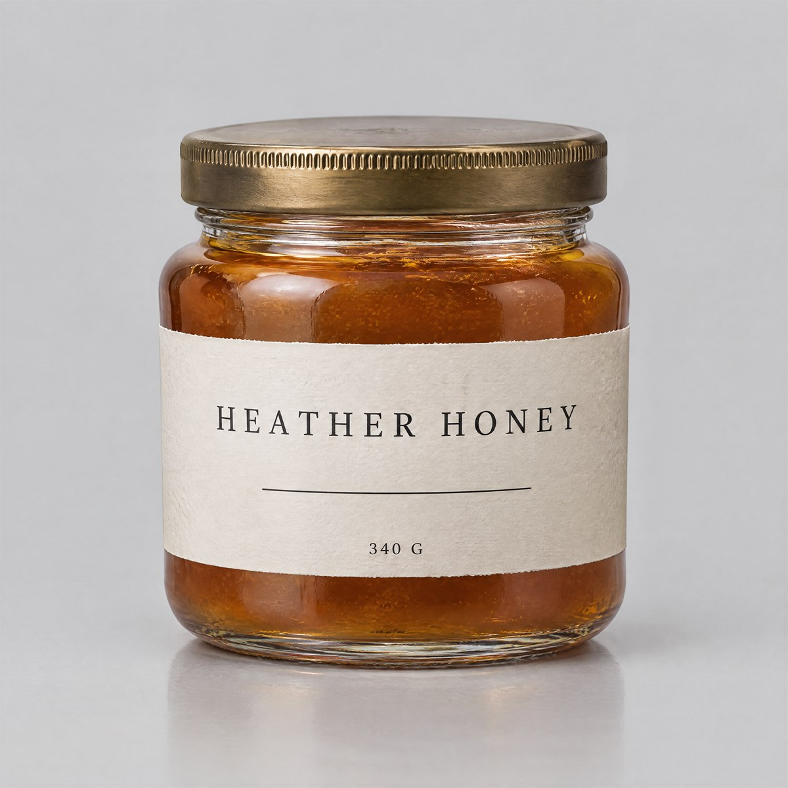<br><sub><b>Image 1</b></sub></td>
</tr></table>

<details>
<summary><b>Prompt</b> — 583 words, 3,233 characters</summary>

```text
Image 1: the product — the sole authority for the jar's form, its proportions, its glass thickness and base, its
bronze knurled lid, the level and colour of the honey inside, the paper label, and every character printed on
it. It supplies no setting, no camera and no lighting.

TASK
Keep the jar exactly as it is and re-photograph it on a weathered oak board in a kitchen, keeping the label
square to the camera and fully legible.

PRESERVE EXACTLY
- The jar's geometry: squat proportions, wide shoulder, short neck, the thickness of the glass at the base, and
  the lid's diameter relative to the body.
- The lid: dark bronze, the fine knurled band around its edge, and its position squarely on the neck.
- The contents: the same deep amber honey at the same level, with the same cloudy depth and the same
  glass-to-honey edge visible in the shoulder.
- The label: the same off-white uncoated paper, the same wrap and registration to the jar's vertical axis, the
  same uneven cut edge, and the same text in the same places — "HEATHER HONEY" on the upper third in
  wide-tracked uppercase serif, one thin horizontal rule below it, and "340 G" small and centred at the bottom.
  Both strings must render once, crisply, and unobstructed.
- The jar's silhouette. It must not be restyled, made taller, made into plastic, or given a different lid.

THE NEW SETTING
A worn oak board, its surface scarred and slightly uneven, running across the lower third of the frame. To the
right of the jar, a folded unbleached linen cloth. To the left of the jar, lying flat on the board, one small
sprig of dried heather. Behind, out of focus, a plain warm plaster wall.

MATCH NATURALLY
- Light direction: one window off-frame to the LEFT, so the jar is lit from the left. Its lit side is on the
  left, its shadow falls to the right, and the linen cloth's fold shadows agree with the same direction.
- Contact shadow: one soft-edged shadow beneath the base, short and to the right, denser where the base meets
  the board and fading outward. The jar must sit on the board, not float above it.
- Reflection: a faint reflection of the jar's base and lower body in the polished parts of the oak immediately
  beneath it, weaker than the reflection of the jar in Image 1.
- Glass behaviour: the same internal refraction and the same dark edge where the glass meets the surface below.
- Colour temperature: the morning window light is warm and the shadows are cool, applied to the jar, the cloth
  and the heather without changing the honey's own amber.
- Scale: the jar remains the largest object in the frame, and the cloth and heather are both clearly smaller
  than it.

DO NOT
- Do not redesign, restyle, recolour or reshape the jar, the lid or the label, and do not change a single
  character on the label.
- Do not add a second jar, a spoon, a dipper, toast, a knife, flowers, honeycomb, a bee, a cup or a hand.
- Do not paste the jar flat: no outline, no cut-out edge, no uniform drop shadow, no missing contact shadow,
  no flat colour fill, no ghost halo around the silhouette.
- Do not apply a shadow or reflection that disagrees with the light coming from the left.
- No text anywhere except the two label strings, no logo, no watermark.
```

</details>

[Case page →](cases/28-product-on-a-new-background/) &nbsp;·&nbsp; [Full-size image](cases/28-product-on-a-new-background/full.jpg) &nbsp;·&nbsp; [Prompt file](cases/28-product-on-a-new-background/prompt.txt)

---

### 29 · Photo to Watercolor

<sub>Image-to-image · medium change</sub>

<p align="center">

</p>

<sub><code>gpt-image-2.5-sunburst</code> &nbsp;·&nbsp; image-to-image &nbsp;·&nbsp; 2K &nbsp;·&nbsp; 2:3 &nbsp;·&nbsp; 1664 × 2512 px &nbsp;·&nbsp;  s &nbsp;·&nbsp; 4,107 characters</sub>

Repainted completely — and still the same person in the same light.

**Built from these reference images**, in the order the prompt calls them:

<table><tr>
<td width="100%">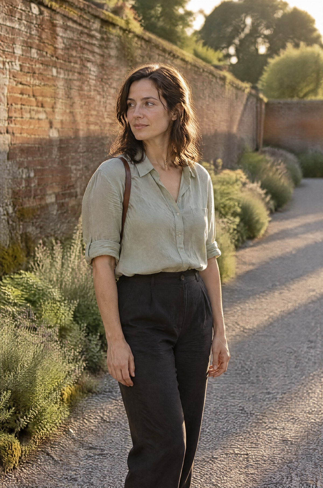<br><sub><b>Image 1</b></sub></td>
</tr></table>

<details>
<summary><b>Prompt</b> — 772 words, 4,107 characters</summary>

```text
Image 1: the photograph — the sole authority for the composition, the pose, the framing, the direction of the
light and the identity of the person. It supplies no paint, no brushwork and no paper.

TASK
Repaint Image 1 as an original watercolour on rough cold-pressed paper, at the same composition and the same
framing, so that it reads as a painted study made from the photograph rather than a photograph with a filter
over it.

THE PERSON — preserve her exactly as she appears in Image 1
- Her hair is worn LOOSE and down, falling just past her jaw with a slight wave, with several strands lying
  across her cheek and one behind the ear. Her hair is NOT tied up: do not add a bun, a twist, a knot, a
  ponytail or a hair clip, and do not lift it off her neck.
- Her clothing is exactly as in the photograph: a pale sage linen shirt with the collar open, sleeves rolled to
  the elbow, tucked into DARK charcoal trousers. The trousers are dark. Do not lighten them, do not make them
  cream, beige or stone, and do not change them to a skirt.
- Both arms hang relaxed at her sides and BOTH HANDS ARE EMPTY AND VISIBLE, held slightly away from the body.
  Do not put a hand in a pocket, do not cross her arms, and do not hide either hand.
- The only bag in the picture is the thin dark leather STRAP crossing her right shoulder, visible where it
  passes over the shirt. There is no bag body visible, no tote bag, no canvas bag and no second strap.
- Her face: the same structure, the same narrow jaw, the same straight nose and eyebrow shape, and the same
  quiet expression with the mouth closed. Her gaze is directed off to the left of the frame.

PRESERVE — the setting and the light
- The wall runs from the near left into the distance at the same angle, and it is RED-BROWN BRICK with visible
  courses and mortar lines, with moss at its base. It is brick, not stone, not rough rubble and not concrete.
- The planting along the wall's base, the gravel path receding behind her, and the tops of the trees above the
  wall line in the same place.
- The sun comes from behind and to her left exactly as in Image 1: the rim of her shoulder, the edge of her hair
  and the fold of her sleeve are the brightest edges, and the long shadows fall on the gravel toward the right.
- The gravel is neutral grey and the brick is warm red-brown.

CHANGE — the medium, completely
- Paint, not pixels. Loose wet-in-wet washes laid in broad passages, pigment blooming where two washes meet,
  granulation settling visibly at those boundaries, and the paper's tooth showing through every wash.
- Several edges deliberately lost: the far end of the wall and the distant treetops dissolve into the paper with
  no line at all, and the gravel path fades out rather than being drawn.
- Whites are unpainted paper. There is no white body paint anywhere, and the brightest values come from areas
  where nothing was applied.
- A few dry-brush skips across the grain, and one or two places where the paper was left to dry before the next
  wash, so the boundary is crisp and irregular rather than soft.
- Palette limited to five pigments: warm ochre, burnt sienna, cool grey-blue, soft sage for the shirt, and one
  deep indigo for the darkest notes in her hair and the wall shadow.
- Figures are suggested, not detailed: her face is a small number of carefully placed shapes with the features
  read from value rather than from line, and her hands are simple masses with no drawn fingers.

DO NOT
- Do not restyle her hair, her clothing or her pose in any way. Do not add a bag, a hat, a scarf or sunglasses.
- Do not make it photographic: no sharp photographic detail, no photographic grain, no lens blur, no depth of
  field, no noise and no digital gradient.
- Do not smooth her face into a generic pretty face, and do not change her apparent age.
- Do not change the direction of her gaze or the direction of the light.
- Do not add people, animals, a gate, a doorway, a bench, a bicycle or flowers in her hands.
- Do not sign it, date it, add a stamp or a watermark, and do not paint a white border around the picture.
```

</details>

[Case page →](cases/29-photo-to-watercolor/) &nbsp;·&nbsp; [Full-size image](cases/29-photo-to-watercolor/full.jpg) &nbsp;·&nbsp; [Prompt file](cases/29-photo-to-watercolor/prompt.txt)

---

### 30 · Character Across Scenes

<sub>Image-to-image · three references, three jobs</sub>

<p align="center">

</p>

<sub><code>gpt-image-2.5-sunburst</code> &nbsp;·&nbsp; image-to-image &nbsp;·&nbsp; 4K &nbsp;·&nbsp; 2:3 &nbsp;·&nbsp; 2336 × 3520 px &nbsp;·&nbsp;  s &nbsp;·&nbsp; 4,254 characters</sub>

One says who, one says how, one says where — and all three hold at once.

**Built from these reference images**, in the order the prompt calls them:

<table><tr>
<td width="33%">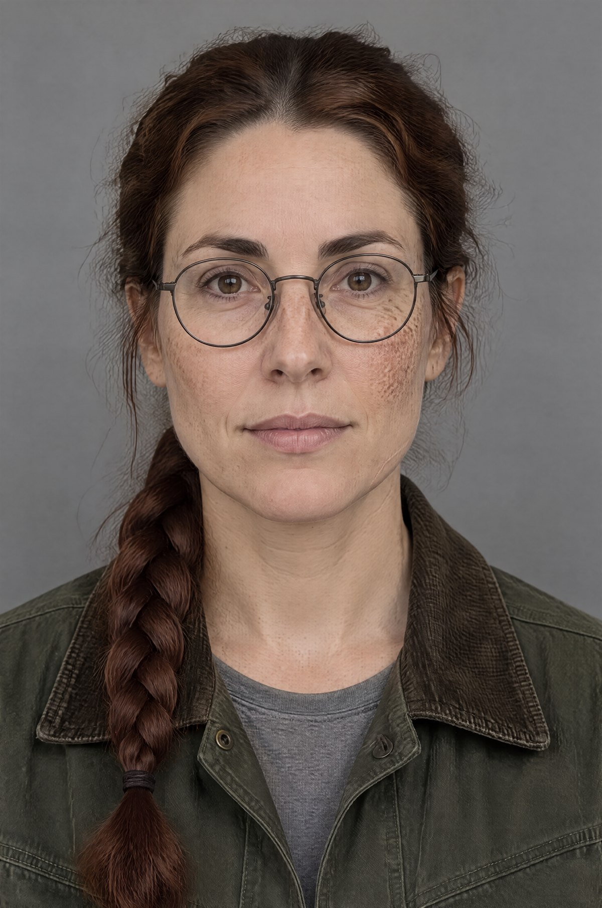<br><sub><b>Image 1</b></sub></td>
<td width="33%">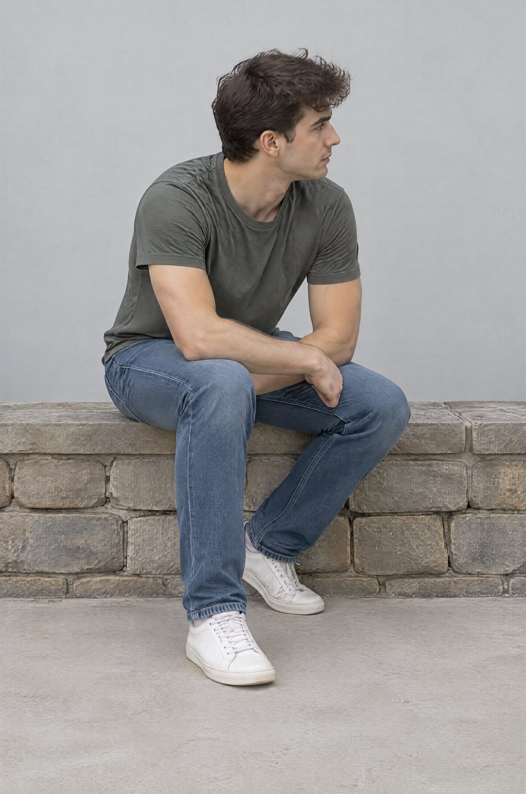<br><sub><b>Image 2</b></sub></td>
<td width="33%">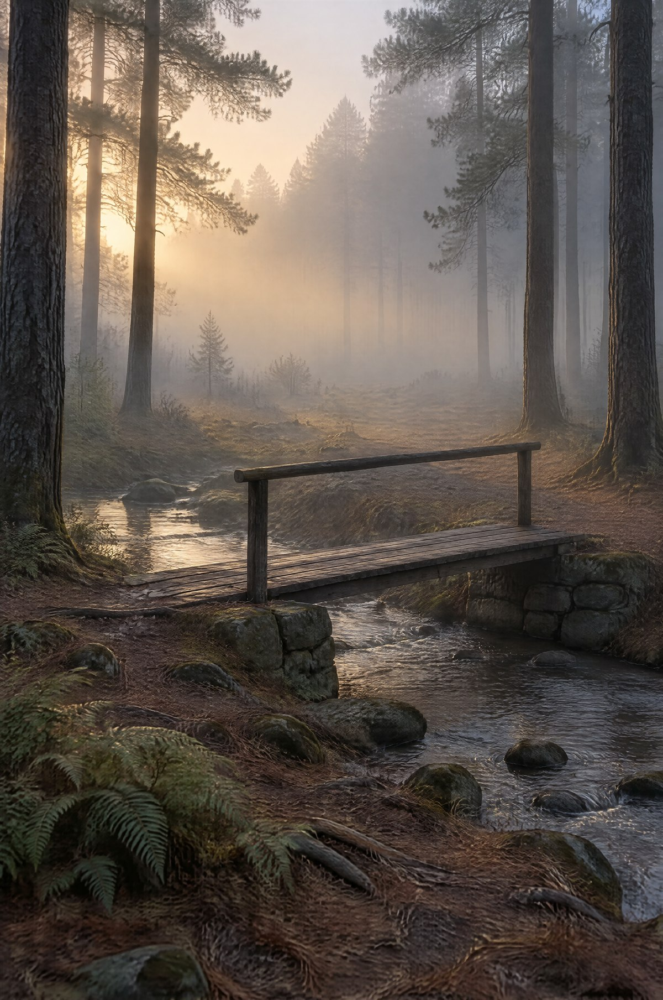<br><sub><b>Image 3</b></sub></td>
</tr></table>

<details>
<summary><b>Prompt</b> — 792 words, 4,254 characters</summary>

```text
Image 1: the person — the sole authority for who she is: her face, her age, her hair and the braid, her glasses,
her freckles, the scar on her jaw, and the clothing she wears. It supplies no pose, no place and no light.
Image 2: the pose — the sole authority for how she is arranged: the seated posture, the turn of the body, the
position of the limbs, the position of the head, and the framing of the shot. It supplies no identity and no
environment.
Image 3: the place and the light — the sole authority for the space, the camera position within it, the scale of
everything, the atmosphere and the direction and quality of every light. It supplies no person.

TASK
Paint the botanist from Image 1 seated in the pose from Image 2 on the low stone abutment of the footbridge in
Image 3, lit by that clearing's dawn light.

CONFLICT POLICY — read this before composing
- Image 1 wins on identity and on the appearance of her clothing, hair, glasses and the braid. Her freckles,
  the scar and the braid's side must not change.
- Image 2 wins on the pose and on where the frame is cut, so both feet stay inside the picture.
- Image 3 wins on everything about the world: the depth of the fog, the wetness of the ground, the direction of
  the light and the colour of the atmosphere.
- Where Image 1 and Image 3 disagree about colour, Image 3 wins on the light falling on her and Image 1 wins on
  the hue of the garment itself: a sage shirt stays sage, but its shading is derived from the clearing.
- Where Image 2 and Image 3 disagree about scale, Image 3 wins, so the bridge and the trunks keep their size
  and the figure is scaled to them.

PRESERVE EXACTLY
- Her face: the same structure, the same freckles across the nose and both cheekbones, the same round wire
  glasses, and the braid over the same shoulder ending at the same length.
- Her clothing: the same dark green canvas jacket with its corduroy collar, worn open at the throat over the
  same grey shirt, and the same dark trousers.
- The pose: seated, body turned a quarter to the right, leaning forward with both forearms on the thighs, left
  foot flat on the ground, right foot slightly back, head turned to look off to the right.
- The place: the clearing's pine trunks receding into fog, the needle floor, the ferns, the shallow stream, the
  timber footbridge on its two low stone abutments, and the fog thickest at about eight metres' depth.
- The light: one low sun outside the frame to the upper left, filtered through fog so it is diffuse and
  volumetric rather than hard, with everything near the light band warm and everything nearer and further away
  cool blue-grey.

MATCH NATURALLY
- She sits ON the stone abutment: her weight compresses the moss there, and her shadow falls on the stone
  beneath her, agreeing with the light coming from the upper left.
- Her shadow joins the long trunk shadows already running toward the lower right; she casts no shadow of her own
  in a different direction.
- Fog behaves with depth: she sits behind the nearest fog and in front of the thickest band, so her silhouette
  is slightly softened at its edges and the ground between her and the camera is a little lighter than the
  ground beyond her.
- Her jacket's damp-weather behaviour matches the clearing: canvas takes on a faint sheen where the fog settles
  and a slight darkening at the shoulders.
- Colour temperature: her rim light is warm pale gold because the sun is behind and above her left shoulder;
  everything facing the camera is lit only by the cool ambient fog, so her face is cool and her edges are warm.
- Grain, focus and contrast identical to the surrounding scene.

DO NOT
- Do not change her identity, her age, her build, or the side the braid falls on.
- Do not change the pose, add a hand on a rail, straighten her spine, or stand her up.
- Do not change the bridge, the stream, the trunks, the fog's depth, the camera height or the direction of the
  light.
- Do not add a second person, a dog, a backpack, a tripod, a notebook, a campfire, a tent or litter.
- Do not introduce hard sun shafts or god rays; the light is diffuse in fog.
- Do not add colour accents that are not in Image 3, and do not warm the whole frame.
- No text, no signage, no watermark.
```

</details>

[Case page →](cases/30-character-across-scenes/) &nbsp;·&nbsp; [Full-size image](cases/30-character-across-scenes/full.jpg) &nbsp;·&nbsp; [Prompt file](cases/30-character-across-scenes/prompt.txt)


---

## How to use a case

1. **Look at the frame.** It was produced with the model, settings and aspect ratio printed on the case page — including the **measured pixel dimensions of the output**, because a requested `4K` is not a promise of 4096 px.
2. **Copy the prompt** from `prompt.txt` — it is a complete, filled brief. There are no `[PLACEHOLDERS]` to replace.
3. **Change what the case tells you to change.** Each case lists two to four adaptations and, where it matters, what has to change along with them.
4. **For image-to-image cases, attach the reference images first, in order.** The prompt refers to `Image 1`, `Image 2`, `Image 3` — the order is part of the prompt, and swapping two references is a different request. All five image-to-image cases also publish **the prompt that generated each reference**, so the whole recipe is reproducible.

## What this atlas does differently

| | This atlas | Typical prompt repository |
|---|---|---|
| Complete, filled prompts — nothing left to substitute | ✅ | often `[YOUR PRODUCT HERE]` |
| The exact frame that prompt produced | ✅ | sometimes |
| Composition declared **before** the subject | ✅ every case | rarely |
| Exact visible text quoted verbatim, then checked character by character | ✅ | rarely |
| Data that has to be internally consistent, not just plausible | ✅ | never |
| Object and panel counts that are stated, numbered, and then verified | ✅ | never |
| Materials and light as separate controls, not "cinematic premium" | ✅ | rarely |
| Model and settings recorded per case, including measured output pixels | ✅ | usually missing |
| Image-to-image: reference order, and which reference supplies what | ✅ | almost never |
| **A written conflict policy** for when two references disagree | ✅ | never |
| **The prompt that generated each reference image**, so the whole recipe is reproducible | ✅ | never |
| **A controlled tier comparison** on identical prompts | ✅ | never |
| Honest notes on what failed or needed a retry | ✅ | almost never |

Cases are not silently re-rolled until something pretty comes out. When a render misses, the case says what missed and what was changed — the [Lunar Courier sheet](cases/09-lunar-courier-character-sheet/) for a failure traced to a contradiction in the prompt, [One Room, Warmer](cases/10-one-room-warmer/) for one that broke its own preservation list, [Photo to Watercolor](cases/29-photo-to-watercolor/) for one where the subject did not survive the change of medium, and [In-Game Footage](showcase/06-gta6-style-in-game-footage/) for one where naming a game produced the genre's texture instead of its identity.

## What is behind the prompts

Every craft case is written against the same set of principles — composition before subject, light before material, materials described by behaviour rather than by name, exact text quoted once and checked, counts that close, preserve lists longer than the task, one job per reference, and a stated winner when references disagree. They are written up in **[docs/craft.md](docs/craft.md)**, ordered by how much damage ignoring them does, and the workflow around rendering them — including the two mistakes that produce bad frames — is in **[docs/how-to-use.md](docs/how-to-use.md)**.

The showcase set runs the opposite experiment. Read [case 14](showcase/14-celebrity-in-real-life/) (16 words) against [case 13](showcase/13-silhouette-universe-poster/) (494 words): the same model, the same settings, and two completely different answers to the question of how much a prompt should say.

## Settings used

Every case records its model, aspect ratio, requested quality and **measured output pixels**. Two routes were used, and they expose different controls:

- **Resolution tiers** (`1K` / `2K` / `4K`) — a fixed pixel size per aspect ratio.
- **Quality tiers** (`low` / `medium` / `high` / `xhigh` / `max`) — a fidelity budget, with the pixel size fixed by the aspect ratio alone.

| Requested | Actual |
|---|---|
| 2K · 4:3 | 2368 × 1776 |
| 2K · 16:9 | 2736 × 1536 |
| 2K · 3:2 | 2512 × 1664 |
| 2K · 2:3 | 1664 × 2512 |
| 4K · 3:2 | 3520 × 2336 |
| 4K · 2:3 | 2336 × 3520 |
| 4K · 3:4 | 2480 × 3312 |
| 4K · 4:3 | 3312 × 2480 |
| 4K · 1:1 | 2880 × 2880 |
| 4K · 16:9 | 3840 × 2160 |
| 4K · 9:16 | 2160 × 3840 |
| 4K · 21:9 | 3840 × 1648 |
| xhigh · 3:2 | 1536 × 1024 |
| xhigh · 3:4 | 1024 × 1536 |
| xhigh · 1:1 | 1024 × 1024 |

## Coverage

Street and candid photography · portraits and editorial · night and mixed lighting · UI and social interfaces · social-media mockups · game screenshots and key art · isometric and pixel art · typography and poster design · dense multi-element grids · product and food advertising · brand identity · world building and cutaways · character design and consistency · sequential art · infographics · architecture · science fiction and fantasy · image-to-image editing, compositing and reference consistency.

## Repository layout

```
showcase/                  20 short prompts — the front page
  <nn>-<short-name>/
    README.md              what it is, how to adapt it, what to watch
    prompt.txt             the prompt, verbatim where marked
    source.json            origin, wording, and any adaptation with its reason
    preview.jpg            gallery image
    full.jpg               full-size download
    generation-or-<tier>.json  model, quality, token count, cost, prompt hash
  (cases 16-20 additionally carry preview-flare/-sunburst and full-flare/-sunburst)

cases/                     30 engineering briefs — the long end
  <nn>-<short-name>/
    README.md · prompt.txt · preview.jpg · full.jpg · generation.json
    reference-N.jpg        image-to-image cases, in the order the prompt refers to them
    reference-prompt-N.txt how each reference image was generated

docs/
  flare-vs-sunburst.md     the controlled tier comparison, five prompts, both frames
  how-to-use.md            adapting a case, and the failure modes worth knowing
  craft.md                 the prompting principles behind every case
```

## Contributing

Cases are welcome and must arrive with their frame. See [CONTRIBUTING.md](CONTRIBUTING.md).

## License

Prompts and documentation: **CC BY 4.0** — use them commercially, credit the atlas. Images: CC BY 4.0 unless the case says otherwise.

Fifteen showcase prompts are reproduced verbatim from the [GPT Image Prompt Library](https://cyberbara.com/gpt-image-prompt-library); each such case carries a source note and the images here were generated for this repository.

This is an independent resource. It is not affiliated with, endorsed by, or sponsored by OpenAI.

---

<div align="center">

**If this saved you a generation or two, a star helps other people find it.**


</div>

<!-- CTA_HOME -->
