<div align="center">

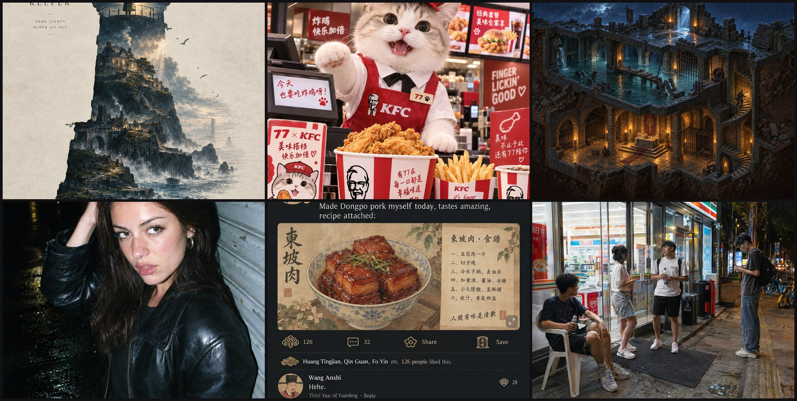

# GPT Image 2.5 Prompt Atlas

**Fifty prompts for `gpt-image-2.5`, each shipped with the exact frame it produced 鈥?and a measured answer to the question everyone repeats instead of testing: Flare or Sunburst?**


<sub><b>Start here</b> 路 <a href="#the-showcase--twenty-short-prompts">Showcase</a> 路 <a href="#flare-or-sunburst-we-measured-it">Tier comparison</a> 路 <a href="#the-craft-cases--thirty-complete-briefs">Craft cases</a> 路 <a href="#how-to-use-a-case">How to use</a> 路 <a href="#repository-layout">Layout</a></sub>

</div>

---

## Two ends of one model

Most prompt repositories pick a side: either a wall of two-sentence ideas, or a shelf of thousand-word specifications. This one ships both, side by side, so you can see what each actually buys.

| | **Showcase** 鈥?20 prompts | **Craft cases** 鈥?30 prompts |
|---|---|---|
| **Length** | 5 to 494 words | 400 to 4,500 words |
| **What is specified** | one idea | canvas, light, materials, exact text, counts |
| **What the model decides** | almost everything | almost nothing |
| **Good for** | seeing what the model does unprompted | shipping a frame that has to be right |
| **Where** | [`showcase/`](showcase/) | [`cases/`](cases/) |

The two ends are the argument. Read [case 14](showcase/14-celebrity-in-real-life/) 鈥?sixteen words 鈥?against [case 13](showcase/13-silhouette-universe-poster/) 鈥?four hundred and ninety-four 鈥?and you have the whole question of prompt length answered by the same model on the same day.

---

## The showcase 鈥?twenty short prompts

Each of these asks for one idea and shows how far the model takes it on its own. **Fifteen are reproduced verbatim** from the [GPT Image Prompt Library](https://cyberbara.com/gpt-image-prompt-library) so you can read the reference idiom unedited 鈥?including the five-word ones. **The last five are written for this atlas** and rendered on both tiers as a controlled comparison.

<table>
<tr>
<td width="33%" valign="top">
<a href="showcase/01-convenience-store-night-scene/">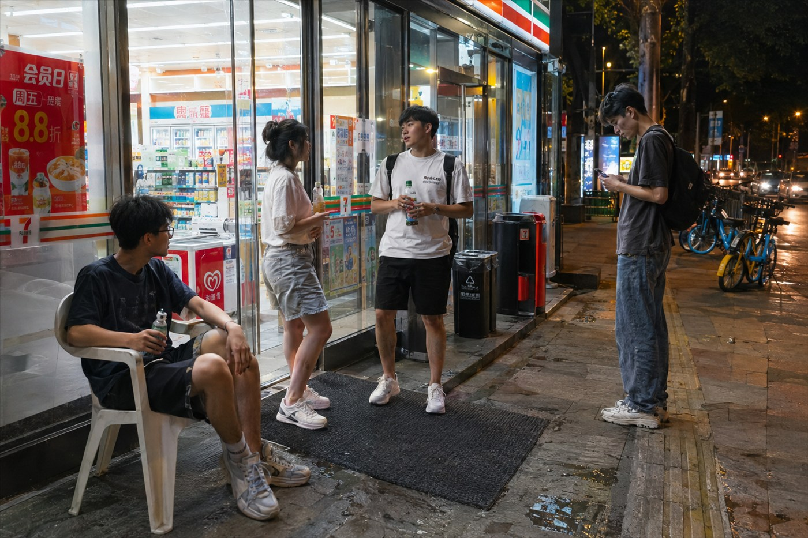</a>
<br><b><a href="showcase/01-convenience-store-night-scene/">Convenience Store Night Scene</a></b><br>
<sub>Photography 路 verbatim 路 145 words</sub><br>
<sub>Four friends outside a shop at 10 PM. Nobody posing.</sub>
</td>
<td width="33%" valign="top">
<a href="showcase/02-raw-iphone-subway-station/">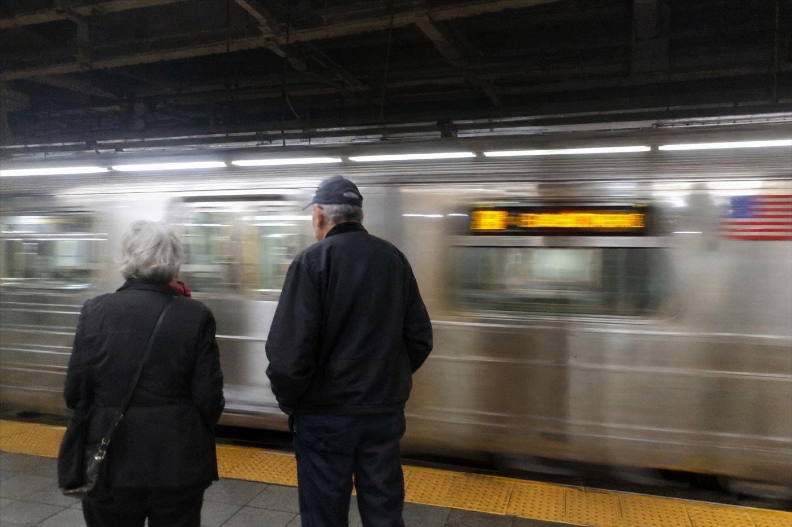</a>
<br><b><a href="showcase/02-raw-iphone-subway-station/">RAW iPhone Quality - Subway Station</a></b><br>
<sub>Photography 路 verbatim 路 38 words</sub><br>
<sub>A subway platform, rendered deliberately unprocessed.</sub>
</td>
<td width="33%" valign="top">
<a href="showcase/03-rice-grain-micro-typography/">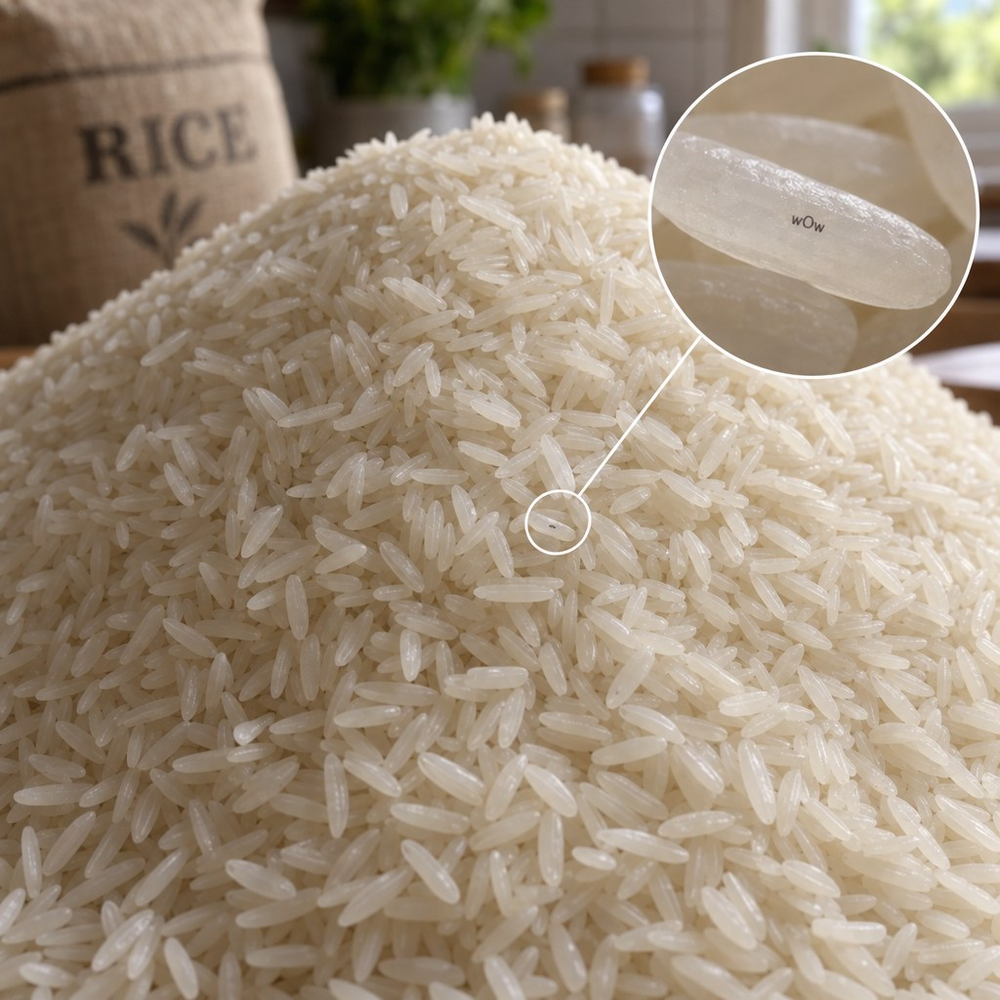</a>
<br><b><a href="showcase/03-rice-grain-micro-typography/">Rice Grain Micro Typography</a></b><br>
<sub>Typography 路 verbatim 路 19 words</sub><br>
<sub>Nineteen words. Three characters, on one grain of rice.</sub>
</td>
</tr>
<tr>
<td width="33%" valign="top">
<a href="showcase/04-360-equirectangular-panorama/">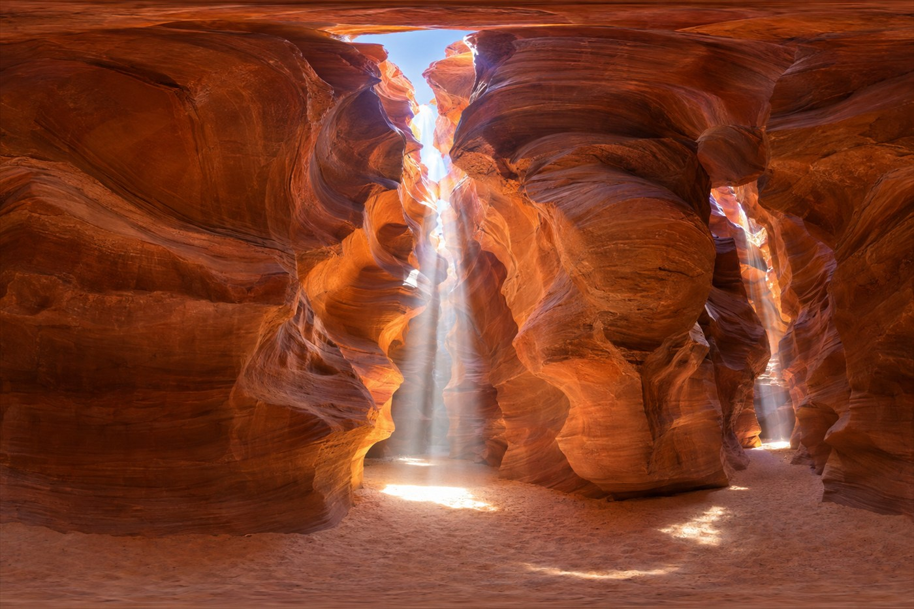</a>
<br><b><a href="showcase/04-360-equirectangular-panorama/">360 Equirectangular Panorama</a></b><br>
<sub>Photography 路 verbatim 路 5 words</sub><br>
<sub>A 360 frame. Sunbeams through a slot canyon at noon.</sub>
</td>
<td width="33%" valign="top">
<a href="showcase/05-90s-point-and-shoot/"></a>
<br><b><a href="showcase/05-90s-point-and-shoot/">90s Point-and-Shoot Aesthetic</a></b><br>
<sub>Photography 路 verbatim 路 5 words</sub><br>
<sub>Five words, and the whole picture is decided.</sub>
</td>
<td width="33%" valign="top">
<a href="showcase/06-gta6-style-in-game-footage/">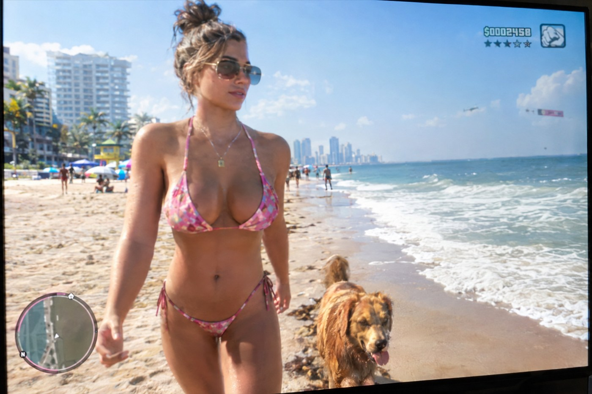</a>
<br><b><a href="showcase/06-gta6-style-in-game-footage/">GTA 6 Style In-Game Footage</a></b><br>
<sub>Game 路 verbatim 路 47 words</sub><br>
<sub>An open-world screenshot, interface and all.</sub>
</td>
</tr>
<tr>
<td width="33%" valign="top">
<a href="showcase/07-100-pixel-art-items-grid/">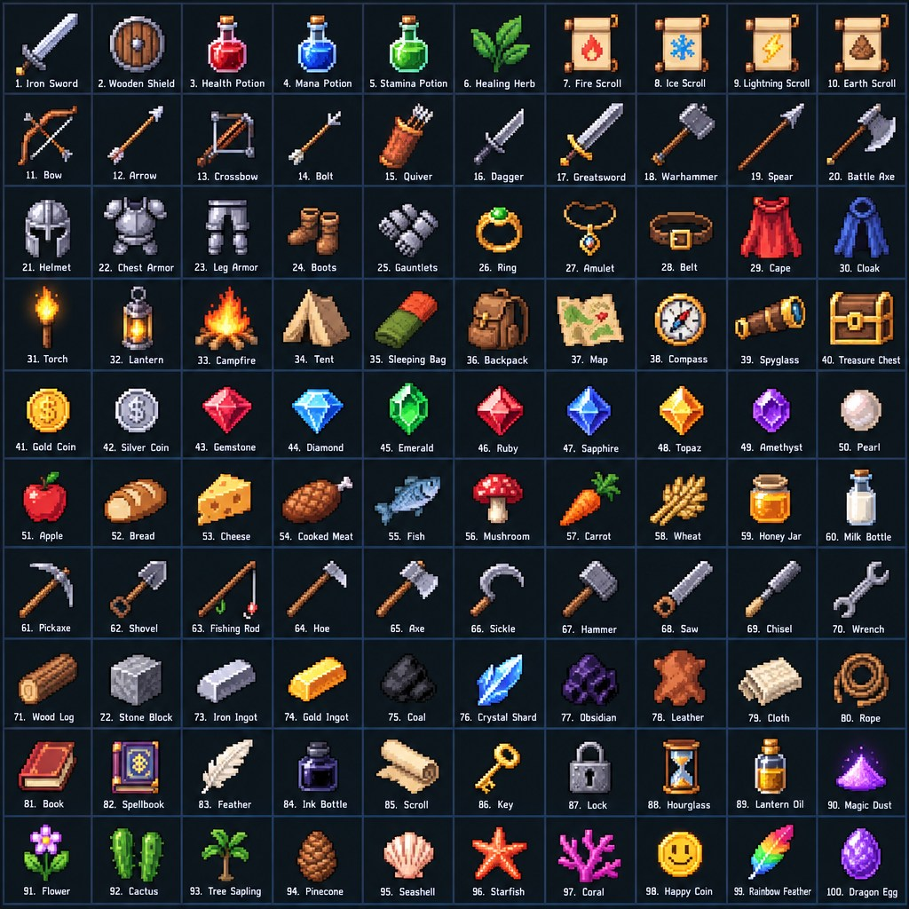</a>
<br><b><a href="showcase/07-100-pixel-art-items-grid/">100 Pixel Art Items Grid</a></b><br>
<sub>Typography 路 verbatim 路 19 words</sub><br>
<sub>A hundred distinct objects on a ten-by-ten grid.</sub>
</td>
<td width="33%" valign="top">
<a href="showcase/08-live-streaming-screenshot/">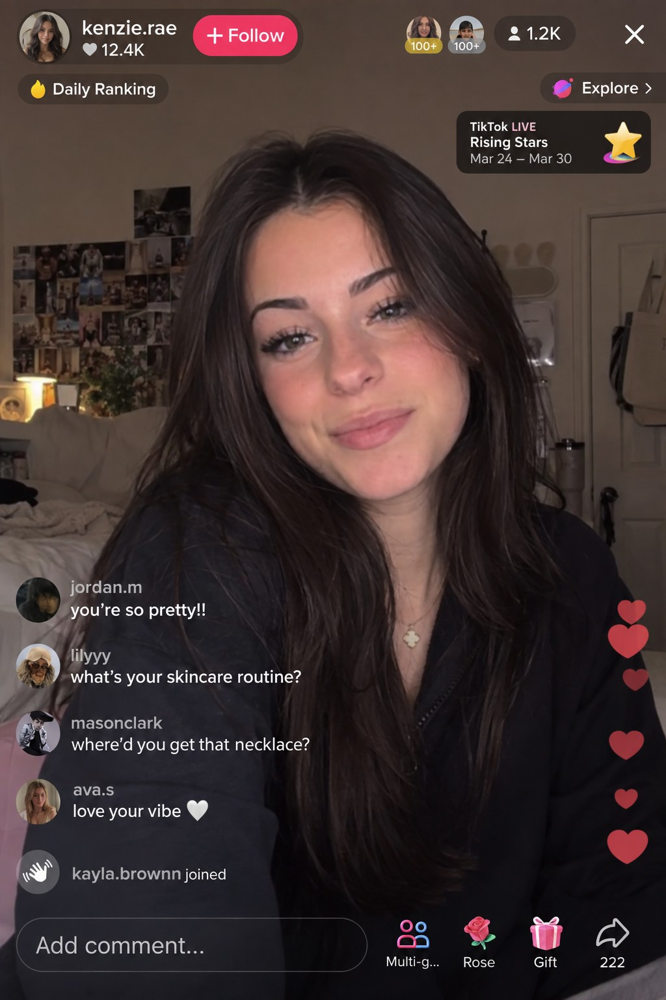</a>
<br><b><a href="showcase/08-live-streaming-screenshot/">Live Streaming Screenshot</a></b><br>
<sub>UI/UX 路 verbatim 路 13 words</sub><br>
<sub>A live stream, drawn down to the gift icons.</sub>
</td>
<td width="33%" valign="top">
<a href="showcase/09-song-dynasty-social-feed/">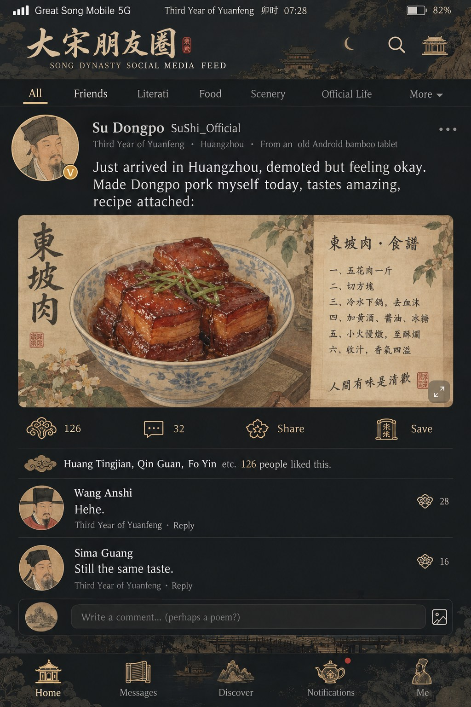</a>
<br><b><a href="showcase/09-song-dynasty-social-feed/">Song Dynasty Social Media Feed</a></b><br>
<sub>UI/UX 路 verbatim 路 152 words</sub><br>
<sub>A Song dynasty group chat. Dongpo pork, 126 likes.</sub>
</td>
</tr>
<tr>
<td width="33%" valign="top">
<a href="showcase/10-wechat-chat-smartphone-photo/"></a>
<br><b><a href="showcase/10-wechat-chat-smartphone-photo/">WeChat Chat Interface Smartphone Photo</a></b><br>
<sub>UI/UX 路 verbatim 路 107 words</sub><br>
<sub>A chat photographed off a phone, scratches and glare.</sub>
</td>
<td width="33%" valign="top">
<a href="showcase/11-pet-brand-collaboration/">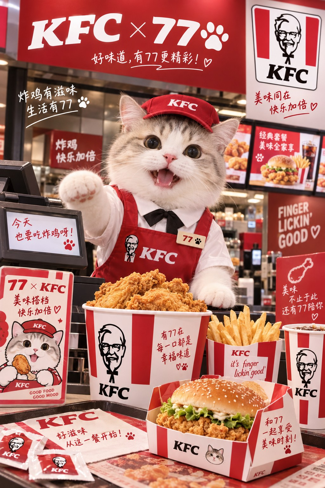</a>
<br><b><a href="showcase/11-pet-brand-collaboration/">Pet Brand Collaboration Poster</a></b><br>
<sub>Editing 路 verbatim 路 98 words</sub><br>
<sub>A cat in a fast-food uniform, and a whole campaign kit.</sub>
</td>
<td width="33%" valign="top">
<a href="showcase/12-world-time-clock-wall/"></a>
<br><b><a href="showcase/12-world-time-clock-wall/">World Time Analog Clock Wall</a></b><br>
<sub>Typography 路 verbatim 路 50 words</sub><br>
<sub>Six clocks, six cities, one instant. All of them right.</sub>
</td>
</tr>
<tr>
<td width="33%" valign="top">
<a href="showcase/13-silhouette-universe-poster/">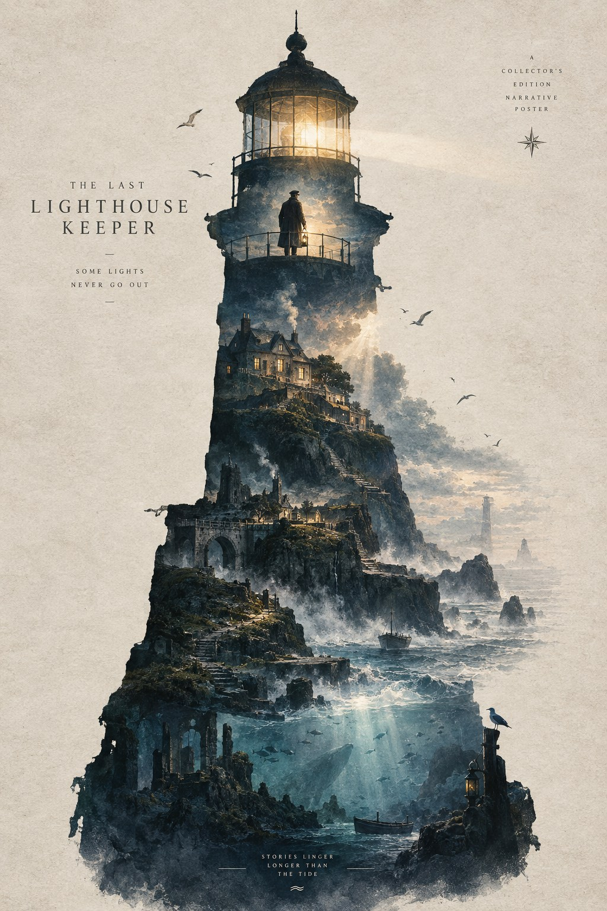</a>
<br><b><a href="showcase/13-silhouette-universe-poster/">Silhouette Universe Narrative Poster</a></b><br>
<sub>Typography 路 verbatim 路 494 words</sub><br>
<sub>494 words. A poster that reveals itself in three passes.</sub>
</td>
<td width="33%" valign="top">
<a href="showcase/14-celebrity-in-real-life/"></a>
<br><b><a href="showcase/14-celebrity-in-real-life/">Celebrity in real life</a></b><br>
<sub>Photography 路 verbatim 路 16 words</sub><br>
<sub>Sixteen words. Three tech figures, one popcorn counter.</sub>
</td>
<td width="33%" valign="top">
<a href="showcase/15-apple-park-keynote-crowd/">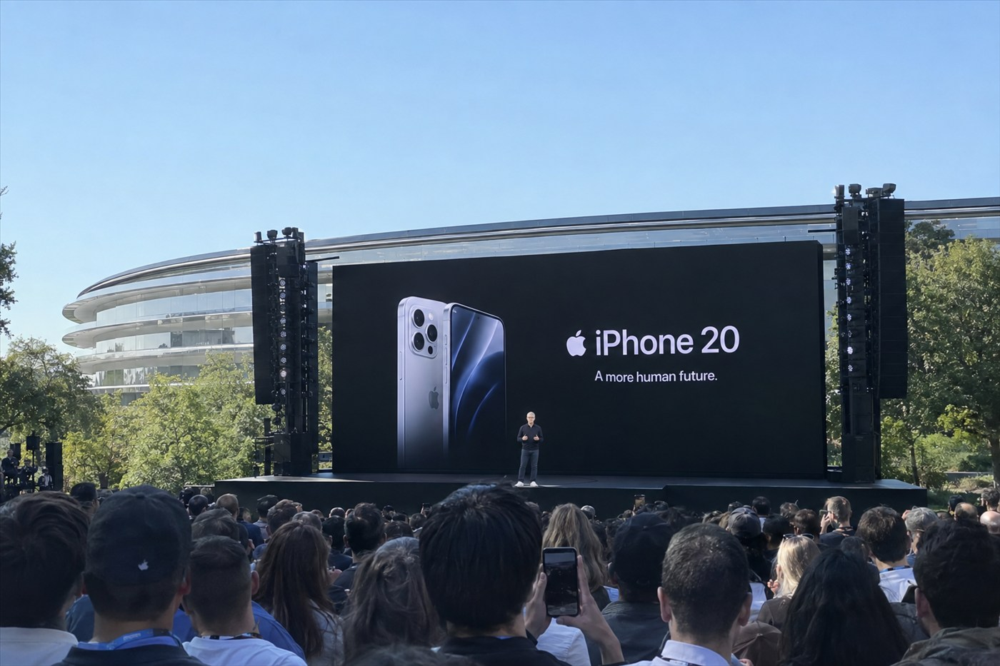</a>
<br><b><a href="showcase/15-apple-park-keynote-crowd/">Apple Park Keynote Crowd Shot</a></b><br>
<sub>Photography 路 verbatim 路 23 words</sub><br>
<sub>A keynote from inside the crowd, stage far away.</sub>
</td>
</tr>
<tr>
<td width="33%" valign="top">
<a href="showcase/16-direct-flash-night-portrait/">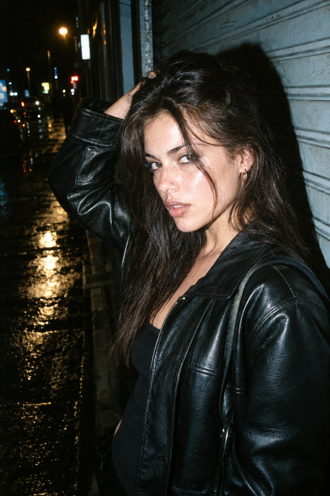</a>
<br><b><a href="showcase/16-direct-flash-night-portrait/">Direct Flash Night Portrait</a></b><br>
<sub>Photography 路 original 路 117 words</sub><br>
<sub>One hard flash, a wall, and nothing else in the frame.</sub>
</td>
<td width="33%" valign="top">
<a href="showcase/17-night-market-queue/">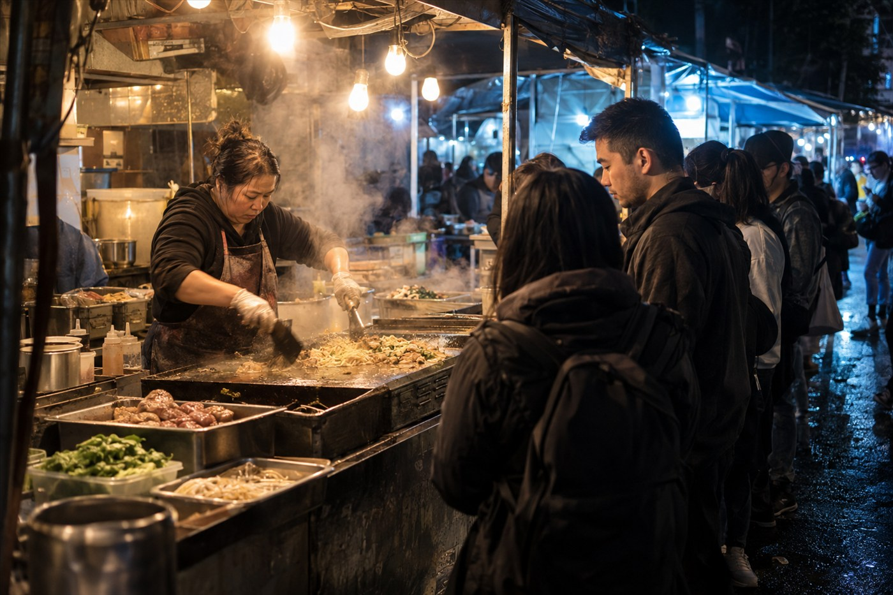</a>
<br><b><a href="showcase/17-night-market-queue/">Night Market Queue</a></b><br>
<sub>Photography 路 original 路 81 words</sub><br>
<sub>Three colour temperatures at eleven at night.</sub>
</td>
<td width="33%" valign="top">
<a href="showcase/18-golden-hour-backlight/">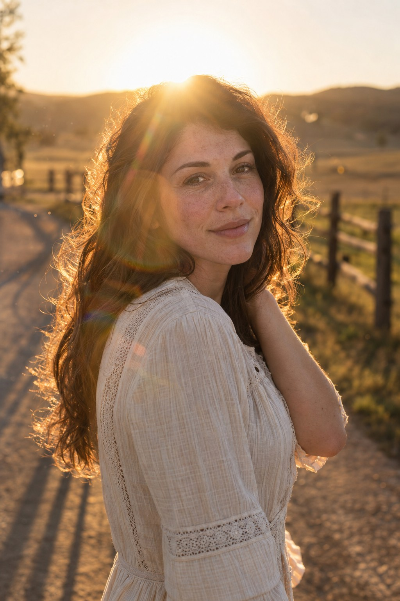</a>
<br><b><a href="showcase/18-golden-hour-backlight/">Golden Hour Backlight</a></b><br>
<sub>Photography 路 original 路 72 words</sub><br>
<sub>Nothing but light. Flare renders this one better.</sub>
</td>
</tr>
<tr>
<td width="33%" valign="top">
<a href="showcase/19-retro-racing-replay/"></a>
<br><b><a href="showcase/19-retro-racing-replay/">Retro Racing Game Replay</a></b><br>
<sub>Game 路 original 路 109 words</sub><br>
<sub>Five exact strings of HUD text. Sunburst wins this one.</sub>
</td>
<td width="33%" valign="top">
<a href="showcase/20-isometric-dungeon-key-art/">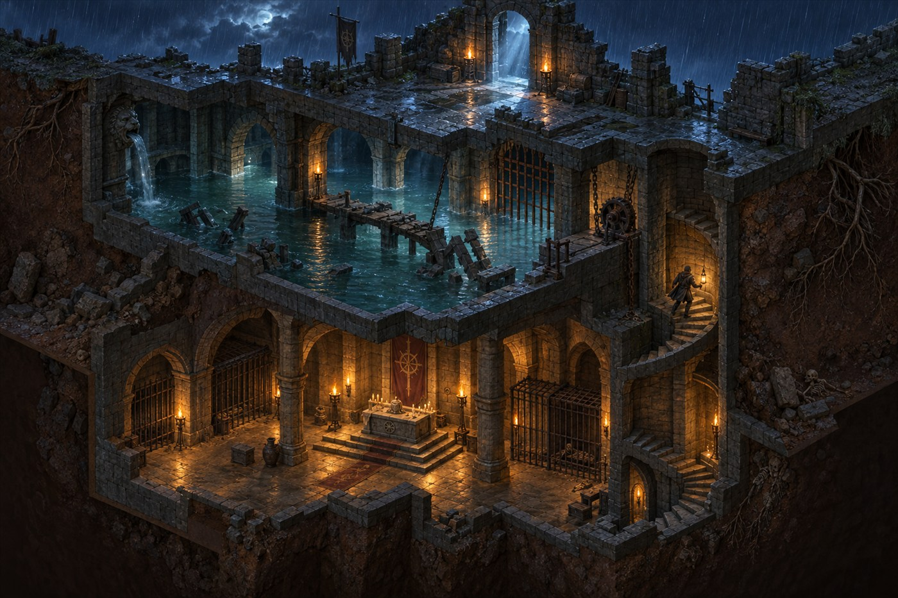</a>
<br><b><a href="showcase/20-isometric-dungeon-key-art/">Isometric Dungeon Key Art</a></b><br>
<sub>Game 路 original 路 131 words</sub><br>
<sub>Three levels, one cutaway, warm inside and cold above.</sub>
</td>
</tr>
</table>

### Flare or Sunburst? We measured it

We could not find anyone who had compared the two tiers rather than repeated the marketing copy, so we rendered five identical prompts through both and looked.

> **If the picture is about light, use Flare. If the picture is about arrangement, use Sunburst.**

Flare renders atmosphere 鈥?flare streaks, bloom, a believable falloff from one hard source. Sunburst renders structure 鈥?type on the baseline, interface elements on a grid, a layout that does not drift. They cost the same.

| Case | Winner | Margin |
|---|---|---|
| 16 Direct Flash Night Portrait | **Flare** | narrow |
| 17 Night Market Queue | tie | 鈥?|
| 18 Golden Hour Backlight | **Flare** | clear |
| 19 Retro Racing Game Replay | **Sunburst** | clear |
| 20 Isometric Dungeon Key Art | **Sunburst** | narrow |

**[Read the full comparison, both frames side by side 鈫抅(docs/flare-vs-sunburst.md)**

---

## The craft cases 鈥?thirty complete briefs

The long end. Each one is a filled specification rather than a description: the canvas is decided before the subject, every visible string is quoted once and then verified, object and panel counts are stated and made to close, and the reference roles are assigned one job each. Where a render missed, the case says what missed and what changed.

<table>
<table>
<table>
<tr>
<td width="33%" valign="top">
<a href="cases/04-miniature-crew-on-a-lens/"></a>
<br><b><a href="cases/04-miniature-crew-on-a-lens/">Miniature Crew on a Lens</a></b><br>
<sub>Scale contrast 路 macro diorama</sub><br>
<sub>Seven workers repairing a camera lens. One of them is standing on the glass.</sub>
</td>
<td width="33%" valign="top">
<a href="cases/08-isometric-bookshop-cutaway/">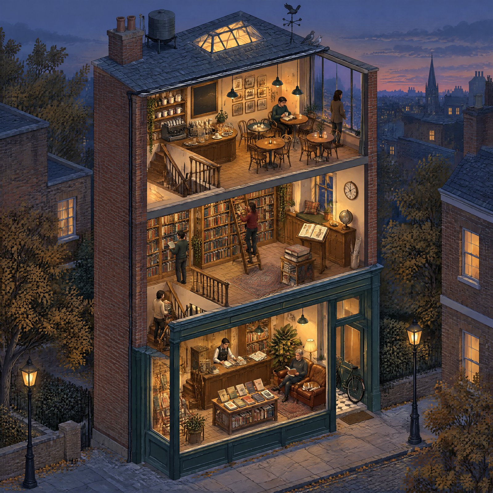</a>
<br><b><a href="cases/08-isometric-bookshop-cutaway/">Isometric Bookshop Cutaway</a></b><br>
<sub>World building 路 true isometric</sub><br>
<sub>Three floors of a bookshop, cold dusk outside, every lamp inside on.</sub>
</td>
<td width="33%" valign="top">
<a href="cases/05-exploded-ramen-bowl/">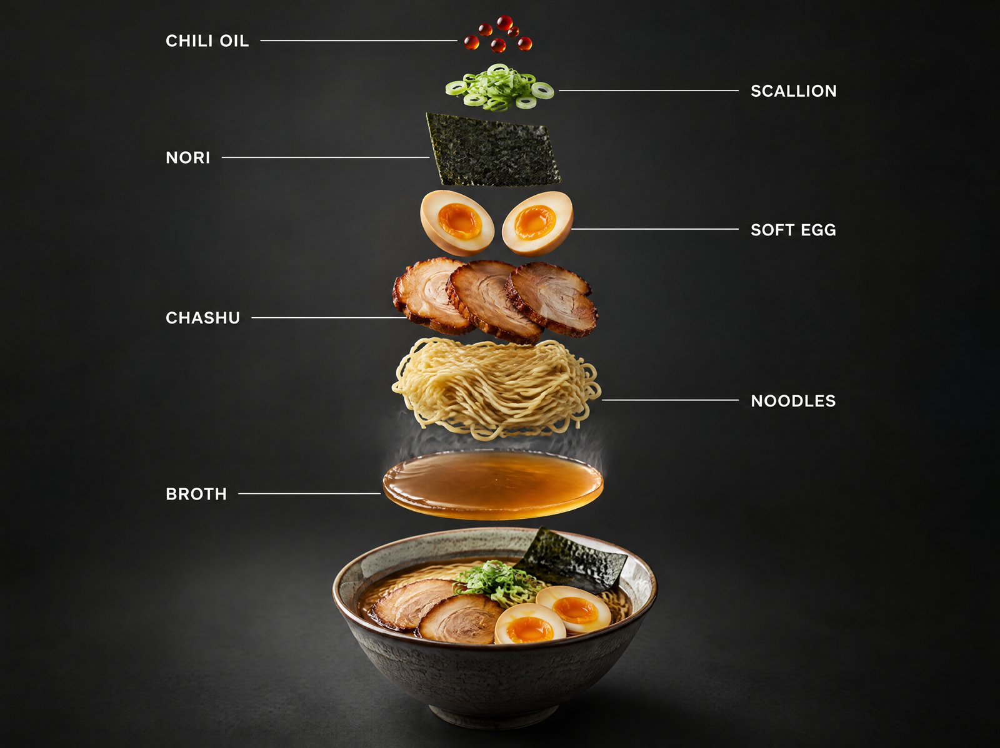</a>
<br><b><a href="cases/05-exploded-ramen-bowl/">Exploded Ramen Bowl</a></b><br>
<sub>Food campaign 路 assembly diagram</sub><br>
<sub>Seven components, seven labels, one thin leader each. Nothing crosses.</sub>
</td>
</tr>
<tr>
<td width="33%" valign="top">
<a href="cases/01-citrus-under-pressure/"></a>
<br><b><a href="cases/01-citrus-under-pressure/">Citrus Under Pressure</a></b><br>
<sub>Beverage campaign 路 product advertising</sub><br>
<sub>One can, one orange slice, one liquid arc. Built on three circles.</sub>
</td>
<td width="33%" valign="top">
<a href="cases/07-six-panel-manga-spread/">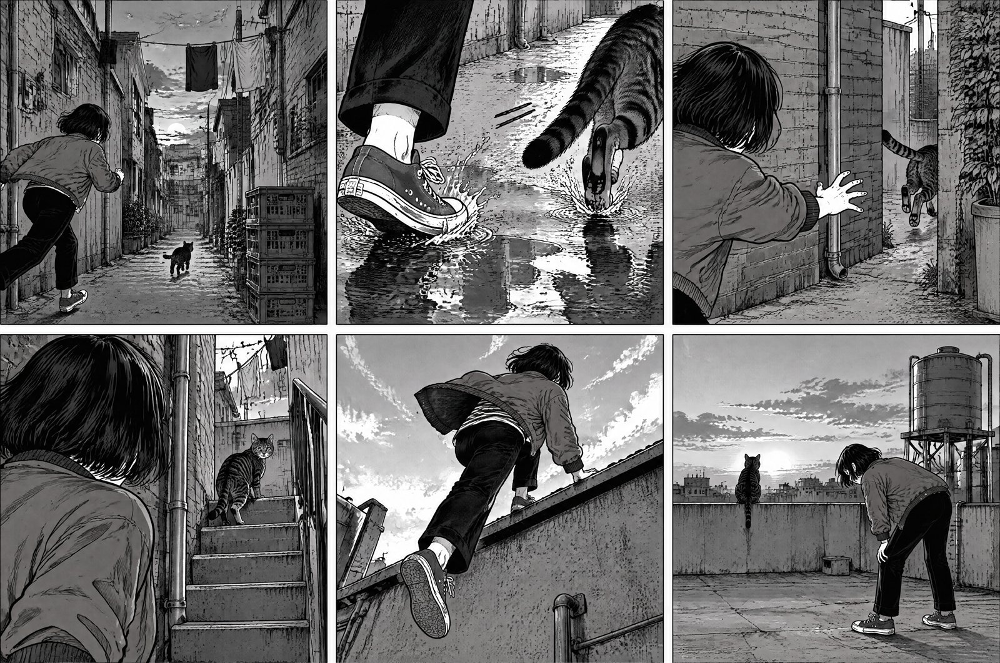</a>
<br><b><a href="cases/07-six-panel-manga-spread/">Six-Panel Manga Spread</a></b><br>
<sub>Sequential art 路 wordless</sub><br>
<sub>Six shots, one chase, no dialogue. Same girl and same cat in all six.</sub>
</td>
<td width="33%" valign="top">
<a href="cases/03-midnight-bathhouse/">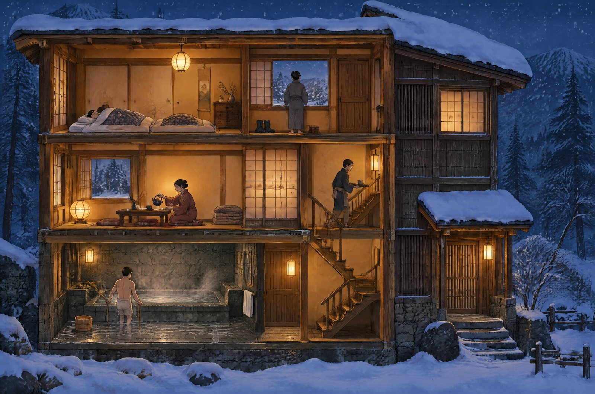</a>
<br><b><a href="cases/03-midnight-bathhouse/">The Midnight Bathhouse</a></b><br>
<sub>World building 路 cutaway illustration</sub><br>
<sub>Three floors, one staircase, and cold outside holding warmth in.</sub>
</td>
</tr>
<tr>
<td width="33%" valign="top">
<a href="cases/13-watercolor-coastal-town/">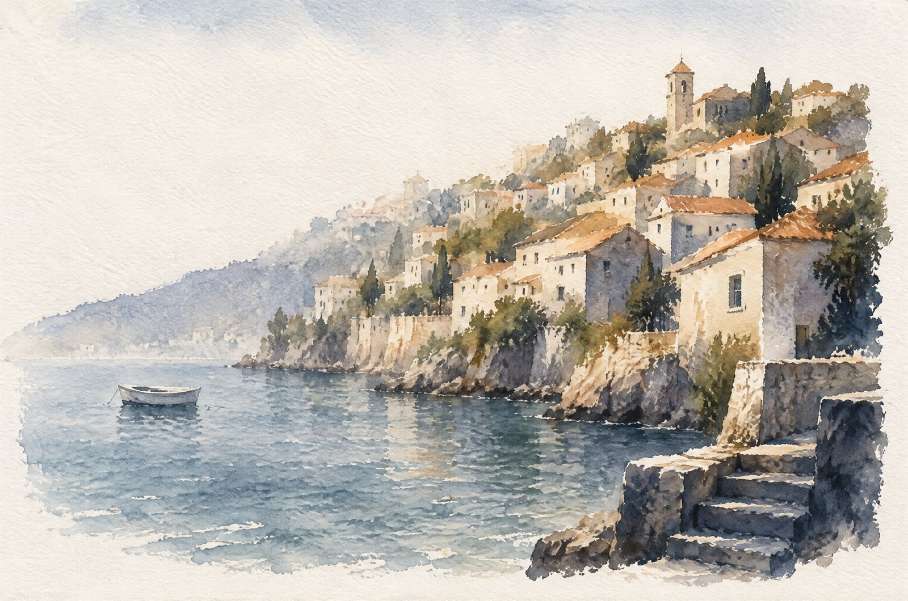</a>
<br><b><a href="cases/13-watercolor-coastal-town/">Watercolor Coastal Town</a></b><br>
<sub>Traditional media 路 watercolour</sub><br>
<sub>Wet-in-wet sky and water, and a town that dissolves into bare paper.</sub>
</td>
<td width="33%" valign="top">
<a href="cases/06-anamorphic-night-crossing/">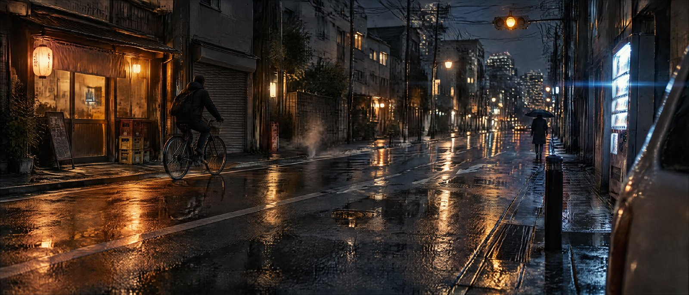</a>
<br><b><a href="cases/06-anamorphic-night-crossing/">Anamorphic Night Crossing</a></b><br>
<sub>Cinematic still 路 21:9</sub><br>
<sub>Wet street, one cyclist, one flare sourced from a light that is actually in frame.</sub>
</td>
<td width="33%" valign="top">
<a href="cases/14-1936-travel-poster/">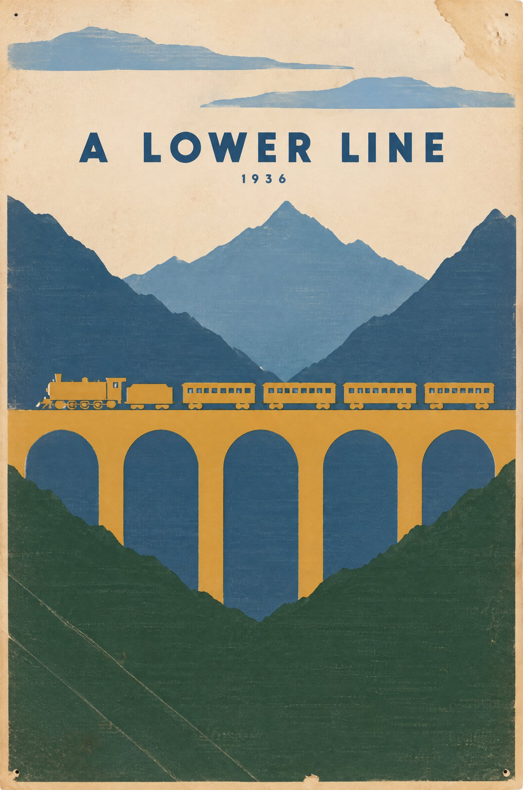</a>
<br><b><a href="cases/14-1936-travel-poster/">1936 Travel Poster</a></b><br>
<sub>Print 路 four-colour silkscreen</sub><br>
<sub>Four flat inks, one slightly off register, and a sheet that has been handled.</sub>
</td>
</tr>
<tr>
<td width="33%" valign="top">
<a href="cases/16-editorial-beauty-portrait/">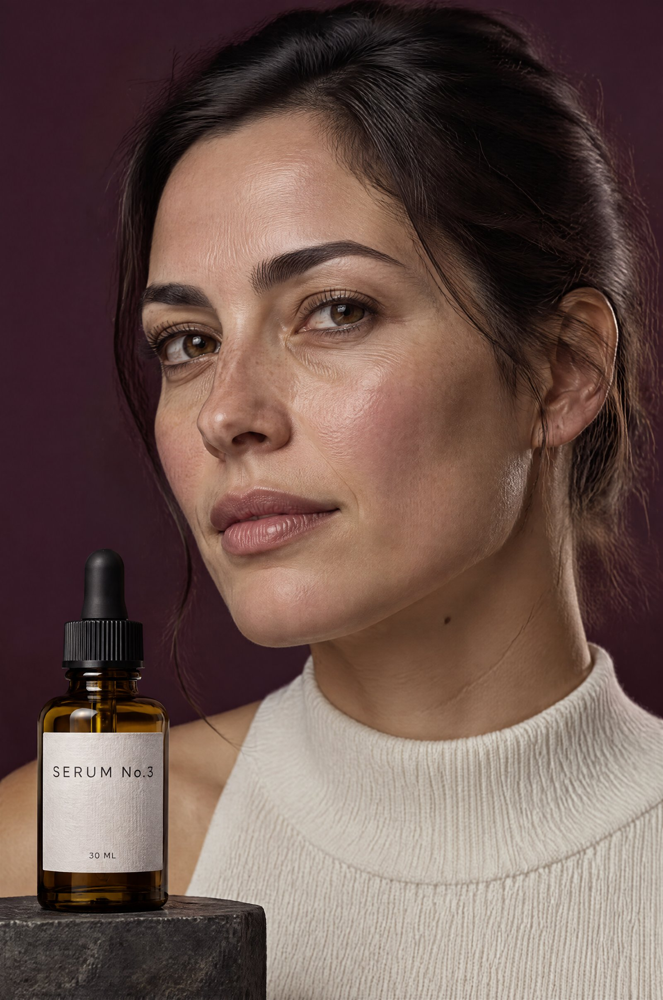</a>
<br><b><a href="cases/16-editorial-beauty-portrait/">Editorial Beauty Portrait</a></b><br>
<sub>Beauty campaign 路 product in frame</sub><br>
<sub>Real skin at close range, and a bottle on a plinth instead of in a hand.</sub>
</td>
<td width="33%" valign="top">
<a href="cases/11-product-into-a-scene/">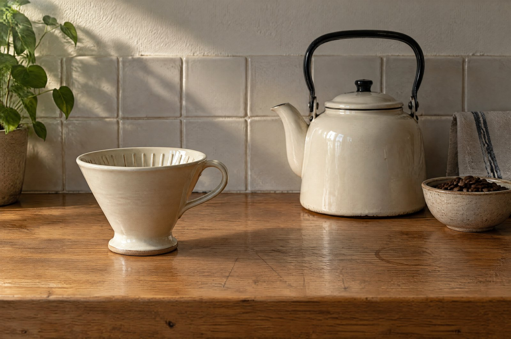</a>
<br><b><a href="cases/11-product-into-a-scene/">Product Into a Scene</a></b><br>
<sub>Image-to-image 路 two references</sub><br>
<sub>One reference owns the object, the other owns the light. Neither does both.</sub>
</td>
<td width="33%" valign="top">
<a href="cases/12-a-small-delivery/"></a>
<br><b><a href="cases/12-a-small-delivery/">A Small Delivery</a></b><br>
<sub>Wordless comic 路 ink and watercolour</sub><br>
<sub>A postal robot shelters a paper crane from the rain. Four panels, no words.</sub>
</td>
</tr>
<tr>
<td width="33%" valign="top">
<a href="cases/17-fashion-lookbook-frame/">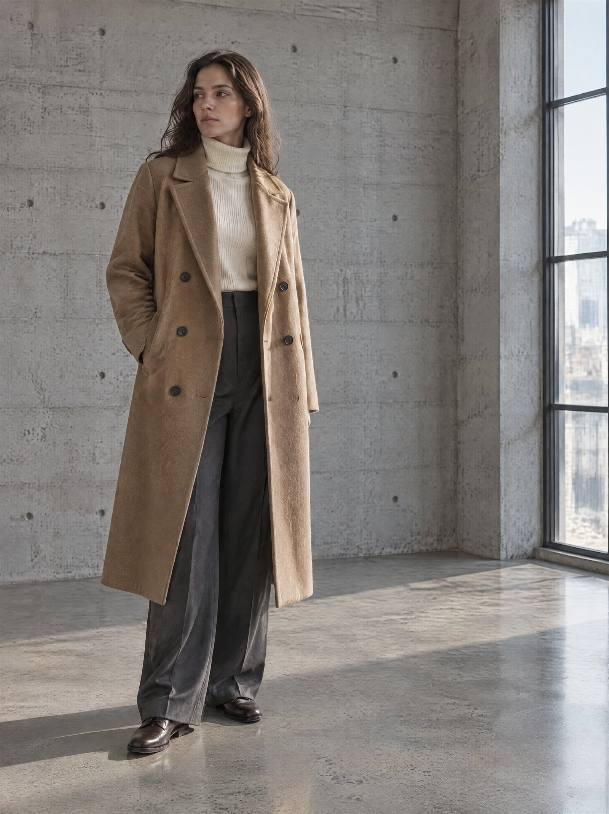</a>
<br><b><a href="cases/17-fashion-lookbook-frame/">Fashion Lookbook Frame</a></b><br>
<sub>Apparel editorial 路 full body</sub><br>
<sub>One window, one coat, and a hand that is safely in a pocket.</sub>
</td>
<td width="33%" valign="top">
<a href="cases/15-irezumi-flash-sheet/">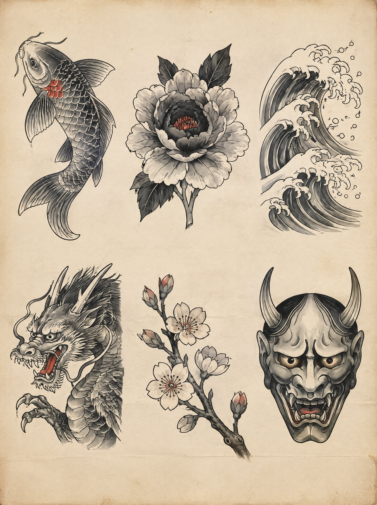</a>
<br><b><a href="cases/15-irezumi-flash-sheet/">Irezumi Flash Sheet</a></b><br>
<sub>Tattoo art 路 six motifs</sub><br>
<sub>Six designs, each one liftable off the sheet and tattooable on its own.</sub>
</td>
<td width="33%" valign="top">
<a href="cases/18-brutalist-library-at-dusk/">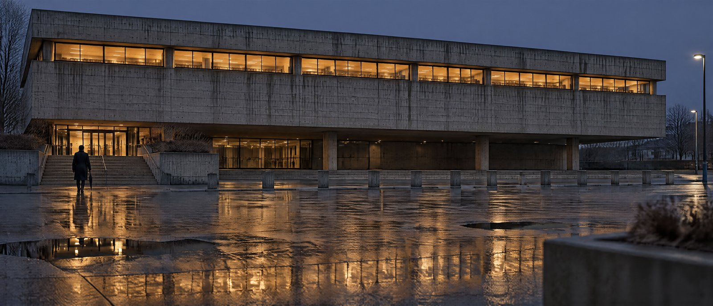</a>
<br><b><a href="cases/18-brutalist-library-at-dusk/">Brutalist Library at Dusk</a></b><br>
<sub>Architecture 路 21:9</sub><br>
<sub>Board-formed concrete, one band of warm glass, and a plaza that reflects it.</sub>
</td>
</tr>
<tr>
<td width="33%" valign="top">
<a href="cases/19-coffee-brand-touchpoint-board/">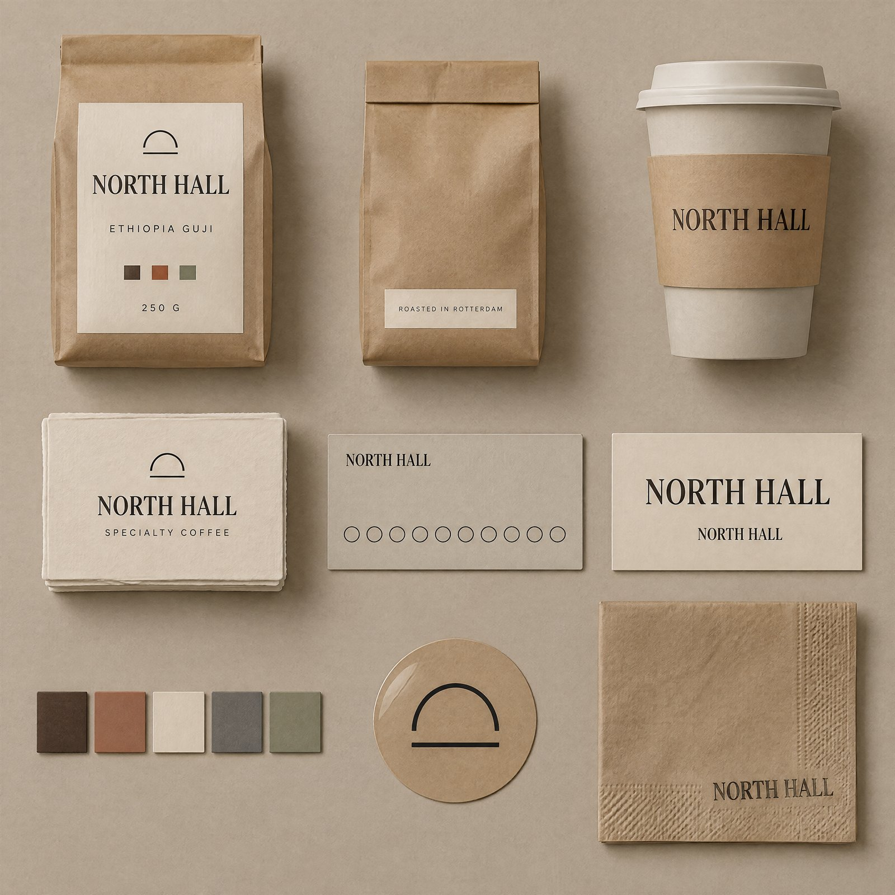</a>
<br><b><a href="cases/19-coffee-brand-touchpoint-board/">Coffee Brand Touchpoint Board</a></b><br>
<sub>Identity 路 nine touchpoints</sub><br>
<sub>One wordmark surviving kraft, card, laminate, vinyl and a stamp.</sub>
</td>
<td width="33%" valign="top">
<a href="cases/10-one-room-warmer/"></a>
<br><b><a href="cases/10-one-room-warmer/">One Room, Warmer</a></b><br>
<sub>Image-to-image 路 soft furnishings only</sub><br>
<sub>The same room, changed only in what you can carry out of it.</sub>
</td>
<td width="33%" valign="top">
<a href="cases/21-mobile-onboarding-flow/">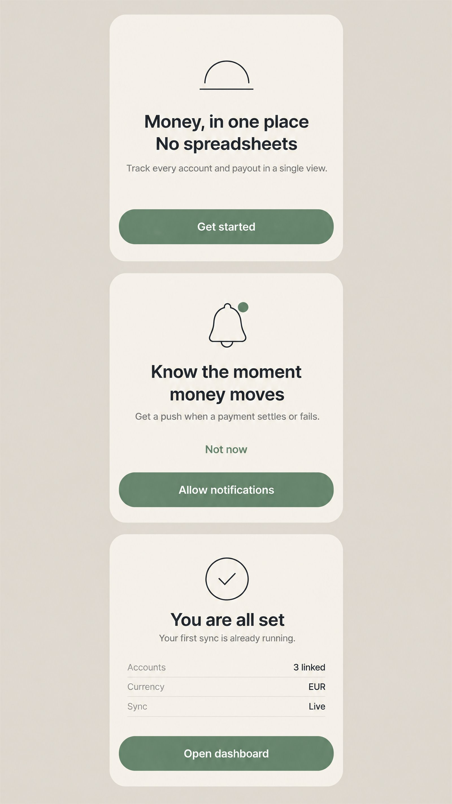</a>
<br><b><a href="cases/21-mobile-onboarding-flow/">Mobile Onboarding Flow</a></b><br>
<sub>UI 路 three screens, 9:16</sub><br>
<sub>Welcome, permission, done 鈥?stacked, untitled, and free of page dots.</sub>
</td>
</tr>
<tr>
<td width="33%" valign="top">
<a href="cases/20-fintech-dashboard/">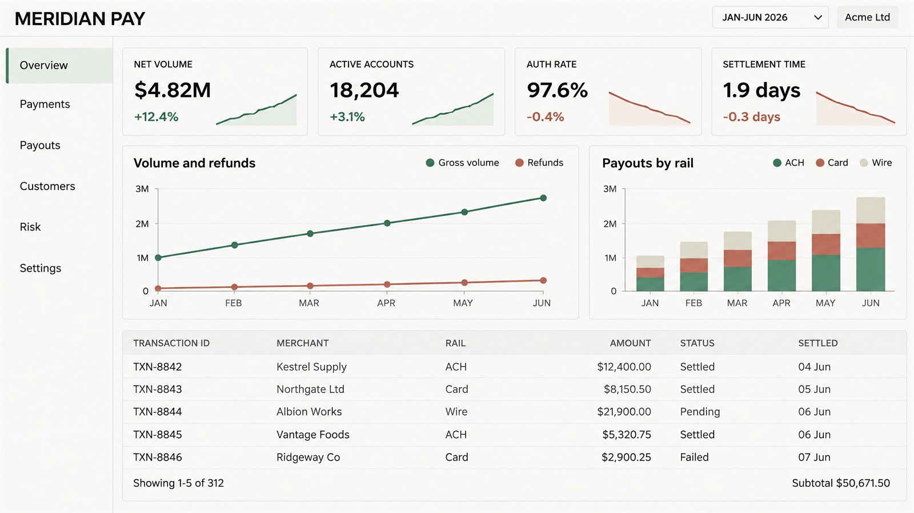</a>
<br><b><a href="cases/20-fintech-dashboard/">Fintech Dashboard</a></b><br>
<sub>UI 路 real committed data</sub><br>
<sub>Four deltas that agree with their own sparklines, and a table that sums to its footer.</sub>
</td>
<td width="33%" valign="top">
<a href="cases/09-lunar-courier-character-sheet/">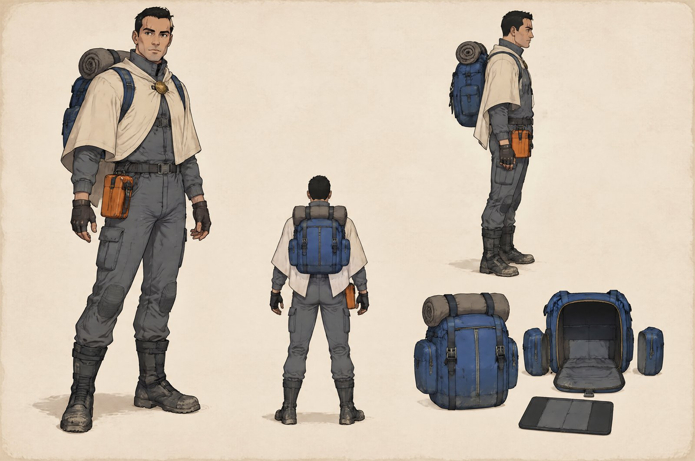</a>
<br><b><a href="cases/09-lunar-courier-character-sheet/">Lunar Courier 鈥?Character Sheet</a></b><br>
<sub>Character design 路 four views</sub><br>
<sub>One asymmetric detail, and the mirroring rule that has to be stated to get it right.</sub>
</td>
<td width="33%" valign="top">
<a href="cases/02-after-hours-jazz-poster/">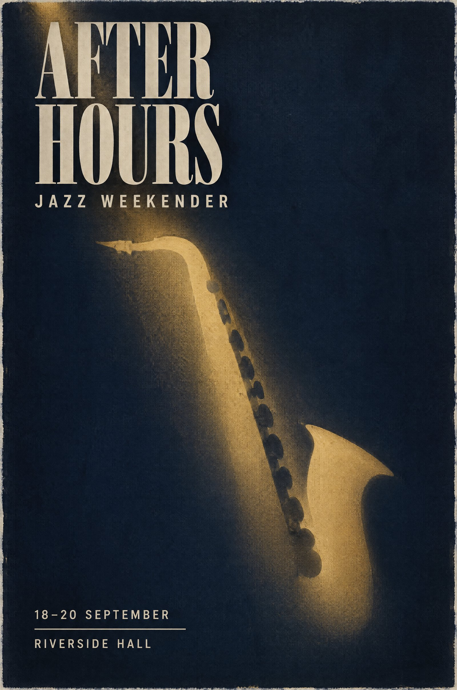</a>
<br><b><a href="cases/02-after-hours-jazz-poster/">After Hours</a></b><br>
<sub>Editorial poster 路 exact copy</sub><br>
<sub>A beam of stage light becomes the instrument. Four strings, once each.</sub>
</td>
</tr>
<tr>
<td width="33%" valign="top">
<a href="cases/22-station-observation-deck/">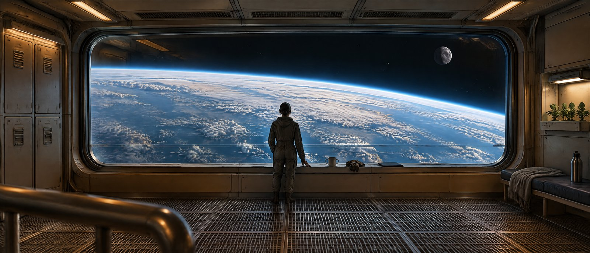</a>
<br><b><a href="cases/22-station-observation-deck/">Station Observation Deck</a></b><br>
<sub>Science fiction 路 21:9</sub><br>
<sub>Warm cabin, cold planet, and a defroster wire across the glass.</sub>
</td>
<td width="33%" valign="top">
<a href="cases/23-dragon-on-a-ruined-tower/">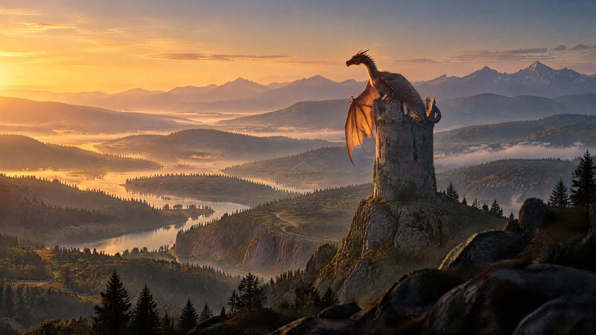</a>
<br><b><a href="cases/23-dragon-on-a-ruined-tower/">Dragon on a Ruined Tower</a></b><br>
<sub>Fantasy landscape 路 <em>painted</em></sub><br>
<sub>Low sun through a wing membrane, and a valley with five layers of depth.</sub>
</td>
<td width="33%" valign="top">
<a href="cases/24-wizards-study/">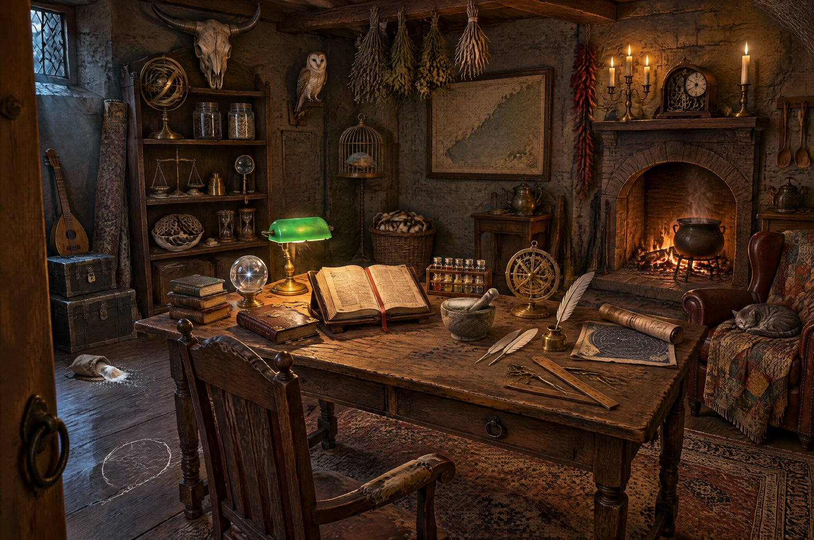</a>
<br><b><a href="cases/24-wizards-study/">The Wizard's Study</a></b><br>
<sub>Maximalist interior 路 <strong>44 listed objects</strong></sub><br>
<sub>Every surface occupied 鈥?and a numbered list the result can be checked against.</sub>
</td>
</tr>
<tr>
<td width="33%" valign="top">
<a href="cases/25-five-zone-explainer/">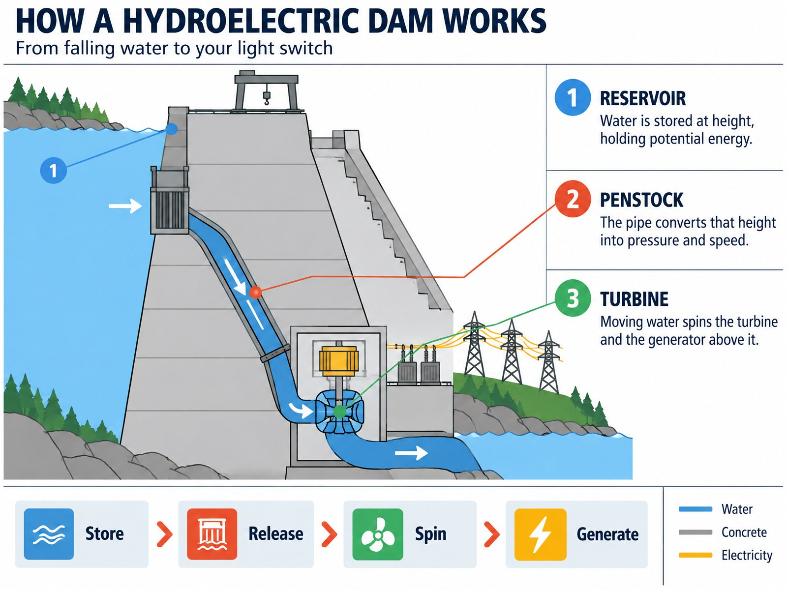</a>
<br><b><a href="cases/25-five-zone-explainer/">Five-Zone Explainer</a></b><br>
<sub>Infographic 路 fixed regions</sub><br>
<sub>How a dam works, in five declared zones that never overlap.</sub>
</td>
<td width="33%" valign="top">
<a href="cases/26-sixteen-pose-contact-sheet/">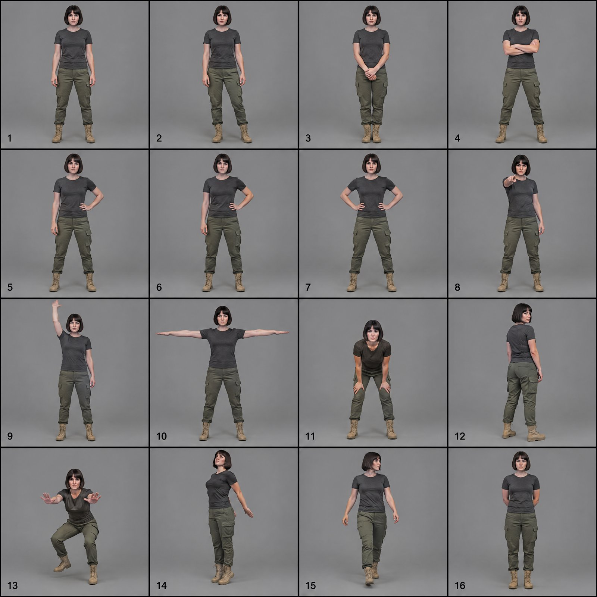</a>
<br><b><a href="cases/26-sixteen-pose-contact-sheet/">Sixteen-Pose Contact Sheet</a></b><br>
<sub>Character reference 路 4脳4 grid</sub><br>
<sub>One camera that never moves, so all sixteen panels are comparable.</sub>
</td>
<td width="33%" valign="top">
<a href="cases/27-16bit-town-at-dusk/">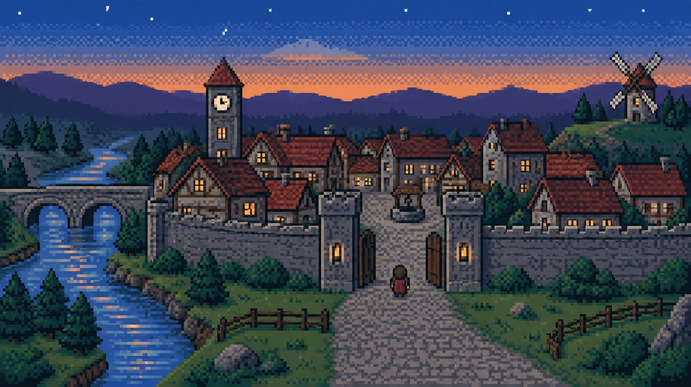</a>
<br><b><a href="cases/27-16bit-town-at-dusk/">16-Bit Town at Dusk</a></b><br>
<sub>Pixel art 路 24-colour palette</sub><br>
<sub>Every gradient is dithered, and every star is one pixel.</sub>
</td>
</tr>
<tr>
<td width="33%" valign="top">
<a href="cases/28-product-on-a-new-background/">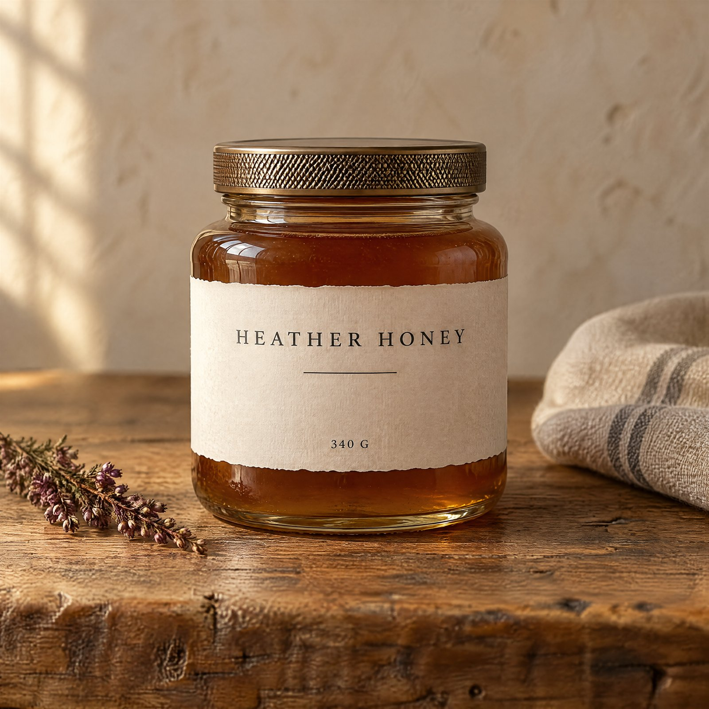</a>
<br><b><a href="cases/28-product-on-a-new-background/">Product on a New Background</a></b><br>
<sub>Image-to-image 路 studio shot to lifestyle</sub><br>
<sub>The label survives the move, character for character.</sub>
</td>
<td width="33%" valign="top">
<a href="cases/30-character-across-scenes/">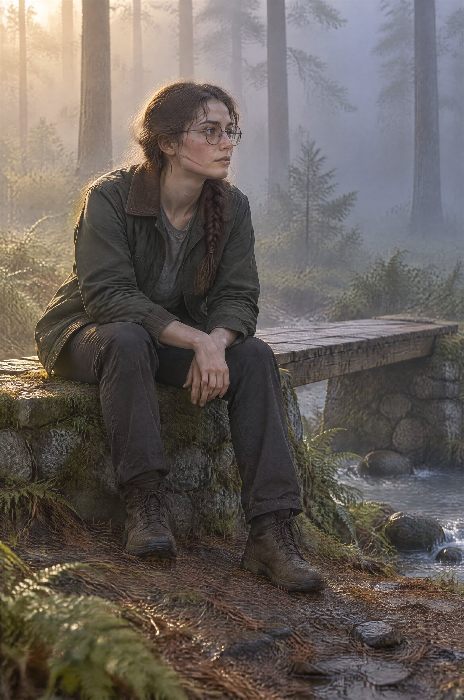</a>
<br><b><a href="cases/30-character-across-scenes/">Character Across Scenes</a></b><br>
<sub>Image-to-image 路 three references, three jobs</sub><br>
<sub>One says who, one says how, one says where 鈥?and all three hold at once.</sub>
</td>
<td width="33%" valign="top">
<a href="cases/29-photo-to-watercolor/">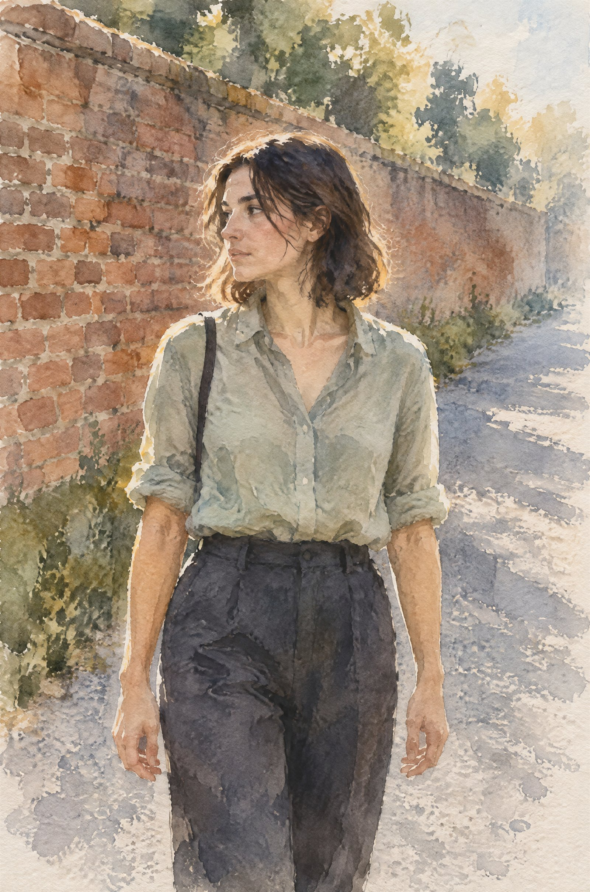</a>
<br><b><a href="cases/29-photo-to-watercolor/">Photo to Watercolor</a></b><br>
<sub>Image-to-image 路 medium change</sub><br>
<sub>Repainted completely 鈥?and still the same person in the same light.</sub>
</td>
</tr>
</table>
</table>

---

## How to use a case

1. **Look at the frame.** It was produced with the model, settings and aspect ratio printed on the case page 鈥?including the **measured pixel dimensions of the output**, because a requested `4K` is not a promise of 4096 px.
2. **Copy the prompt** from `prompt.txt` 鈥?it is a complete, filled brief. There are no `[PLACEHOLDERS]` to replace.
3. **Change what the case tells you to change.** Each case lists two to four adaptations and, where it matters, what has to change along with them.
4. **For image-to-image cases, attach the reference images first, in order.** The prompt refers to `Image 1`, `Image 2`, `Image 3` 鈥?the order is part of the prompt, and swapping two references is a different request. All five image-to-image cases also publish **the prompt that generated each reference**, so the whole recipe is reproducible.

## What this atlas does differently

| | This atlas | Typical prompt repository |
|---|---|---|
| Complete, filled prompts 鈥?nothing left to substitute | 鉁?| often `[YOUR PRODUCT HERE]` |
| The exact frame that prompt produced | 鉁?| sometimes |
| Composition declared **before** the subject | 鉁?every case | rarely |
| Exact visible text quoted verbatim, then checked character by character | 鉁?| rarely |
| Data that has to be internally consistent, not just plausible | 鉁?| never |
| Object and panel counts that are stated, numbered, and then verified | 鉁?| never |
| Materials and light as separate controls, not "cinematic premium" | 鉁?| rarely |
| Model and settings recorded per case, including measured output pixels | 鉁?| usually missing |
| Image-to-image: reference order, and which reference supplies what | 鉁?| almost never |
| **A written conflict policy** for when two references disagree | 鉁?| never |
| **The prompt that generated each reference image**, so the whole recipe is reproducible | 鉁?| never |
| **A controlled tier comparison** on identical prompts | 鉁?| never |
| Honest notes on what failed or needed a retry | 鉁?| almost never |

Cases are not silently re-rolled until something pretty comes out. When a render misses, the case says what missed and what was changed 鈥?the [Lunar Courier sheet](cases/09-lunar-courier-character-sheet/) for a failure traced to a contradiction in the prompt, [One Room, Warmer](cases/10-one-room-warmer/) for one that broke its own preservation list, [Photo to Watercolor](cases/29-photo-to-watercolor/) for one where the subject did not survive the change of medium, and [In-Game Footage](showcase/06-gta6-style-in-game-footage/) for one where naming a game produced the genre's texture instead of its identity.

## What is behind the prompts

Every craft case is written against the same set of principles 鈥?composition before subject, light before material, materials described by behaviour rather than by name, exact text quoted once and checked, counts that close, preserve lists longer than the task, one job per reference, and a stated winner when references disagree. They are written up in **[docs/craft.md](docs/craft.md)**, ordered by how much damage ignoring them does, and the workflow around rendering them 鈥?including the two mistakes that produce bad frames 鈥?is in **[docs/how-to-use.md](docs/how-to-use.md)**.

The showcase set runs the opposite experiment. Read [case 14](showcase/14-celebrity-in-real-life/) (16 words) against [case 13](showcase/13-silhouette-universe-poster/) (494 words): the same model, the same settings, and two completely different answers to the question of how much a prompt should say.

## Settings used

Every case records its model, aspect ratio, requested quality and **measured output pixels**. Two routes were used, and they expose different controls:

- **Resolution tiers** (`1K` / `2K` / `4K`) 鈥?a fixed pixel size per aspect ratio.
- **Quality tiers** (`low` / `medium` / `high` / `xhigh` / `max`) 鈥?a fidelity budget, with the pixel size fixed by the aspect ratio alone.

| Requested | Actual |
|---|---|
| 2K 路 4:3 | 2368 脳 1776 |
| 2K 路 16:9 | 2736 脳 1536 |
| 2K 路 3:2 | 2512 脳 1664 |
| 2K 路 2:3 | 1664 脳 2512 |
| 4K 路 3:2 | 3520 脳 2336 |
| 4K 路 2:3 | 2336 脳 3520 |
| 4K 路 3:4 | 2480 脳 3312 |
| 4K 路 4:3 | 3312 脳 2480 |
| 4K 路 1:1 | 2880 脳 2880 |
| 4K 路 16:9 | 3840 脳 2160 |
| 4K 路 9:16 | 2160 脳 3840 |
| 4K 路 21:9 | 3840 脳 1648 |
| xhigh 路 3:2 | 1536 脳 1024 |
| xhigh 路 3:4 | 1024 脳 1536 |
| xhigh 路 1:1 | 1024 脳 1024 |

## Coverage

Street and candid photography 路 portraits and editorial 路 night and mixed lighting 路 UI and social interfaces 路 social-media mockups 路 game screenshots and key art 路 isometric and pixel art 路 typography and poster design 路 dense multi-element grids 路 product and food advertising 路 brand identity 路 world building and cutaways 路 character design and consistency 路 sequential art 路 infographics 路 architecture 路 science fiction and fantasy 路 image-to-image editing, compositing and reference consistency.

## Repository layout

```
showcase/                  20 short prompts 鈥?the front page
  <nn>-<short-name>/
    README.md              what it is, how to adapt it, what to watch
    prompt.txt             the prompt, verbatim where marked
    source.json            origin, wording, and any adaptation with its reason
    preview.jpg            gallery image
    full.jpg               full-size download
    generation-or-<tier>.json  model, quality, token count, cost, prompt hash
  (cases 16-20 additionally carry preview-flare/-sunburst and full-flare/-sunburst)

cases/                     30 engineering briefs 鈥?the long end
  <nn>-<short-name>/
    README.md 路 prompt.txt 路 preview.jpg 路 full.jpg 路 generation.json
    reference-N.jpg        image-to-image cases, in the order the prompt refers to them
    reference-prompt-N.txt how each reference image was generated

docs/
  flare-vs-sunburst.md     the controlled tier comparison, five prompts, both frames
  how-to-use.md            adapting a case, and the failure modes worth knowing
  craft.md                 the prompting principles behind every case
```

## Contributing

Cases are welcome and must arrive with their frame. See [CONTRIBUTING.md](CONTRIBUTING.md).

## License

Prompts and documentation: **CC BY 4.0** 鈥?use them commercially, credit the atlas. Images: CC BY 4.0 unless the case says otherwise.

Fifteen showcase prompts are reproduced verbatim from the [GPT Image Prompt Library](https://cyberbara.com/gpt-image-prompt-library); each such case carries a source note and the images here were generated for this repository.

This is an independent resource. It is not affiliated with, endorsed by, or sponsored by OpenAI.

---

<div align="center">

**If this saved you a generation or two, a star helps other people find it.**


</div>

<!-- CTA_HOME -->
