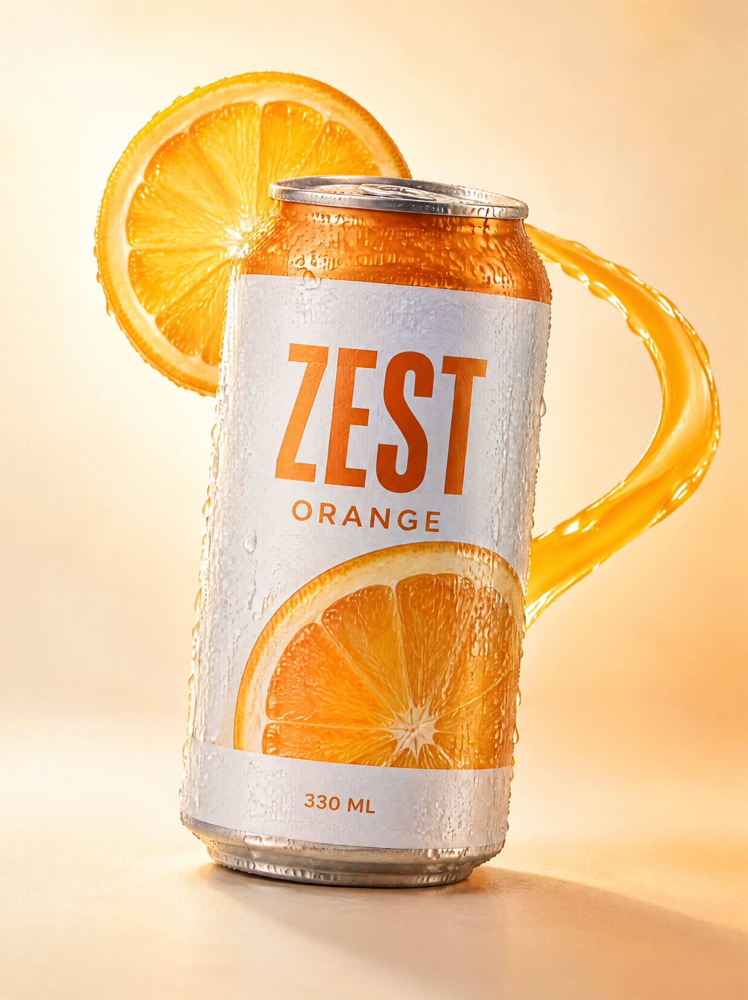

# Citrus Under Pressure



A restrained citrus soda campaign built around one orange slice, one liquid arc and one unmistakable hero can. Use it for beverage and snack packaging, campaign key visuals, and product-advertising studies where the product has to stay intact while the setting carries all the drama.

## Try the prompt

```text
A bright beverage advertisement photograph of a chilled can of orange sparkling soda, standing at a slight
tilt on a smooth pale surface, shot on a 3:4 vertical canvas at close product distance.

COMPOSITION
The can is the largest and most central element, occupying about 55% of the frame height, its base resting
just below the lower third. A single thin orange slice curls behind the can's upper third, its circle echoing
the can's rim. One narrow arc of liquid rises from the surface behind the can and sweeps around its right
side at the can's mid-height, then falls out of frame. The arc passes BEHIND the can and never crosses the
label. The composition is built on three circles — the slice, the rim, the liquid arc — held on one vertical
axis. Empty space falls to the lower left. Nothing touches the frame edges.

SETTING AND LIGHT
Background: a seamless warm cream backdrop with a soft apricot falloff toward the lower right, no props, no
horizon. Lighting: one large soft source behind the can at the upper left, acting as a rim light that passes
through the orange slice and glows through the liquid arc; one broad white bounce card in front at low
intensity to keep the label legible. Contact shadow: one tight soft shadow directly beneath the can base.
No coloured gels, no second light, no reflections of studio equipment.

MATERIALS
Cold aluminium can with a satin brushed finish and a fine bead-blasted sheen along the rim; heavy condensation
across the cold metal, with droplets varying from fine mist to a few larger runs, all catching the back light.
Orange slice: translucent flesh with visible radial segments and a pith ring, the back light glowing through
it so the pulp reads as wet rather than as coloured glass. Liquid: thin, glossy, opaque orange with a defined
meniscus, heavy enough to hold a smooth curve, catching a bright highlight line along its top edge.

LABEL AND TEXT
The label is white with a matte paper texture, wrapped cleanly and registered straight to the can's vertical
axis. It carries exactly this text, once each: the brand word "ZEST" in a bold condensed sans on the upper
third, "ORANGE" beneath it in a smaller light sans, and "330 ML" at the bottom of the label. No other words,
numbers, marks or symbols appear anywhere in the frame. Brand text must be crisp, correctly kerned, unobstructed
and readable at thumbnail size.

CONSTRAINTS
One liquid arc only. No scattered fruit pieces, no splashes, no droplets scattered through the air. The can's
silhouette, the label's proportions and the label's registration must stay unchanged. Do not add a second can,
a glass, ice cubes, leaves or a straw. No invented logos, no badges, no awards, no "new" or "best" flashes,
no watermark. Avoid plastic-looking CGI, avoid flat airless lighting, avoid over-sharpened edges.
```

[Copy plain text](prompt.txt) · [Full-size image](full.jpg)

## Make it your own

- **Swap the product and flavour together.** Changing the drink means changing the fruit, its translucency and the liquid's colour and viscosity in the same pass. A soda and a cold-press juice do not pour the same way.
- **Change the backdrop and the light as one decision.** A cream backdrop with a back light is what lets the liquid glow. Move to a dark backdrop and the same setup makes the drink read as a bottle in a fridge — cheaper, not moodier.
- **Keep one decorative element.** The whole frame rests on three circles. Adding a second slice or a second arc flattens it into a stock photograph.

## Settings and result

`gpt-image-2.5-sunburst` · 4K requested · 3:4 · **2480 × 3312 px** · 37.6 s

The label came out exactly as specified — `ZEST`, `ORANGE`, `330 ML`, all three legible at thumbnail size and correctly kerned. The back light does what it was asked to do: it glows through the orange slice and rides the top edge of the liquid arc, which is what separates this from a flat catalogue shot.

Two things are worth knowing. The liquid arc came out **thicker than "narrow" implies** and reads a little like a handle at small sizes; a stricter arc — half the thickness, more taper at the tail — would read better, and that is the first line to edit. And the model added a **printed orange half-slice across the lower part of the label**, which the brief did not ask for. It works, and it is not text, so it was kept — but if you need the label to match a real pack exactly, add one line forbidding imagery on the label as well as words.

---

<!-- CTA_CASE -->

[← Back to the gallery](../../README.md)
