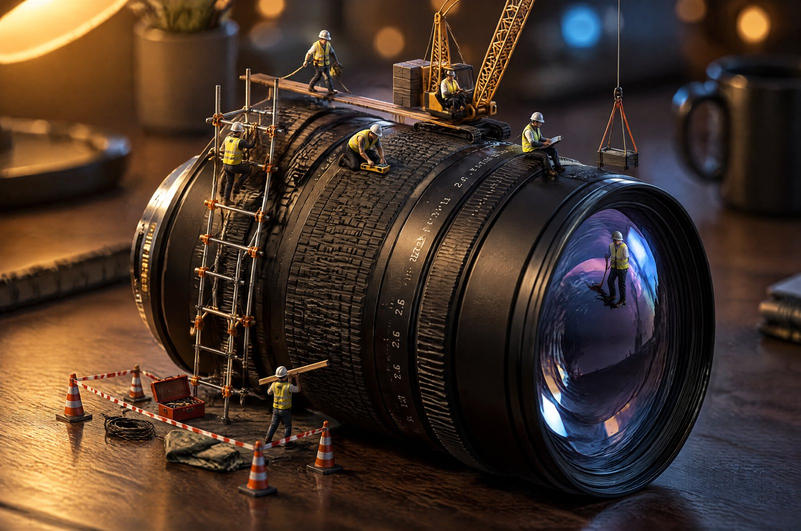

# Miniature Crew on a Lens



A miniature construction site built on a real camera lens: seven tiny workers repairing the barrel, a crane lifting a crate, and one figure standing out on the front glass with nothing but a reflection under his feet. Use it for scale-contrast key visuals, camera and optics brands, and any campaign that needs a stop-scrolling image built from an ordinary object.

## Try the prompt

```text
A macro photograph of a miniature construction site built on top of a real camera lens lying on a dark
wooden desk, shot at 3:2 with a tilt-shift effect so the plane of focus runs diagonally across the lens barrel.

THE LENS AS LANDSCAPE
A large prime lens lies on its side, filling most of the frame: black anodised aluminium barrel with fine
knurled focus and aperture rings, a metal mount ring at the near end, engraved white numerals along the barrel,
and the front glass element facing the camera at the far end. The glass is deep blue-violet with concentric
coating rings and a curved reflection of the room's ceiling. The lens is the terrain — everything else is built
on it.

THE SITE
A miniature crew is working along the top of the barrel. On the rubber ring: a climbing scaffold of thin
aluminium poles lashed with small orange ties. Mid-barrel: a lattice crane with a counterweight, its hook
lowered toward the glass. Near the mount: a striped barrier line of cones and tape around a "work area", with
a tiny open toolbox, a coiled cable, a folded tarp and two traffic cones. On the front glass element: a
single worker standing well out on the glass, casting a reflection beneath himself.

FIGURES
Seven figures in high-visibility yellow vests and white helmets. Each is doing something different: one
climbing the scaffold, one walking a beam with a tether, one at the crane controls, one kneeling to check a
level, one carrying a plank over the shoulder, one standing on the glass, one sitting on the barrel edge with
a clipboard. All are anatomically plain, correctly scaled to each other, and never repeated as identical stamps.

LIGHT AND DEPTH
One warm desk lamp off-frame to the upper left, its shade just visible as a soft amber glow at the frame's
edge, throwing warm directional light along the barrel and long soft shadows to the right. A cold blue rim
from a window behind separates the figures from the background. Strong tilt-shift depth of field: the strip
across the barrel top is sharp, the near knurling and the far background fall into soft focus. Background
bokeh of warm amber point lights and one blue highlight.

CONSTRAINTS
The lens must remain a real, correctly proportioned camera lens: barrel diameter, ring widths, mount ring,
engraved numerals and the glass element all plausible and consistent. No text anywhere except the lens's own
engraved markings, which are embossed metal and unreadable at this scale. No logos, no brand marks, no
watermark. Do not make the scene look like plastic toys: real metal, real rubber, real glass, real tiny
clothing with fabric weave. No flame, no welding sparks, no dust cloud.
```

[Copy plain text](prompt.txt) · [Full-size image](full.jpg)

## Make it your own

- **Change the terrain, not just the object.** The idea works because the surface being worked on has scale and texture — a lens barrel with knurled rings, a camera body, a watch movement, a mechanical keyboard. Putting the crew on something smooth and flat kills the whole effect.
- **Keep the crew at seven, and keep every pose different.** Seven figures each doing a distinct job reads as a real site. Ten figures doing variations of "standing" reads as a sticker sheet.
- **The one figure on the glass is the hook.** Do not move him somewhere safer. Standing on a transparent surface with his own reflection beneath him is the thing people look at twice.

## Settings and result

`gpt-image-2.5-sunburst` · 4K requested · 3:2 · **3520 × 2336 px** · 40.3 s

Every structural requirement held. The lens reads as a real prime lens — knurled focus ring, engraved aperture markings, metal mount ring and a coated front element with concentric colour rings — and all seven workers are present, correctly scaled, and doing seven different jobs. The scaffolding, lattice crane, cones, barrier tape, open toolbox, coiled cable and folded tarp are all there, and the worker standing out on the front glass casts the reflection the brief asked for.

Two details carry the image. The tilt-shift focus works exactly as a real one would, sharp in a diagonal strip across the barrel and soft at both ends, which is what makes a desk object read as landscape. And the lighting logic holds: warm amber from the lamp on the left, a cold blue rim from the window behind, with the background bokeh mixing the two. The only text in the frame is the lens's own embossed engraving, unreadable at this scale, as required.

---

<!-- CTA_CASE -->

[← Back to the gallery](../../README.md)
