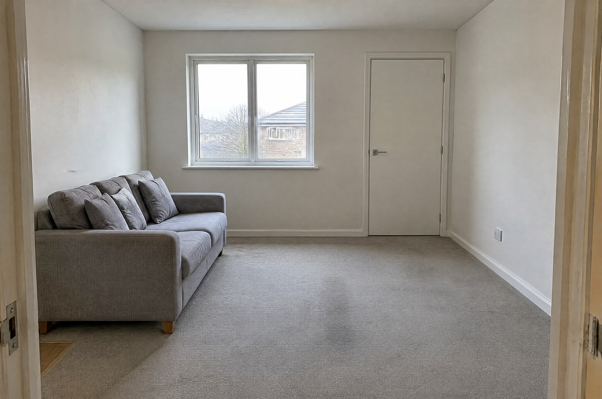
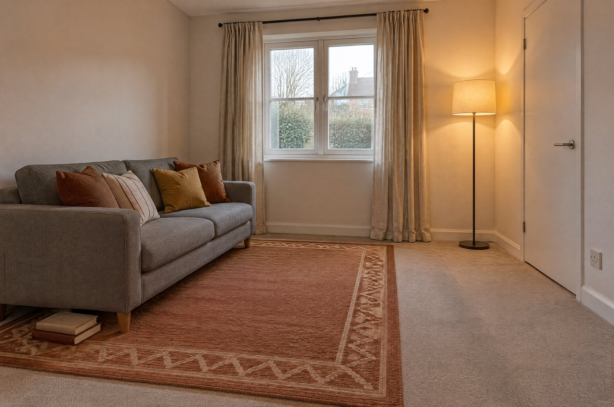

# One Room, Warmer

| Before | After |
|---|---|
|  |  |

Take a flat, unstyled room photograph and change **only the soft furnishings** — rug, cushions, curtains, one lamp, two books — while the window, the door, the walls and the sofa stay where they are. Use it for interior styling, rental and staging mock-ups, and any edit where the room must remain recognisably the same room.

**This case documents a genuine two-attempt process.** The first render broke the case's own preservation promise; the note at the bottom says exactly what broke and what fixed it.

## Try the prompt

```text
Image 1: the room — the sole authority for the architecture, the camera and the existing furniture. It supplies
no new styling, no new objects and no new light.

TASK
Keep this room exactly as it is and make it warmer: change only the soft furnishings and add one lamp, so the
same room reads as lived-in and inviting while remaining unmistakably the same room.

PRESERVE EXACTLY — architecture, joinery and furniture
- The window: same position, same size, same plain white frame, and the same glazing. It is a simple two-leaf
  casement window with ONE horizontal glazing bar in each leaf, six panes in total. Do not convert it into a
  multi-pane Georgian or sash window, do not add bars, do not add muntins, do not change the frame profile.
- The door: same position, same swing, same plain FLAT door leaf with no panels and no mouldings, same simple
  lever handle on the same side. Do not add raised panels, mouldings, glazing or a different handle.
- The sofa: same position against the left wall, same size, same silhouette, same wooden feet. Its upholstery
  stays the same grey woven fabric of the same mid-grey value — do not lighten it, do not re-colour it, do not
  change it to linen or cream, do not change the weave.
- Walls, skirting, ceiling line, both room corners, the socket on the right wall and the low scuff mark on the
  left wall, all unchanged.
- The camera: identical position, identical height, identical angle and identical lens. The result must align
  with Image 1 edge to edge, with the ceiling line, both corners and the floor plane in the same places.
- The pale grey carpet and the faint worn path in the middle of the room.

CHANGE — only these five things
- Add a large wool rug under the sofa and slightly in front of it: warm terracotta with a simple repeating
  geometric border.
- Replace the four grey cushions with four cushions in warm rust, ochre and cream linen, one slightly creased.
  The sofa itself keeps its grey upholstery — only the loose cushions change.
- Hang floor-length linen curtains in warm oatmeal on a slim black rod above the window, drawn open to both
  sides so the window stays completely visible and no glass is covered.
- Add one slim floor lamp with a cream linen shade standing in the near right corner, switched on.
- Set a small stack of two books on the floor beside the sofa's near arm, on the rug.

MATCH NATURALLY
- The lamp adds a warm pool of light entering from the right; the window keeps its cool daylight from the left.
  Both must be visible in the final frame and neither may cancel the other.
- Every new object casts a soft-edged shadow, and each shadow agrees with both light sources: a soft shadow to
  the right from the window, a second softer shadow away from the lamp.
- Fabric must read as fabric: wool with visible fibre and a slightly flattened pile where the sofa legs press
  into it, linen with a soft vertical fold and a hint of translucency at the curtain's leading edge.
- The rug must follow the floor plane in the same perspective as the carpet beneath it.

DO NOT
- Do not restyle the joinery. The window stays a plain two-leaf casement, the door stays a plain flat leaf.
- Do not re-colour, re-upholster or restyle the sofa in any way.
- Do not move, resize or remove the window, the door, the walls, the skirting, the ceiling or the sofa.
- Do not change the camera, the crop, the aspect ratio or the perspective. This is the same frame.
- Do not add architectural elements: no second window, no built-in shelving, no new doorway, no wallpaper, no
  picture rail, no coving.
- Do not add people, pets, plants, artwork, a television, a coffee table, a sideboard or a fireplace.
- Do not brighten or HDR the whole frame. The daylight stays flat and cool; only the lamp area gains warmth.
- No text, no signage, no watermark.
```

The reference image was generated for this case too, so the whole before/after pair is reproducible — its prompt is in [`reference-prompt.txt`](reference-prompt.txt).

[Copy plain text](prompt.txt) · [Full-size image](full.jpg)

## Make it your own

- **Name the joinery, not just "keep the room".** This is the lesson of this case. "Preserve the room" was not enough — the model kept the layout and quietly replaced a plain casement with a Georgian window, a flat door with a four-panel one, and a grey sofa with a cream one. Naming the glazing bars, the flat leaf and the grey value is what fixed it.
- **Give light a reason to be added.** The room is only warmer because a switched-on lamp enters from one side while the window keeps its cool daylight from the other. Without two temperatures the edit is just a brighter photograph.
- **Change the soft furnishings and nothing else.** The rug, the cushions, the curtains and the lamp are all removable objects. The moment an edit touches the walls, the floor or the joinery, it stops being a styling job and becomes a renovation.

## Settings and result

`gpt-image-2.5-sunburst` · 4K requested · 3:2 · **3520 × 2336 px** · 43.9 s (second attempt)

**The first attempt broke this case's own preservation list, so it was rewritten and re-rendered.** The layout, the camera and the furniture positions held, but three things in the PRESERVE EXACTLY block were restyled anyway: the plain two-leaf casement became a multi-pane Georgian window, the flat door leaf gained raised panels, and the grey sofa was re-upholstered in cream. A published frame that contradicts its own prompt is worse than no frame, which is exactly the rule this repository applies to everyone else.

The fix was to stop saying "keep the room" and start naming the joinery: *a two-leaf casement with one horizontal glazing bar per leaf, a plain flat door leaf with no panels, a grey woven sofa of the same mid-grey value*, each with an explicit instruction not to restyle it. The second render holds all three.

What the second render delivers: the same room from the same direction, the same cool window light from the left, and a warm lamp entering from the right so both temperatures are visible at once. The rug, the four rust-ochre-cream cushions, the oatmeal curtains on their slim rod and the two books are all present, each casting shadows that agree with both light sources.

One honest limit remains, and it is the limit of the technique rather than of the prompt: the result is **close to, but not edge-to-edge identical with, the reference**. The camera reads slightly closer and the door sits nearer the right edge of the frame. A prompt is not a pixel lock — for work that must align exactly, compositing is the tool, not image-to-image. Every image-to-image case in this atlas should be read with that in mind.

---

<!-- CTA_CASE -->

[← Back to the gallery](../../README.md)
