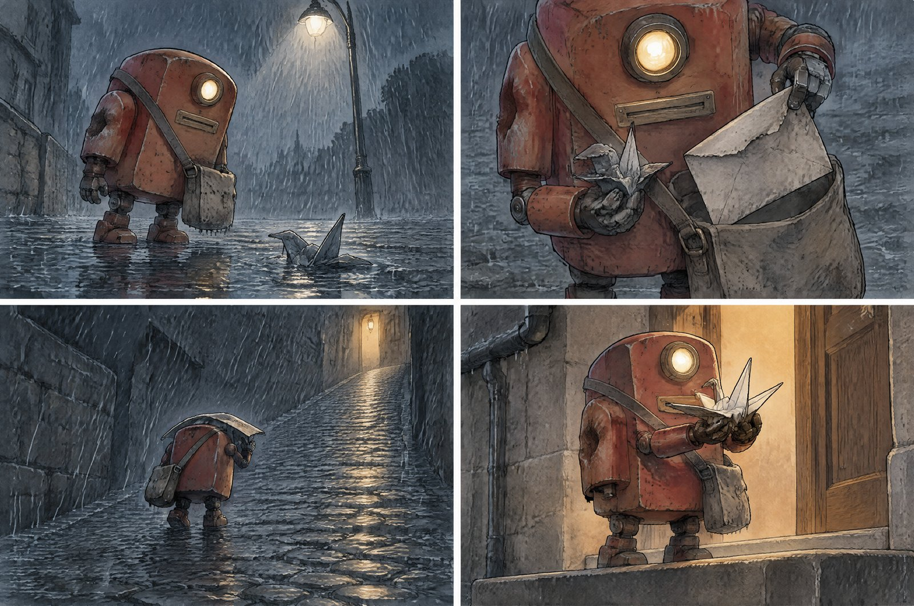

# A Small Delivery



A four-panel wordless comic in ink and watercolour: a small postal robot finds a soaked paper crane in the rain, shelters it under a used envelope, carries it up a cobbled lane and gives it back at a warm doorway. Use it for silent comics, animation pitch pages, children's book spreads, and any sequence that has to carry an emotion without a single line of dialogue.

## Try the prompt

```text
A four-panel wordless comic, 3:2 landscape, arranged as two columns of two equal panels with even gutters,
reading left to right then top to bottom. Ink line with watercolour wash, consistent throughout. No text
of any kind.

STYLE
Loose confident ink linework with a fine nib, watercolour washes layered underneath, edges softening slightly
outside the lines. Cool grey-blue palette for the rain, warm amber for the lit interior. Paper texture visible
in the washes. Whites are left as raw paper. Nothing is digitally sharp or vector-clean.

THE CHARACTER — identical in all four panels
A small boxy postal robot, about knee height, with a rounded rectangular body in faded red paint with visible
scratches and a dent in the left flank, a single round lamp eye set high on the front, a small brass slot on
the chest, short articulated legs with flat feet, and a worn canvas mail satchel on a strap across its body.
Its proportions, paint wear and the dent must be in the same place in every panel.

THE STORY, four beats
Panel 1 — the discovery. Medium shot, low angle at the robot's eye level. Rain falls across the frame. The
robot stands on a wet pavement looking down at a small paper crane lying crumpled in a puddle, one wing
soaked through and dark. A single street lamp above and behind it throws a cold cone of light; the crane sits
just inside the light's edge.
Panel 2 — the protection. Close-up, from just above. The robot has lifted the crane clear of the water and is
holding it against its chest with one small articulated hand while it pulls a large used envelope out of the
satchel with the other. The envelope is already creased and its flap is torn. The robot's lamp eye is angled
down at the crane.
Panel 3 — the journey. Wide shot, from behind and slightly to the side. The robot walks away from us up a
steep wet cobbled lane toward a single warm light at the far end. It is holding the envelope arched over the
crane like a small roof; the crane is hidden underneath, only its folded tip visible. Rain streaks the frame
diagonally. The lane is empty and dark.
Panel 4 — the arrival. Medium close-up, from a low angle. The robot stands on a dry stone doorstep in front of
a warm amber doorway with a paper of light spilling out onto the wet step. It is holding the crane up with both
hands, offering it. The crane is dry and its folds have opened back into shape. The rain has stopped and only
drips from the gutter remain.

CONSISTENCY
The same robot, the same satchel, the same envelope once it appears, the same crane. Lighting is consistent
throughout: cold blue-grey for the rain in panels 1 to 3, warm amber for the doorway in panel 4. The paper
crane's condition progresses in one direction only — soaked in panel 1, dark and limp in panel 2 and 3, dry and
opened back into shape in panel 4.

CONSTRAINTS
No text anywhere: no dialogue, no captions, no sound-effect lettering, no signage, no page numbers, no
watermark, no signature. Do not add a title, a border beyond the gutters, or a gutter label. Do not add
people, cats, cars, bins or other props. Do not let the robot's design change between panels, and do not mirror
its dent or its satchel strap between panels. Do not make the crane into a bird — it stays a folded paper object
in every panel.
```

[Copy plain text](prompt.txt) · [Full-size image](full.jpg)

## Make it your own

- **Write the four beats as four shots.** The sequence holds because every panel changes the distance: medium low angle, close-up from above, wide from behind, medium close-up. Four panels at the same distance is a sticker sheet, not a story.
- **Wordless means the props have to act.** The crane gets wet in panel 1, stays dark and limp through panels 2 and 3, and opens back into shape in panel 4. That progression is the entire emotional arc — it replaces every line of dialogue you would otherwise have written.
- **Keep the robot's damage in the same place.** The dent in the left flank, the scratches and the satchel strap are what prove it is one character across four panels. A robot that is merely "red and boxy" will not read as the same robot by panel 4.

## Settings and result

`gpt-image-2.5-sunburst` · 4K requested · 3:2 · **3520 × 2336 px** · 52.4 s

All four panels rendered in the correct 2×2 grid with even gutters, and all four beats are readable with no words at all: the robot bending over the crane in the rain under the lamp, the close-up of it holding the crane to its chest while dragging a torn envelope out of the satchel, the wide shot of it walking away up the cobbled lane with the envelope arched over its head, and the doorstep ending with the crane held up in both hands and opened back into shape.

The consistency requirements held. The robot keeps its faded red paint, its dent in the left flank, its single round lamp eye, its brass chest slot and its canvas satchel across all four panels, and the crane's condition progresses in one direction only — soaked, limp, then dry and unfolded. The colour logic is the part that carries the mood and it is exact: cold blue-grey rain through panels 1 to 3, warm amber daylight in panel 4, with the rain stopping between the last two panels.

The style is a genuine ink-and-wash rather than a digital filter over a 3D render — line weight varies, the washes bleed slightly past the lines, and the paper texture is visible in the flat areas.

---

<!-- CTA_CASE -->

[← Back to the gallery](../../README.md)
