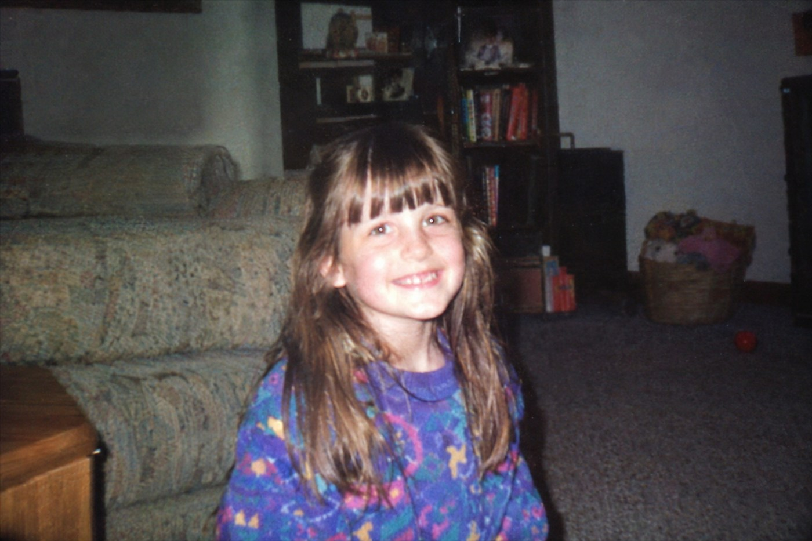

# 90s Point-and-Shoot Aesthetic



A five-word style tag — the shortest prompt in this set — that turns the model into a 1990s point-and-shoot. Use it as a look preset for portraits, family archives, zine layouts and anything that should feel older than it is.

## Try the prompt

```text
90s + point-and-shoot camera quality
```

[Copy plain text](prompt.txt) · [Full-size image](full.jpg)

## Make it your own

- **The style is the whole prompt.** Five words. Add a subject and you are done; add styling instructions and you fight it.
- **Replace the era freely.** `2000s + flip phone camera quality`, `80s + Kodak Gold`, `today + disposable camera`. The shorter the tag, the more the model commits.
- **Do not ask for sharpness.** The softness, the flat flash falloff and the slightly muddy colour are what the tag means.

## Settings and result

`openai/gpt-image-2.5-flare` · quality `xhigh` · 3:2 · **2459 image tokens** · 26 s · $0.0738

Five words, and every one of them is doing work. Compare it with case 01 at 145 words: this is the opposite end of the same model.

The result is a plain domestic snapshot with no photographic ambition — which is precisely what the tag promises. It is a look, not a subject, so it belongs on the settings row of your own prompt rather than in a brief of its own.

> **Source.** Prompt reproduced verbatim from the [GPT Image Prompt Library](https://cyberbara.com/gpt-image-prompt-library). The frame below was generated for this repository and is not the source image.

---

<!-- CTA_CASE -->

[← Back to the gallery](../../README.md)
