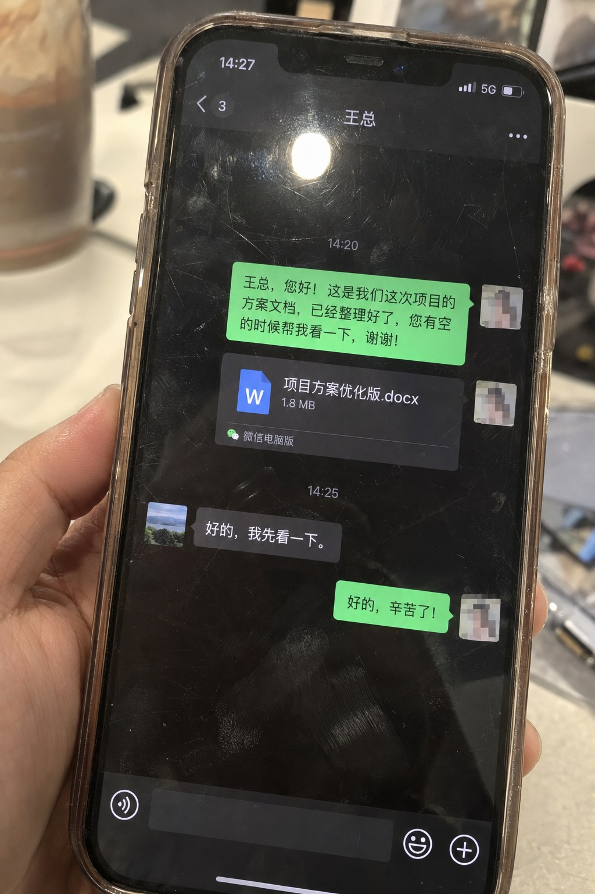

# WeChat Chat Interface Smartphone Photo



A photograph of a phone — not a screenshot. The screen carries fingerprints, smudges, a hairline crack and a hard reflection of a window. Use it where a chat needs to feel physical: editorial illustration, investigative layouts, product-context shots.

## Try the prompt

```text
Generate an image, aspect ratio 3:4. A real-life smartphone photo, with the phone screen displaying a WeChat chat interface in Chinese dialogue, featuring chat bubbles and a Word document attachment. The interface has green and gray bubbles. The screen shows obvious fingerprints, smudges, and scratches. The glass has strong reflections and a direct light source creating glare. The frame is slightly tilted, handheld shot, natural ambient light, imperfect composition, strong sense of realism, casual everyday snapshot, high detail, 4K. The dialogue is between a boss and an employee: the employee sends a file to the boss, and the boss replies that they will take a look first.
```

[Copy plain text](prompt.txt) · [Full-size image](full.jpg)

## Make it your own

- **Photograph the phone, do not screenshot the app.** `A real-life smartphone photo, with the phone screen displaying …` is the line that produces this. Drop it and you get a flat UI mock.
- **Ask for the damage.** Fingerprints, smudges, scratches, glare, a tilted frame. The damage is the realism.
- **Keep the conversation short.** Two or three bubbles. A realistic phone photo cannot resolve a long thread, and pretending otherwise breaks the illusion.

## Settings and result

`openai/gpt-image-2.5-sunburst` · quality `xhigh` · 3:4 · **2459 image tokens** · 48 s · $0.0745

The screen is genuinely tilted, the glass carries a hard window reflection across the top third, and fingerprints are visible on the dark areas — all of it holding up at full size.

Both the sender and receiver bubbles are legible, and the phone itself is blurred at the edges exactly as it would be held in a hand.

> **Source.** Prompt reproduced verbatim from the [GPT Image Prompt Library](https://cyberbara.com/gpt-image-prompt-library). The frame below was generated for this repository and is not the source image.

---

<!-- CTA_CASE -->

[← Back to the gallery](../../README.md)
