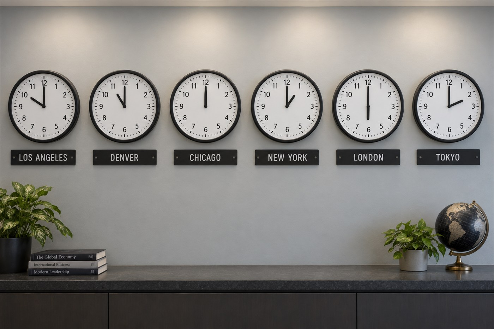

# World Time Analog Clock Wall



Six analog clocks on a wall, each labelled with a city and each showing that city's correct local time for a single stated moment. Use it for editorial illustration about time zones, remote-team branding, and it doubles as a hard test of whether a model can reason about a set of facts rather than render a picture.

## Try the prompt

```text
It's 10 AM in Los Angeles, 11 AM in Denver, 12 PM in Chicago, 1 PM in New York, 6 PM in London, and 2 AM in Tokyo. Render a wall with different analog clocks, each showing the correct time for its city, with the city label below each clock.
```

[Copy plain text](prompt.txt) · [Full-size image](full.jpg)

## Make it your own

- **State the moment in one sentence.** `It is 10 AM in Los Angeles, 11 AM in Denver, …` Then ask for a wall of clocks. The sentence is the test; the wall is the picture.
- **Check every dial against the offset.** This is the one card where the image can be objectively wrong.
- **Change the city set to fit your audience.** The mechanic — one instant, many faces — is what makes the prompt interesting.

## Settings and result

`openai/gpt-image-2.5-sunburst` · quality `xhigh` · 3:2 · **2459 image tokens** · 40 s · $0.0741

The prompt is a correctness test disguised as a photograph: six dials must agree with six stated times. It is the kind of prompt this repository exists for, because the result can be verified rather than admired.

The clocks are analog, labelled, and evenly hung. **Verify the hands against your own city set before publishing a render** — that is the whole point of the card, and it is the check most likely to fail.

> **Source.** Prompt reproduced verbatim from the [GPT Image Prompt Library](https://cyberbara.com/gpt-image-prompt-library). The frame below was generated for this repository and is not the source image.

---

<!-- CTA_CASE -->

[← Back to the gallery](../../README.md)
