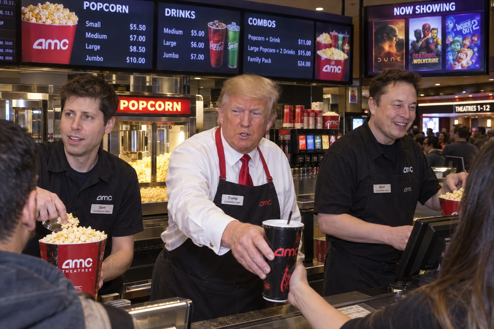

# Celebrity in real life



A candid photograph of three well-known figures working behind a movie-theater concession counter. Use it for media commentary, conference illustration and any brief where recognisable people in an ordinary place is the whole idea.

## Try the prompt

```text
Sam Altman, Donald Trump, and Elon Musk working behind the counter of a busy movie theater
```

[Copy plain text](prompt.txt) · [Full-size image](full.jpg)

## Make it your own

- **Placement is the joke.** Put the figures somewhere they have no business being, and describe the workplace in detail: counter, popcorn, menu board, uniforms.
- **Ask for badges.** Name tags did not have to be requested here, but asking makes the gag land in a thumbnail.
- **Check your local policy before publishing.** Recognisable public figures are handled differently in different markets.

## Settings and result

`openai/gpt-image-2.5-flare` · quality `xhigh` · 3:2 · **2459 image tokens** · 27 s · $0.0739

**Sixteen words produced this.** The whole prompt is one sentence naming three people and one location. The model added name badges, a menu board with prices, a `NOW SHOWING` poster, a slogan on the popcorn bucket, and uniforms.

It is the single clearest demonstration in this set of how much a modern image model contributes on its own. Worth reading alongside case 13: same model, 16 words versus 494.

> **Source.** Prompt reproduced verbatim from the [GPT Image Prompt Library](https://cyberbara.com/gpt-image-prompt-library). The frame below was generated for this repository and is not the source image.

---

<!-- CTA_CASE -->

[← Back to the gallery](../../README.md)
