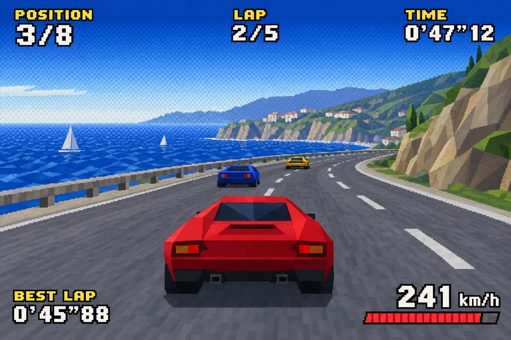
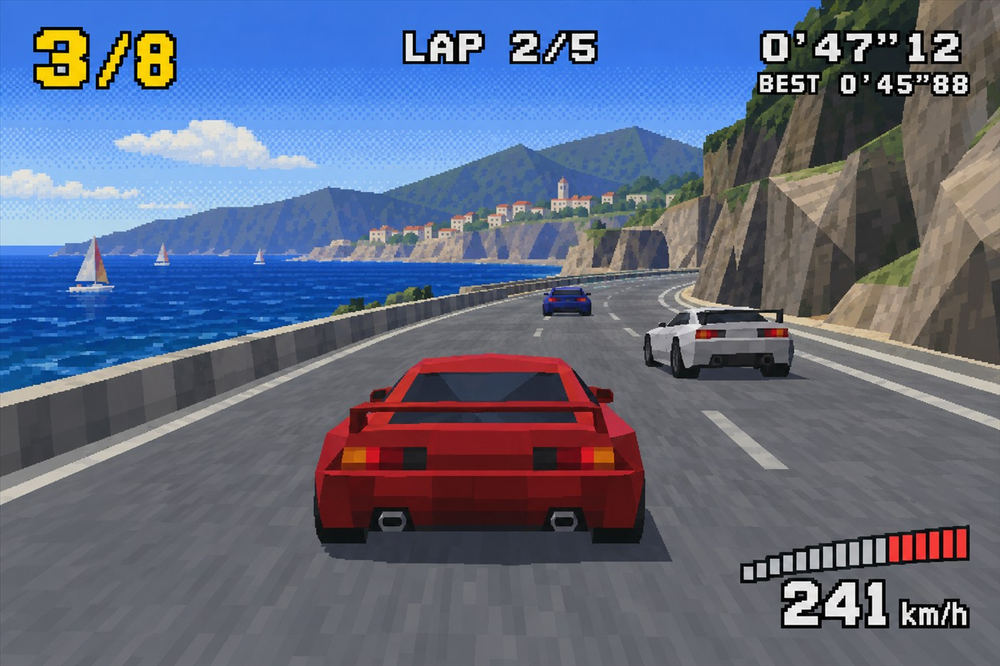

# Retro Racing Game Replay





<sub>Flare (top) and Sunburst (bottom), both rendered from the identical prompt at quality `xhigh`.</sub>

A 1990s arcade racing game replay screen: low-poly cars on a coastal road, dithered gradients, and a fully rendered HUD. Use it for game mockups, retro-gaming editorial, and as a hard test of whether a model can place five exact strings without a typo.

## Try the prompt

```text
A gameplay screenshot of a 1990s arcade racing game replay screen, 16:9. Low-polygon flat-shaded cars on a seaside coastal road seen from a chase camera, a low-poly sea to one side, dithered gradients on the horizon, visible polygon edges and low-resolution textures as a period console would render them. The HUD is fully rendered over the gameplay: a position indicator reading "3/8", a lap counter reading "LAP 2/5", a timer reading "0'47\"12", a best-lap reading "0'45\"88", and a speed readout reading "241 km/h" with a red-line bar. Chunky pixel font, all caps. Render only those five strings. No other text, no watermark, no real game logo or track name.
```

[Copy plain text](prompt.txt) · [Full-size Flare](full-flare.jpg) · [Full-size Sunburst](full-sunburst.jpg)

## Make it your own

- **List every string and its exact value.** Position, lap, timer, best lap, speed. Five labels; five chances to fail.
- **Ask for period rendering, not stylisation.** Polygon edges, low-resolution textures, dithered gradients. Modern crispness ruins the look.
- **Keep one odd number format.** `0'47"12` is what makes it read as a real arcade timer rather than a mockup.

## Settings and result

`openai/gpt-image-2.5-flare` and `openai/gpt-image-2.5-sunburst` · quality `xhigh` · 16:9 · **2459 image tokens** · 46 s

**Both tiers got all five strings exactly right** — `3/8`, `LAP 2/5`, `0'47"12`, `0'45"88`, `241 km/h` — which is the precision claim this card exists to test.

**The HUD layout is where they differ, and Sunburst wins clearly.** Sunburst stacks the readouts in one tight top-right block with yellow-on-white type, a dark outline and a segmented speed bar. Flare scatters the same five readings to all four corners with flatter white type. For interface work, Sunburst is the tier to reach for.

---

<!-- CTA_CASE -->

[← Back to the gallery](../../README.md)
